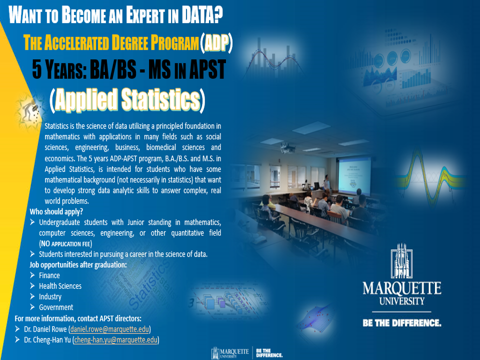

<script type="text/x-mathjax-config">
MathJax.Hub.Config({
  TeX: {
    Macros: {
      var: "{\\mathrm{Var}}",
      cov: "{\\mathrm{Cov}}",
      bsbeta: "{\\boldsymbol{\\beta}}",
      bsalpha: "{\\boldsymbol{\\alpha}}",
      bsep: "{\\boldsymbol{\\epsilon}}",
      bsdel: "{\\boldsymbol{\\delta}}",
      bseta: "{\\boldsymbol{\\eta}}",
      bsgamma: "{\\boldsymbol{\\gamma}}"
    }
  }
});
</script>


```{r child = "./setup.Rmd"}

```


```{r packages, echo=FALSE, message=FALSE, warning=FALSE}
set.seed(1234)
library(ISLR)
library(tidyverse)
library(performance)
```

exclude:false

## Summary of 4740/5740
- You've learned **a lot** in this course!

--

- Went through
  + Probability: definitions, random variables, distributions, conditional, independence, Bayes formula, etc.
  + Statistical inference: estimation and hypothesis testing for various parameters
  + Models such as ANOVA, linear regression and logistic regression

???
- In addition to basic descriptive statistics, 

<!-- -- -->

```{r, echo=FALSE, cache=TRUE, eval=FALSE}
source("./hexwall.R")
hexwall("../../hex_files/hex-stickers-master/PNGuse/", sticker_row_size = 10, sticker_width = 100)
```

--

<br>
<br>


.center[
.large[
.dark-blue[
If you'd like to learn advanced statistical modeling and methods, 
]
]
]


---
exclude:false

## Recommendation

```{r, echo=FALSE, fig.show = "hold", out.width = "20%", fig.align = "default"}
knitr::include_graphics("https://upload.wikimedia.org/wikipedia/commons/e/e6/Gamma_distribution_pdf.svg")
knitr::include_graphics("https://upload.wikimedia.org/wikipedia/commons/2/2f/Linear_subspaces_with_shading.svg")
knitr::include_graphics("https://upload.wikimedia.org/wikipedia/commons/7/72/Max_paraboloid.svg")
knitr::include_graphics("https://upload.wikimedia.org/wikipedia/commons/5/58/Hash_table_4_1_1_0_0_1_0_LL.svg")
knitr::include_graphics("https://upload.wikimedia.org/wikipedia/commons/e/e6/Merge_sort_algorithm_diagram.svg")
``` 

- Probability (MATH 4700/5700; MSSC 6010)
- Statistical inference (MATH 4710/5710; MSSC 6020)
- Linear algebra (MATH 3100; MSSC 6040)
- Optimization (MATH 4650/5650), 
- Data structure, Algorithms, etc.


---
exclude:false

## [ADP in Applied Statistics](https://www.marquette.edu/mathematical-and-statistical-sciences/graduate-program-applied-statistics.php)
.pull-left-narrow[
- BA/BS and MS in **5 years**
- Advanced statistical and data analytics tools
- **No** application fees
- Courses include
  + Computational Probability
  + Statistical Simulation
  + Applied Linear Algebra
  + Design of Experiments
  + Machine Learning
  + Statistical Computing and more!
]

.pull-right-wide[
```{r, echo=FALSE, out.width = "120%"}

``` 

]


---
exclude:false

- Happy to discuss statistics questions, and write a recommendation letter for you.

--

- Course evaluation! `r emo::ji('clap')``r emo::ji('clap')` `r emo::ji('clap')`

```{r, echo=FALSE, out.width="38%"}

```

.center[
.huge-pink[
Thank you!
]
]

