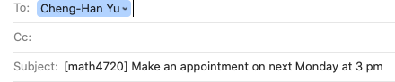
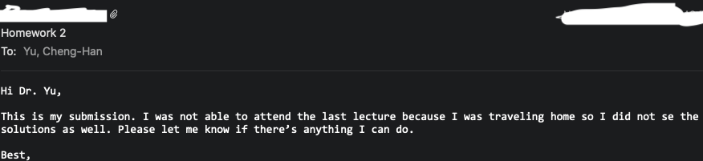
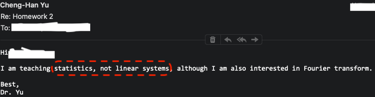
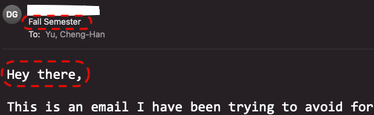
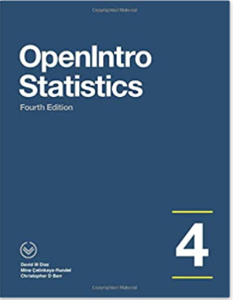
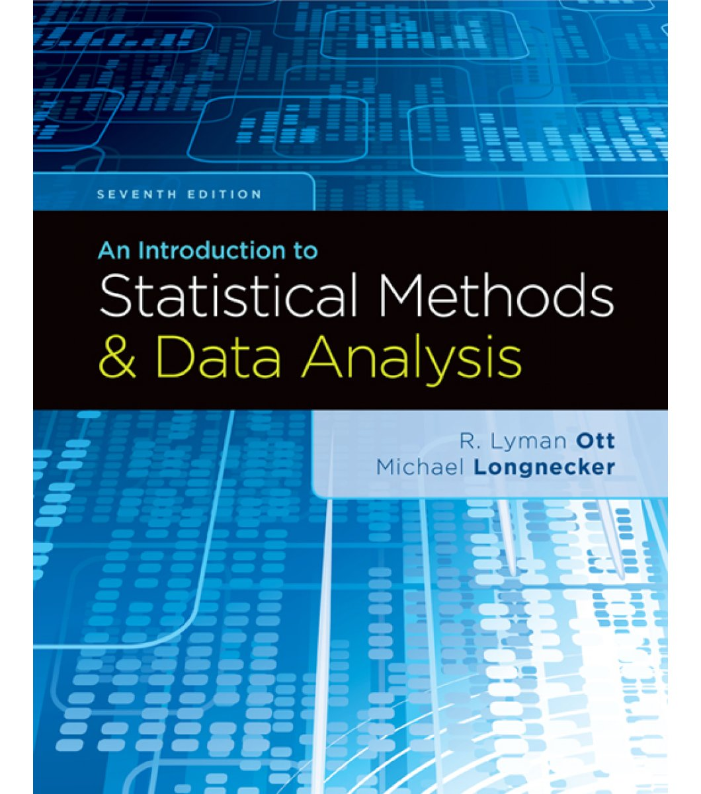
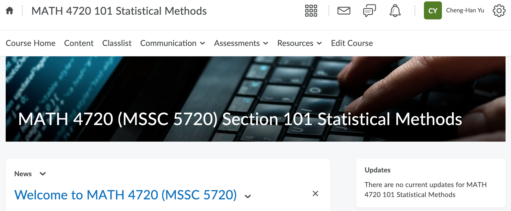
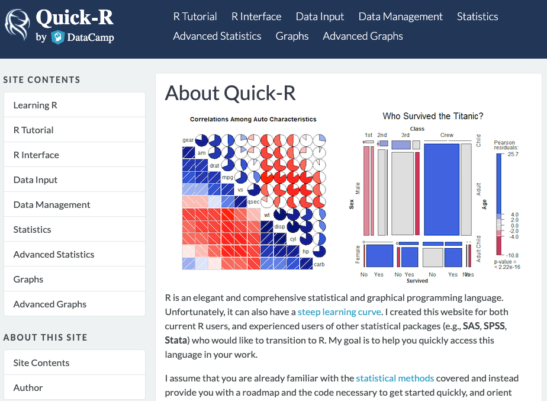
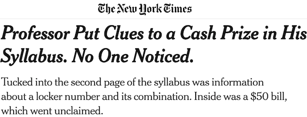
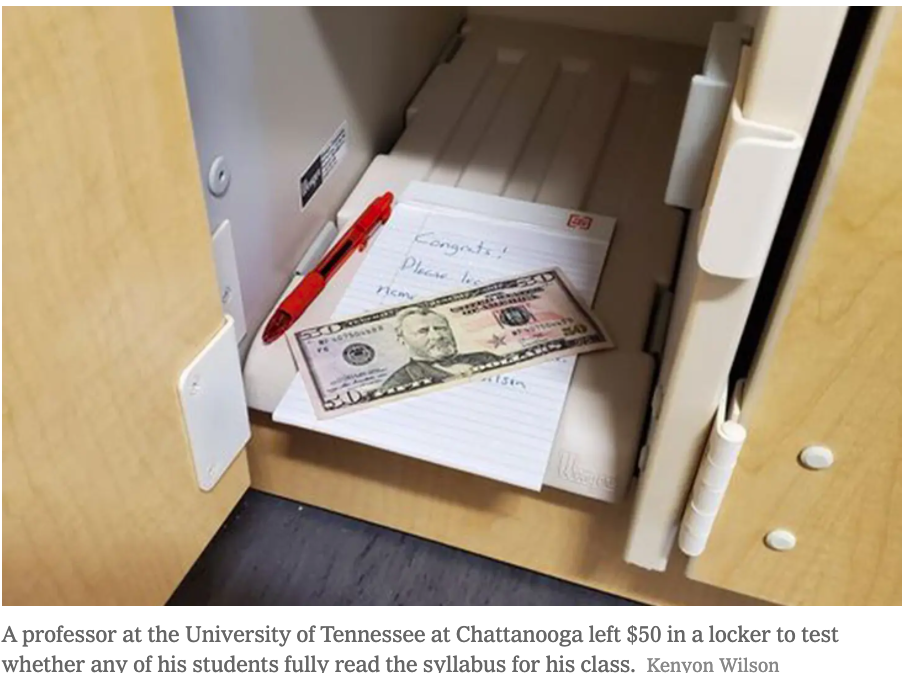

```{r child = "./setup.Rmd"}

```


```{r packages, echo=FALSE, message=FALSE, warning=FALSE}
library(tidyverse)
```


background-image: url("./img/taiwan.jpeg")
background-position: 50% 50%
background-size: cover

class: left, top, inverse

<!-- # Welcome Aboard! -->

```{r, echo=FALSE, out.width="30%", fig.align='right'}

```
# Taipei, Taiwan


---
class: low_opacity


## My Journey

- **MA in Economics/PhD program in Statistics**
```{r, echo=FALSE, out.width="45%", fig.align='center'}

```
- **PhD in Statistics**
```{r, echo=FALSE, out.width="45%", fig.align='center'}

```
- **Postdoctoral Fellow**
```{r, echo=FALSE, out.width="45%", fig.align='center'}

```
- **Assistant Professor (2020/08 - )**
```{r, echo=FALSE, out.width="40%", fig.align='center'}

```


---

## How to Reach Me
- Office hours: **MW 4:45 - 5:45 PM** and **Tu 1 - 2 PM** in **Cudahy Hall 353**.
<!-- - Online office hours: **W 12 - 1 PM** via Microsoft Teams. -->
- `r emo::ji('e-mail')`  <cheng-han.yu@marquette.edu> 
  + Answer your question within 24 hours. 
  + Expect a reply on **Monday** if shoot me a message **on weekends**.
  + Start your subject line with **[math4720]** or **[mssc5720]** followed by a **clear description of your question**.
```{r, echo=FALSE, out.width="45%", fig.align='center'}

```
  + I will **NOT** respond to your e-mail if ... **Check the email policy in the [syllabus](https://d2l.mu.edu/d2l/le/content/488959/viewContent/3826407/View)**!


---
exclude:false
## When You Have Two Dr. Yu in One Semester `r emo::ji('joy')`

```{r, echo=FALSE, out.width="100%", fig.align='center'}

```

```{r, echo=FALSE, out.width="100%", fig.align='center'}

```


---
exclude:false
## Unclear Subject Title and No Email Ettiquette `r emo::ji('unamused')`

```{r, echo=FALSE, out.width="70%", fig.align='center'}

```


---
exclude:false
## TA Information
.pull-left[
- Name: **Jesse Adikorley**

- `r emo::ji('incoming_envelope')` <jesse.adikorley@marquette.edu>

- Office/desk help hours:
  - **TuTh 2 - 3:15 PM** at Cudahy Hall 4th floor Help Desk
  
- Welcome to set up a meeting with your TA via Teams.

<!-- - Responsible for homework and quiz grading. -->

- Let me know if you need any other help! `r emo::ji("smile")`
]

.pull-right[
```{r, echo=FALSE, out.width="80%", fig.align='center'}

```
]


---
## Textbook 1 (Data oriented)

- [*OpenIntro Statistics, 4th edition*](https://www.openintro.org/book/os/), by David Diez, Mine Çetinkaya-Rundel and Christopher Barr. Publisher: OpenIntro, Inc.
- **Free** book and resources on line, including code! `r emo::ji('sunglasses')`

```{r, echo=FALSE, out.width="31%", fig.align='center'}

```


---
## Textbook 2 (Math oriented)
- [*An Introduction to Statistical Methods & Data Analysis, 7th edition*](https://www.amazon.com/Introduction-Statistical-Methods-Data-Analysis/dp/1305269470), by R. Lyman Ott, Michael Longnecker. Publisher: Cengage Learning.
- For senior or graduate students

```{r, echo=FALSE, out.width="34%", fig.align='center'}

```


---
## Learning Management System ([D2L](https://d2l.mu.edu/d2l/home/488959))

```{r, echo=FALSE, out.width="80%", fig.align='center'}

```

- Any new announcement will be posted in **News** in **Course Home**.
- **Content > Start Here: Course Information** includes syllabus and other useful information.
- Week modules (**Content > Week 1 to Week 15**) include course materials.
- Go to <https://www.marquette.edu/remote-learning/d2l.php> to learn more about D2L.


---
## Grading Policy &#x2728;

- Your final grade is earned out of **1000 total points** distributed as follows:
  - **Homework 1 to 8: 200 pts (25 pts each)**
  - **Quiz 1 to 4: 240 pts (60 pts each)**
  - **Exam 1 and 2: 320 pts (160 pts each)**
  - **Final exam: 240 pts**
  - **Class participation** 
- `r emo::ji("x")` No extra credit projects/homework/exam to compensate for a poor grade. 
- Individual grade will **NOT** be curved.
- This is not a course that gives most of students grade A. Wanna get a good grade? Study hard. No pain, no gain! &#x270D; &#x270D;


---
## Grade-Percentage Conversion &#x2728;

- Your final grade is based on your percentage of points earned out of 1000 points.
- $[x, y)$ means greater than or equal to $x$ and less than $y$.

```{r, echo=FALSE, fig.align='center'}
letter <- c("A", "A-", "B+", "B", "B-", "C+", "C", "C-",
                       "D+", "D", "F")
percentage <- c("[94, 100]", "[90, 94)", "[87, 90)", "[83, 87)", "[80, 83)",
                "[77, 80)", "[73, 77)", "[70, 73)", 
                "[65, 70)", "[60, 65)", "[0, 60)")
grade_dist <- data.frame(Grade = letter, Percentage = percentage)
library(kableExtra)
knitr::kable(grade_dist, longtable = TRUE, format = "html", align = 'l') %>% kable_styling(position = "center", font_size = 21)
```


---
## Homework (200 pts)

- **Assessments > Dropbox** and upload your homework in **PDF** format.
- There are 8 homework sets.
- You must submit YOUR OWN work. `r emo::ji("please")`
- `r emo::ji("x")` **No make-up homework**.
- Every homework is due by **Friday 11:59 PM ** (**Don't miss it. This is a hard deadline**`r emo::ji("exclamation")`).
<!-- - At least **one week** is allowed to do your homework. -->
- The lowest score of the homework sets will not be in your final grade calculation.

---
## Quizzes (240 pts)
- There are 4 in-class quizzes.
<!-- - Questions in the quizzes are similar to homework questions. So do the HW! -->
- `r emo::ji("books")` Quizzes are individual and in *closed-book* format. 
- `r emo::ji("x")` No cheat sheet is allowed.
- `r emo::ji("x")` **No make-up quizzes** for any reason unless you got [COVID](https://www.marquette.edu/central/registrar/faculty-staff/guidance-on-fall-2022-class-attendance-withdrawal-grading.php) or [excused absence](https://bulletin.marquette.edu/undergrad/academicregulations/#attendance). Check the syllabus for more details.


---
## Exams (560 pts)

- There are **two** midterm exams and **one** final exam.
- Have *in-class* and *take-home* parts.
<!-- - The in-class exams are about one-hour long. -->
- `r emo::ji("page_facing_up")` One piece of  **letter size** cheat sheet is allowed. It has to be turned-in with your in-class exam.
- **Assessments > Dropbox** to submit your take-home exams in **PDF** format. 
<!-- - `r emo::ji("x")` **Handwriting is NOT allowed**. -->
- Exam 1 covers Week **1 to 6**
- Exam 2 covers Week **7 to 11**  
- Final exam is comprehensive and covers the **all course materials**.  `r emo::ji("sunglasses")`
- `r emo::ji("x")` **No make-up exams** unless you got [COVID](https://www.marquette.edu/central/registrar/faculty-staff/guidance-on-fall-2022-class-attendance-withdrawal-grading.php) or [excused absence](https://bulletin.marquette.edu/undergrad/academicregulations/#attendance). Check the syllabus for more details.


---
##  What Computing Language We Use (I Teach)?
.pull-left[
- `r emo::ji("chart_with_upwards_trend") ` The best language for statistical computing!
<!-- - `r emo::ji("x") ` If you do **NOT** want to learn R, choose another section!  -->
- `r emo::ji("white_check_mark")` You may use other tools or software such as Excel, Python, Minitab, etc to do your work, but I will **NOT** teach any of them.
- `r emo::ji("x")` Drop/Swap deadline: **09/06/2022**. Don't miss it!
]
.pull-right[
```{r, echo=FALSE, out.width="100%", fig.align='center', fig.cap="https://www.r-project.org/"}
knitr::include_graphics("./img/Rlogo.png")
```
]


---
## Integrated Development Environment (IDE) for R

```{r, echo=FALSE, out.width="100%", fig.align='center', fig.cap='<a href="https://www.rstudio.com/">RStudio Website</a>'}
knitr::include_graphics("./img/RStudio_logo.png")
```


---
## R Resources
<!-- No one single main textbook. -->

- [*Quick-R*](https://www.statmethods.net/index.html) if you are new to $\textsf{R}$ and would like to grasp its syntax for some specific topic quickly.


- [*Hands-On Programming with R*](https://rstudio-education.github.io/hopr/)
- [*A Student's Guide to R*](https://cran.r-project.org/doc/contrib/Horton+Pruim+Kaplan_MOSAIC-StudentGuide.pdf) 
- Google your questions!


---
## Academic Integrity

This course expects all students to follow University and College statements on [academic integrity](https://bulletin.marquette.edu/undergrad/academicregulations/).
- **Honor Pledge and Honor Code**: *I recognize the importance of personal integrity in all aspects of life and work. I commit myself to truthfulness, honor, and responsibility, by which I earn the respect of others. I support the development of good character, and commit myself to uphold the highest standards of academic integrity as an important aspect of personal integrity. My commitment obliges me to conduct myself according to the Marquette University Honor Code*.
- `r emo::ji("x")` `r emo::ji("x")` `r emo::ji("x")` You know what I am talking about. Yes, **DO NOT CHEAT**. `r emo::ji("x")` `r emo::ji("x")` `r emo::ji("x")`


---
## Attendance and [COVID-19](https://today.marquette.edu/2022/08/covid-19-mitigation-protocols-to-begin-the-fall-2022-semester/)
- It is **your** responsibility as a Marquette University student to protect the health and safety of our community in this course.
- Visit [What to do if you are exposed to COVID-19 or test positive](https://www.marquette.edu/coronavirus/what-to-do-if-you-are-exposed-or-test-positive.php) website for university guidelines on the best course of action. 
- Visit guidance on Fall 2022 [Class attendance, withdrawal, and grading](https://www.marquette.edu/central/registrar/faculty-staff/guidance-on-fall-2022-class-attendance-withdrawal-grading.php)
  + Students are responsible for contacting instructors prior to the missed class session to indicate absence and the need to make up classwork/assignments.  
  + Students requesting make up classwork/assignments are required to provide the COVID Cheq "stop sign" to confirm inability to attend class.


---
## Comments and Questions from the Background Survey
`r emo::ji("question")` **Will there be any focus on programming/data science in this course?**  

`r emo::ji("point_right")` The course is mainly for statistical inference, which plays an important role in data analysis and data science. MATH 4730 R programming for statistics and data science, and MATH/COSC 3570 Introduction to Data Science.

<br>
--

`r emo::ji("question")` **I really struggle when tests or homework problems ask me to extrapolate upon the material we go through in class**  

`r emo::ji("point_right")` Homework, quizzes and exams are all based on course slides.


<br>
--

`r emo::ji("question")` **I would love to learn R and do a lot on computer programs like minitab.** **I would like to learn R a little bit. ** **I'm interested to see what code we'll be implementing**

`r emo::ji("point_right")` We will learn some basic R data types and functions/commands for statistical analysis. For advanced R programming, take MATH 4750 Statistical Computing.

<br>
--

`r emo::ji("question")` **Will the syllabus be shared by the first day of class? Are we going to have an online course page?**

`r emo::ji("point_right")` You've got the answer!


---
class: center, middle, inverse

# `r emo::ji("handshake")` Please read the syllabus!!! Because ... 


---
## You May Find Something Good!

.pull-left[
```{r, echo=FALSE, out.width="100%", fig.align='center'}

```
]

.pull-right[
```{r, echo=FALSE, out.width="100%", fig.align='center'}

```
]
