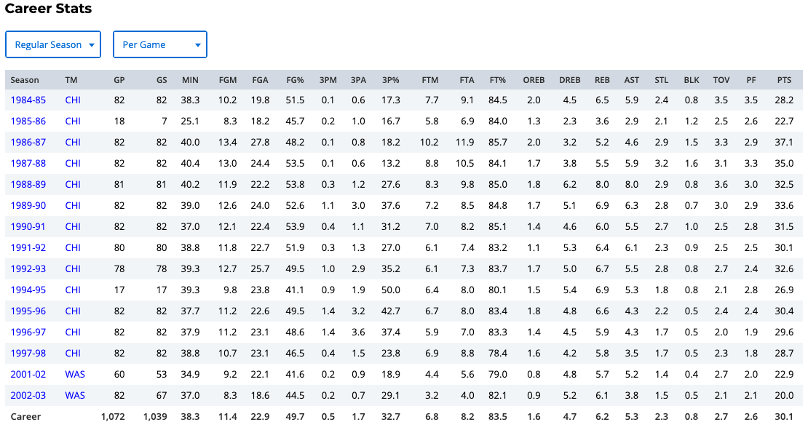
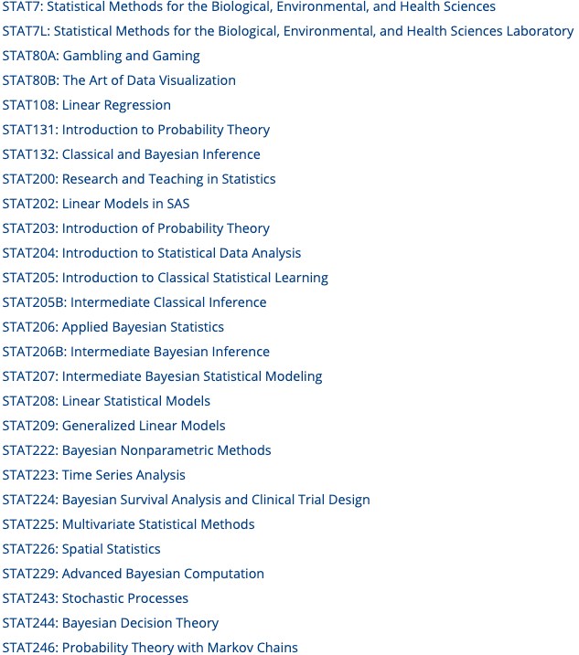
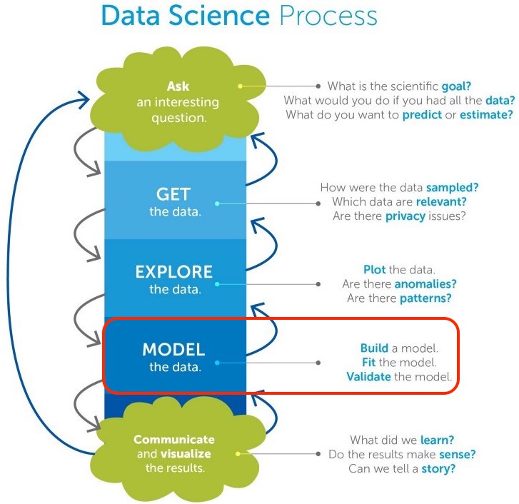
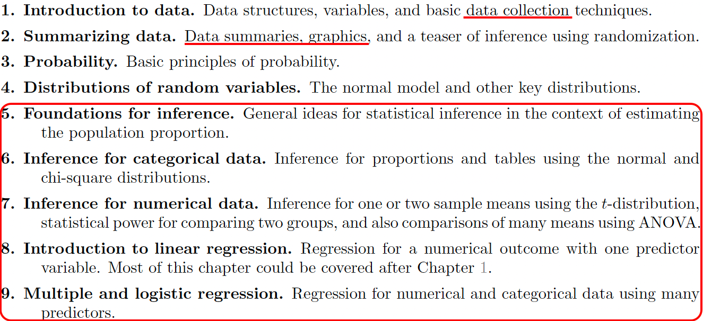
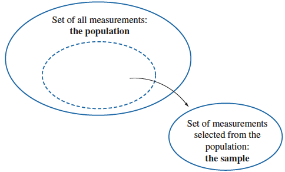
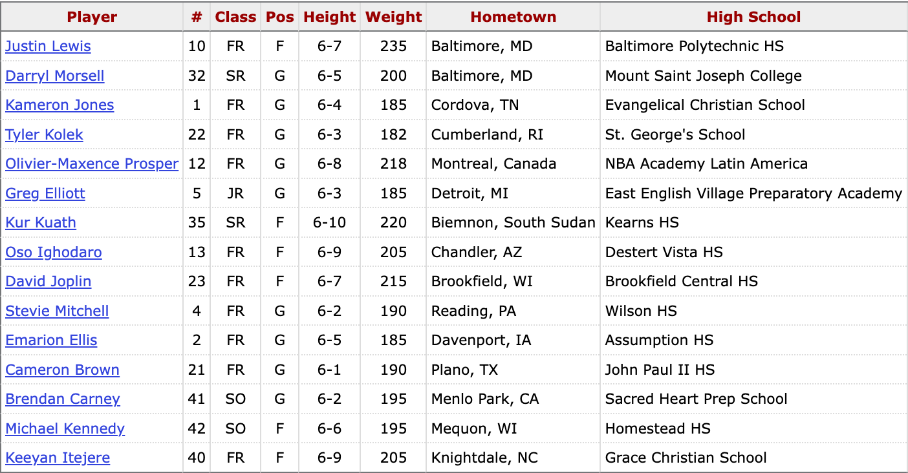
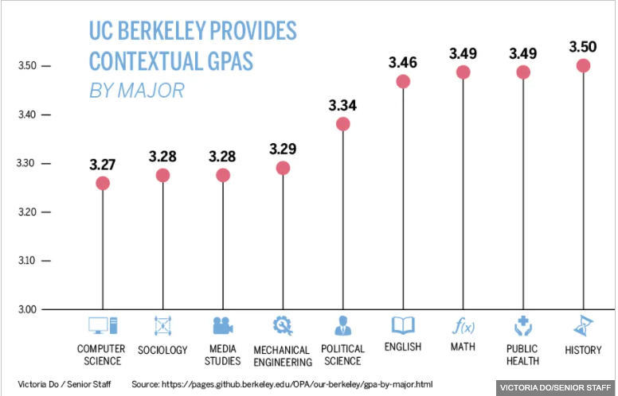
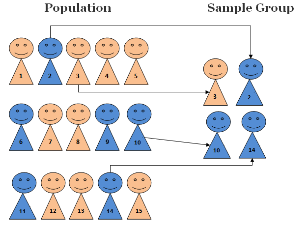
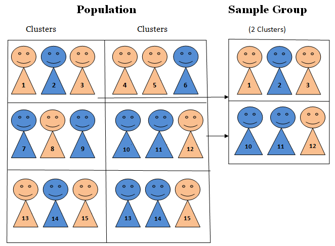

```{r child = "./setup.Rmd"}

```


```{r packages, echo=FALSE, message=FALSE, warning=FALSE}
library(tidyverse)
library(emo)
library(openintro)
library(ggVennDiagram)
library(ggplot2)
library(ggVennDiagram)
library(plotrix)
library(diagram)
data(COL)
source("./sample_method_fcns.R")
```

background-image: url(./img/what_stats.jpg)
background-position: 50% 50%
background-size: cover
class: center, middle, inverse
# What is Statisitcs


---
## Statistics as Numeric Records
- In ordinary conversations, the word **statistics** is used as a term to
indicate a set or collection of **numeric records**.
```{r, echo=FALSE, out.width="90%", fig.align='center'}

```


---
## Statistics as Numeric Records
- In ordinary conversations, the word **statistics** is used as a term to
indicate a set or collection of **numeric records**.

```{r, echo=FALSE, out.width="34%",fig.align='center', fig.cap="https://slamgoods.com/products/jordan-collectors-issue"}
knitr::include_graphics("./img/mj.jpeg")
```


---
```{r, echo=FALSE, out.width="80%",fig.align='center', fig.cap="Source: shorturl.at/vEMNS"}
#| label: fig-stat-shirt
knitr::include_graphics("./img/statistics.jpg")
```


---
## Statistics as a Discipline

```{r, echo=FALSE, out.width="100%",fig.align='center'}
#| label: fig-stat-wiki
#| fig-cap: >
#|   Source: https://en.wikipedia.org/wiki/Statistics
knitr::include_graphics("./img/stats_wiki.png")
```

--

- **Statistics** is a **Science of Data**.


--

- A __*science of data*__ using **statistical thinking, methods and models**.


--

<br>

<br>

.center[
.large[
`r emo::ji('thinking')` But wait, then what is **DATA SCIENCE** `r emo::ji('question')`
]
]


---
## Difference between Statistics and Data Science


- [Investopedia](https://www.investopedia.com/terms/d/data-science.asp) defines Data Science as a field of **Big Data** which seeks to provide meaningful information from large amounts of complex data.


--


---
## UC Santa Cruz Department of Statistics Courses
```{r, echo=FALSE, out.width="60%",fig.align='center'}

```


---
## Data Science Is Now a Broader View of Statistics
- Collection, organization, analysis, interpretation and presentation of data.

```{r, echo=FALSE, out.width="50%",fig.align='center'}

```


---
## What Do We Learn In this Course

<!-- - We will discuss most of materials in Chapter 1 to 9. -->

```{r, echo=FALSE, out.width="100%",fig.align='center'}

```


---
## We Focus On Statistical Inference

- We spend most of time on various *statistical methods for analyzing data*.
- Learn useful information 
  + about the **population** we are interested
  + from our **sample data**
  + through **statistical inferential** methods, including **estimation** and **testing**


```{r, echo=FALSE, out.width="55%",fig.align='center'}
# <!-- # ```{r, echo=FALSE, out.width="50%",fig.align='center'} -->
# <!-- # #| eval:false -->
# <!-- #  -->
# <!-- # ``` -->
par(mar = c(0, 0, 0, 0))
plot(0, 0, type = "n", axes = FALSE, xlab = "", ylab = "")
plotrix::draw.ellipse(x = -0.3, y = 0.5, a = 0.65, b = 0.55, lwd = 2)
plotrix::draw.ellipse(x = -0.3, y = 0.4, a = 0.35, b = 0.25, lwd = 2, lty = 2)
text(x = -0.3, y = 0.7, labels = "Set of all measurements: Population", cex = 1.2)
plotrix::draw.ellipse(x = 0.5, y = -0.4, a = 0.36, b = 0.26, lwd = 2, lty = 1)
diagram::curvedarrow(from = c(-0.3, 0.4), to = c(0.5, -0.2),
                     curve = -0.2, arr.pos = 0.98)
text(x = 0.5, y = -0.5, labels = "Sample", cex = 1.2)
text(x = 0, y = -0.3, labels = "Set of data selected from the population:", cex = 1.2)
```


---

## Statistics is a Science of Data, so What is Data?

- **Data**: A set of **objects** on which we observe or measure one or more **characteristics**.
- Objects are individuals, observations, subjects or cases in statistical studies.
- A characteristic or attribute is called a **variable** because it *varies* from one to another.
```{r, echo=FALSE, out.width="80%",fig.align='center'}

```


---
## Data Matrix
- Each row corresponds to a unique case or observational unit.
- Each column represents a characteristic or variable.
- This structure allows new cases to be added as rows or new variables as new columns.
```{r mu_data, echo=FALSE, out.width="80%",fig.align='center'}

```


---
background-image: url(./img/data_collect.jpg)
background-position: 50% 50%
background-size: cover
class: center, middle, inverse
# Population and Sample


---
## Target Population
- The first step in conducting a study is to *identify questions* to be investigated.
- A clear research question is helpful in identifying 
  + what *cases* should be studied (row)
  + what *variables* are important (column)
  
- Target **Population**: The **complete** collection of data we'd like to make inference about.

.pull-left[
- *What is the average GPA of currently enrolled Marquette students?*
```{r, echo=FALSE, out.width="70%",fig.align='center'}
knitr::include_graphics("./img/study.jpeg")
```
]


--
.pull-right[
- <span style="color:blue">All Marquette students that are currently enrolled.</span>
]


---
## Target Population
- The first step in conducting a study is to *identify questions* to be investigated.
- A clear research question is helpful in identifying 
  + what *cases* should be studied (row)
  + what *variables* are important (column)
  
- Target **Population**: The **complete** collection of data we'd like to make inference about.

.pull-left[
- *Does a new drug reduce mortality in patients with severe heart disease?*
```{r, echo=FALSE, out.width="70%",fig.align='center'}
knitr::include_graphics("./img/heart_disease.jpeg")
```
]


--

.pull-right[
- <span style="color:blue">All people with severe heart disease. </span> 
]


---
## Sample Data
.pull-left[
- Sometimes, it's possible to collect data of all cases we are interested.
- Most of the time, it is too expensive to collect data for every case in a population.
- What about the average GPA of all students in Illinois? the U.S.? the world? `r emo::ji('scream')` `r emo::ji('scream')` `r emo::ji('scream')`

]

.pull-right[
```{r sample, cache=TRUE, echo=FALSE, out.width="100%"}
par(mar = 0.1*c(1,1,1,1))
plot(c(0, 2),
     c(0, 1.1),
     type = 'n',
     axes = FALSE, xlab = "", ylab = "")
temp <- seq(0, 2 * pi, 2 * pi / 100)
x <- 0.5 + 0.5 * cos(temp)
y <- 0.5 + 0.5 * sin(temp)
lines(x, y)

s <- matrix(runif(700), ncol = 2)
S <- matrix(NA, 350, 2)
j <- 0
for (i in 1:nrow(s)) {
  if(sum((s[i, ] - 0.5)^2) < 0.23){
    j <- j + 1
    S[j, ] <- s[i, ]
  }
}
points(S, col = COL[1, 3], pch = 20)
text(0.5, 1, 'All current students', pos = 3)

set.seed(50)
N <- sample(j, 25)
lines((x - 0.5) / 2 + 1.5, (y - 0.5) / 2 +  0.5, pch = 20)

SS <- (S[N, ] - 0.5) / 2 + 0.5
these <- c(2, 5, 11, 10, 12)
points(SS[these, 1] + 1,
       SS[these, 2],
       col = COL[4, 2],
       pch = 20,
       cex = 1.5)
text(1.5, 0.75, 'Sample', pos = 3)

for (i in these) {
  arrows(S[N[i], 1], S[N[i], 2],
         SS[i, 1] + 1 - 0.03, SS[i, 2],
         length = 0.08, col = COL[5], lwd = 1.5)
}
```
]


--
- **Sample**: A **subset** of cases selected from a population.
- Compute the average GPA of the sample data
- Hope sample avg GPA $\approx$ population avg GPA. `r emo::ji('please')`


---
## Good Sample vs. Bad Sample

.question[
Is **this 4720/5720 class** a sample data of the target population Marquette students?
]

--

.question[
Is **this 4720/5720 class** a *"good"* sample of the target population?
]


--

```{r, cache=TRUE, echo=FALSE, out.width="65%"}
par(mar = c(0,0,2,0))
major <- c("CS" = 14, "Engineering" = 29, "Math" = 9, "DS" = 4,
           "Chem/Bio" = 5, "Business" = 5, "Other" = 4)
pie(major, col = 1:7, main = "Major of 4720/5720 class")
```


---
## Good Sample vs. Bad Sample

.question[
Is **this 4720/5720 class** a *"good"* sample of the target population?
]

- The sample is convenient to be collected, but it is NOT **representative** of the population.
- **Biased** sample: The average GPA of the class may be far from that of all MU undergrads.
```{r, cache=TRUE, echo=FALSE, out.width="60%"}
par(mar = c(0,0,0,0))
plot(c(0, 2),
     c(0, 1.1),
     type = 'n',
     axes = FALSE, xlab = "", ylab = "")
temp <- seq(0, 2 * pi, 2 * pi / 100)
x <- 0.5 + 0.5 * cos(temp)
y <- 0.5 + 0.5 * sin(temp)
lines(x, y)

s <- matrix(runif(700), ncol = 2)
S <- matrix(NA, 350, 2)
j <- 0
sub <- rep(FALSE, 1000)
for (i in 1:nrow(s)) {
  if(sum((s[i,] - 0.5)^2) < 0.23){
    j <- j+1
    S[j,] <- s[i,]
  }
  if(sum((s[i, ] - c(0.05, 0.18) - 0.5)^2) < 0.07){
    sub[j] <- TRUE
  }
}
points(S, col = COL[1, 4 - 2 * sub], pch = 20)
text(0.5, 1, 'All students', pos = 3)
lines((x - 0.5) * 2 * sqrt(0.07) + 0.55,
      (y - 0.5) * 2 * sqrt(0.07) + 0.68)

set.seed(7)
N <- sample((1:j)[sub], 25)
lines((x - 0.5) / 2 + 1.5,
      (y - 0.5) / 2 + 0.5,
      pch = 20)

SS <- (S[N, ] - 0.5) / 2 + 0.5
these <- c(2, 5, 7, 12, 15)
points(SS[these, 1] + 1,
       SS[these, 2],
       col = COL[4, 2],
       pch = 20,
       cex = 1.5)
text(1.5, 0.75, 'Sample', pos = 3)

for (i in these)  {
  arrows(S[N[i], 1], S[N[i], 2],
         SS[i, 1] + 1 - 0.03, SS[i, 2],
         length = 0.08,
         col = COL[5],
         lwd = 1.5)
}
rect(0.143, 0.2, 0.952, 0.301,
     border = "#00000000",
     col = "#FFFFFF88")
rect(0.236, 0.301, 0.858, 0.403,
     border = "#00000000",
     col = "#FFFFFF88")
text(0.55, 0.5 + 0.18 - sqrt(0.07),
     'Students from \n STEM fields',
     pos = 1)
```


---
```{r, echo=FALSE, out.width="100%", fig.asp=0.7}
# 
major_and_average_gpa <- 
    read.csv("~/OneDrive - Marquette University/mallorywork/code/data/major_and_average_gpa.csv")

names(major_and_average_gpa) <- c("major", "avg_gpa")
par(mar = c(4, 4, 2, 1), mgp = c(2.5, 0.8, 0))

my_bar <- barplot(height = major_and_average_gpa$avg_gpa, ylab = "Average GPA", 
                  main = "UC Berkeley Average GPA by Major", col = "lightblue",
                  ylim = c(3, 4), las = 1, xpd = FALSE) 
text(my_bar, major_and_average_gpa$avg_gpa + 0.05, 
     paste(major_and_average_gpa$avg_gpa))  
text(cex = 0.8, x = my_bar - 0.25, y = 3, xpd = TRUE,
     major_and_average_gpa$major, srt = 45)
```


---
## How and Why a Representative Sample?
- We always seek to **randomly** select a sample from a population.
- Lots of statistical methods are based on *randomness assumption*.

```{r, ref.label="sample", echo=FALSE}

```


---
background-image: url(./img/data_collect.jpg)
background-position: 50% 50%
background-size: cover
class: center, middle, inverse
# Data Collection

---
## Two Types of Studies to Collect Sample Data

- **Observational Study**: Observe and measure characteristics/variables, and do **NOT** attempt to modify or intervene with the subjects being studied.
  + <span style="color:blue"> Sample from `r emo::ji('one')` the heart disease and `r emo::ji('two')` heart disease-free populations. Then record the fat content of the diets for the two groups.</span> </span> 

- **Experimental Study**: Apply some **treatment(s)** and then proceed to observe its responses or effects on the individuals (experimental units).
  + <span style="color:blue">Assign volunteers to one of several diets with different levels of dietary fat (treatments). Then compare the treatments with respect to the incidence of hear disease after a period of time. </span> 


--

.question[
Observational or Experimental?
- <span style="color:blue">Randomly select 40 males and 40 females to see the difference in blood pressure levels between male and female. </span> 
- <span style="color:blue"> Test the effects of a new drug by randomly dividing patients into 3 groups (high dosage, low dosage, placebo). </span> 
]


---
## Limitation of Observational Studies: Confounding

- **Confounder**: A variable NOT included in a study but affects the variables in the study.
- Observe past data show that increases in ice cream sales are associated with increases in drownings, and we conclude that **eating ice cream causes drownings**. `r emo::ji('scream')` `r emo::ji('confused')` `r emo::ji('interrobang')`
 
.pull-left[
```{r icecream, cache=TRUE, echo=FALSE, out.width="50%"}
knitr::include_graphics("./img/icecream.jpeg")
```
]

.pull-right[
```{r drown, cache=TRUE, echo=FALSE, out.width="50%"}
knitr::include_graphics("./img/drowning.jpeg")
```
]

--

.question[
What is the confounder that is not in the data, but affects ice cream sales and the number of drownings?
]

--
***Temperature***: as temperature increases, ice cream sales increase and the number of drownings goes up because more people swim.
```{r beach, cache=TRUE, echo=FALSE, out.width="15%"}

```


---
## Causal Relationship
- Making causal conclusions based on *experiments* is often more reasonable than making the same causal conclusions based on observational data.
- Observational studies are generally only sufficient to show **associations, not causality**.


```{r, cache=TRUE, echo=FALSE, out.width="50%"}
par(mar = c(0,0,0,0))
plot(c(-0.05, 1.2), c(0.39, 1),
     type = 'n', xlab = "", ylab = "", axes = FALSE)
text(0.59, 0.89, 'temparature', font = 2)
rect(0.4, 0.8, 0.78, 1)
text(0.3, 0.49, 'ice cream sales', font = 2)
rect(0.1, 0.4, 0.48, 0.6)
arrows(0.49, 0.78, 0.38, 0.62,
       length = 0.08, lwd = 1.5)
text(0.87, 0.5, 'drowning cases', font = 2)
rect(0.71,0.4, 1.01, 0.6)
arrows(0.67, 0.78, 0.8, 0.62,
       length = 0.08, lwd = 1.5)
arrows(0.5, 0.5, 0.69, 0.5,
       length = 0.08, col = COL[6,2])
text(0.595, 0.565, "?", font = 2,
     cex = 1.5, col = COL[4])
```


---
background-image: url(./img/data_collect.jpg)
background-position: 50% 50%
background-size: cover
class: center, middle, inverse
# Sampling Methods


---
## Simple Random Sample

- **Random Sample**: Each member of a population is **equally likely** to be selected.
- **Simple Random Sample (SRS)**: Every possible sample of sample size $n$ has the same chance to be chosen.
- **Example**: If sample 100 students from all, say 10,000 Marquette students, I would *randomly* assign each student a number (from 1 to 10,000), then *randomly* select 100 numbers. 

.pull-left[
```{r, cache=TRUE, echo=FALSE, out.width="90%"}
set.seed(3)
N   <- 108
n   <- 18
colSamp <- COL[4]
PCH <- rep(c(1, 3, 20)[3], 3)
col <- rep(COL[1], N)
pch <- PCH[match(col, COL)]

par(mar = c(0,0,0,0))
plot(0, xlim=c(0,2), ylim=0:1, type='n', axes=FALSE)
box()
x   <- runif(N, 0, 2)
y   <- runif(N)
inc <- n
points(x, y, col=col, pch=pch)

these <- sample(N, n)
points(x[these], y[these], pch=20, cex=0.8, col=colSamp)
points(x[these], y[these], cex=1.4, col=colSamp)
```
]


.pull-right[
```{r, echo=FALSE, out.width="75%",fig.align='center', fig.cap="https://research-methodology.net/sampling-in-primary-data-collection/random-sampling/"}

```
]


---
## Stratified Random Sample
- **Stratified Sampling**: Subdivide the population into different subgroups (strata) that share the **same** characteristics, then draw a simple random sample from each subgroup.
- **Homogeneous within strata; Non-homogeneous between strata**
```{r, echo=FALSE, out.width="75%"}
knitr::include_graphics("./img/stratified_sampling.png")
```


---
## Stratified Random Sample Example
- **Example**: Divide Marquette students into groups by colleges, then SRS for each group.

```{r, cache=TRUE, echo=FALSE, out.width="62%"}
par(mar = c(0,0,0,0))
PCH <- rep(c(1, 3, 20)[3], 3)
plot(0, xlim=c(0,2), ylim=0:1, type='n', axes=FALSE, xlab = "", ylab = "")
box()
X    <- c(0.18, 0.3, 0.68, 1.18, 1.4, 1.74)
Y    <- c(0.2, 0.78, 0.44, 0.7, 0.25, 0.65)
locs <- c(1, 4, 5, 3, 6, 2)
gps  <- list()
N    <- 1.1*c(15, 12, 35, 22, 13, 28)
R    <- sqrt(N/500)
p    <- matrix(c(12, 2, NA,
				 1,  2, NA,
				 4,  30, NA,
				 19, 1, NA,
				 11, 0, NA,
				 3, 24, NA), 3)
p     <- round(p*1.1)
p[3,] <- N - p[1,] - p[2,]
above <- c(1, 1, 1, 1, -1, 1)
for(i in 1:6){
	hold <- seq(0, 2*pi, len=99)
	x    <- X[i] + (R[i]+0.01)*cos(hold)
	y    <- Y[i] + (R[i]+0.01)*sin(hold)
	polygon(x, y, border=COL[5,4])
	x    <- rep(NA, N[i])
	y    <- rep(NA, N[i])
	for(j in 1:N[i]){
		inside <- FALSE
		while(!inside){
			xx <- runif(1, -R[i], R[i])
			yy <- runif(1, -R[i], R[i])
			if(sqrt(xx^2 + yy^2) < R[i]){
				inside <- TRUE
				x[j]   <- xx
				y[j]   <- yy
			}
		}
	}
	type <- sample(1, N[i], TRUE)
	pch  <- PCH[type]
	col  <- COL[type]
	x    <- X[i]+x
	y    <- Y[i]+y
	points(x, y, pch=pch, col=col)
	these  <- sample(N[i], 3)
	points(x[these], y[these], pch=20, cex=0.8, col=colSamp)
	points(x[these], y[these], cex=1.4, col=colSamp)
}
college <- c("Arts/Sciences", "Business", "Engineering", "Law", "Nursing", "Health Sciences")
text(X, Y+above*(R+0.01), college, pos=2+above, cex=1.1, font = 2)
```


---
## Cluster Sampling
- **Cluster Sampling**: Divide the population into clusters, then randomly select some of those clusters, and then choose **all** the members from those selected clusters.
- **Homogeneous between clusters; Non-homogeneous within clusters**

```{r, echo=FALSE, out.width="55%"}

```


---
## Cluster Sampling Example
- **Example**: Study 4720 student drinking habit by dividing the students into 9 groups, then randomly selecting 3 and interviewing all of the students in each of those clusters.

```{r, cache=TRUE, echo=FALSE, out.width="62%"}
par(mar = c(0,0,0,0))
PCH <- rep(c(1, 3, 20)[3], 3)
plot(0, xlim=c(0,2), ylim=0:1, type='n', axes=FALSE)
box()
X    <- c(0.17, 0.19, 0.52, 0.85, 1, 1.22, 1.49, 1.79, 1.85)
Y    <- c(0.3, 0.75, 0.5, 0.26, 0.73, 0.38, 0.67, 0.3, 0.8)
locs <- c(1, 4, 5, 3, 6, 2)
gps  <- list()
N    <- c(18, 12, 11, 13, 16, 14, 15, 16, 12)
R    <- sqrt(N/500)
p    <- matrix(c(6,  8, NA,
				 4,  4, NA,
				 4,  4, NA,
				 5,  4, NA,
				 8,  5, NA,
				 4,  5, NA,
				 5,  9, NA,
				 6,  5, NA,
				 4,  5, NA), 3)
p[3,] <- N - p[1,] - p[2,]
above <- c(-1, 1, 1, 1, 1, -1, 1, 1, 1)
for(i in 1:length(X)){
	hold <- seq(0, 2*pi, len=99)
	x    <- X[i] + (R[i]+0.02)*cos(hold)
	y    <- Y[i] + (R[i]+0.02)*sin(hold)
	polygon(x, y, border=COL[5,4])
	if(i %in% c(3, 4, 8)){
		polygon(x, y, border=COL[4], lty=2, lwd=1.5)
	}
	x    <- rep(NA, N[i])
	y    <- rep(NA, N[i])
	for(j in 1:N[i]){
		inside <- FALSE
		while(!inside){
			xx <- runif(1, -R[i], R[i])
			yy <- runif(1, -R[i], R[i])
			if(sqrt(xx^2 + yy^2) < R[i]){
				inside <- TRUE
				x[j]   <- xx
				y[j]   <- yy
			}
		}
	}
	type <- sample(1, N[i], TRUE)
	pch  <- PCH[type]
	col  <- COL[type]
	x    <- X[i]+x
	y    <- Y[i]+y
	points(x, y, pch=pch, col=col)
	these  <- sample(N[i], N[i])
	# these  <- N[i]
	if(i %in% c(3, 4, 8)){
	points(x[these], y[these], pch=20, cex=0.8, col=colSamp)
	points(x[these], y[these], cex=1.4, col=colSamp)
		#points(x[these], y[these], pch=19, col=colSamp)
	}
}
class_name <- c("Cluster 1", "Cluster 2", "Cluster 3", "Cluster 4",
                "Cluster 5", "Cluster 6",
                "Cluster 7", "Cluster 8", "Cluster 9")
text(X, Y+above*(R+0.01), class_name, 
     pos=2+above, cex=1.1, font = 2)
# text(X, Y+above*(R+0.01), paste("Cluster", 1:length(X)), 
#      pos=2+above, cex=1.1, font = 2)
```


---
background-image: url(./img/data_collect.jpg)
background-position: 50% 50%
background-size: cover
class: center, middle, inverse

# Data Type 


---
```{r data_type, cache=TRUE, echo=FALSE, out.width="90%"}
par(mar = c(0,0,0,0))
plot(c(-0.15, 1.3),
     c(0, 1),
     type = 'n',
     axes = FALSE)

text(0.6, 0.9, 'Variables/Data', font = 2)
rect(0.4, 0.8, 0.8, 1)

text(0.25, 0.55, 'Categorical', font = 2)
text(0.25, 0.45, '(Qualitative)', font = 2)
rect(0.1, 0.4, 0.4, 0.6)
arrows(0.45, 0.78, 0.34, 0.62, length = 0.08)

text(0.9, 0.55, 'Numerical', font = 2)
text(0.9, 0.45, '(Quantitative)', font = 2)
rect(0.73, 0.4, 1.07, 0.6)
arrows(0.76, 0.78, 0.85, 0.62, length = 0.08)

text(0, 0.1, 'Nominal', font = 2, col = "blue")
rect(-0.1, 0.05, 0.1, 0.15)
arrows(0.13, 0.38, 0.05, 0.22, length = 0.08)

text(0.4, 0.1, 'Ordinal', font = 2, col = "blue")
rect(0.3, 0.05, 0.5, 0.15)
arrows(0.35, 0.38, 0.4, 0.22, length = 0.1)

text(0.6, 0.19, 'Level of measurements', font = 2, col = "lightblue")

text(0.75, 0.1, 'Interval', font = 2, col = "blue")
# text(0.77, 0.05, '(unordered categorical)',
#      col = COL[6],
#      cex = 0.5, font = 2)
rect(0.65, 0.05, 0.85, 0.15)
arrows(0.82, 0.38, 0.77, 0.22, length = 0.08)

text(1.1, 0.1, 'Ratio', font = 2, col = "blue")
# text(1.14, 0.05, '(ordered categorical)', col = COL[6], cex = 0.5, font = 2)
rect(1, 0.05, 1.2, 0.15)
arrows(1, 0.38, 1.05, 0.22, length = 0.08)

text(1.18, 0.32, 'Continuous', font = 2, col = "red")
rect(1.05, 0.25, 1.3, 0.38)
arrows(1.07, 0.5, 1.15, 0.4, length = 0.08)

text(1.18, 0.73, 'Discrete', font = 2, col = "red")
rect(1.05, 0.65, 1.3, 0.8)
arrows(1.07, 0.5, 1.15, 0.64, length = 0.08)
```


---
## Categorical vs. Numerical Variables
- A **categorical** variable provides *non-numerical* information which can be placed in **one (and only one)** category from two or more categories.

--

  + <span style="color:blue">Gender (Male  `r emo::ji('man')`, Female  `r emo::ji('woman')`,  Trans  `r emo::ji('rainbow_flag')`) </span> 
  + <span style="color:blue">Class (Freshman, Sophomore, Junior, Senior, Graduate) </span>
  + <span style="color:blue">Country (USA `r emo::ji('us')`, Canada `r emo::ji('canada')`, UK `r emo::ji('uk')`, Germany `r emo::ji('de')`, Japan `r emo::ji('jp')`, Korea `r emo::ji('kr')`) </span> 

--
- A **numerical** variable is recorded in a *numerical* value representing counts or measurements.

--

  + <span style="color:blue"> GPA </span> 
  + <span style="color:blue"> The number of relationships you've had </span>
  + <span style="color:blue"> Height </span> 
  


---
## Numerical Variables can be Discrete or Continuous
- A **discrete** variable takes on values of a **finite** or **countable** number. 
- A **continuous** variable takes on values **anywhere** over a particular range *without gaps or jumps*.

--

  + <span style="color:blue"> GPA is **continuous** because it can be any value between 0 and 4. </span> 
  + <span style="color:blue"> The number of relationships you've had is **discrete** because you can count the number and it is finite.</span>
  + <span style="color:blue"> Height is **continuous** because it can be any number within a range. </span> 

---
## Categorical Variables are Usually Recorded as Numbers 
  + <span style="color:blue">Gender (Male = 0, Female = 1, Trans = 2) </span>
  + <span style="color:blue">Class (Freshman = 1, Sophomore = 2, Junior = 3, Senior = 4, Graduate = 5) </span> 
  + <span style="color:blue">Country (USA = 100, Canada = 101, UK = 200, Germany = 201, Japan = 300, Korea = 301) </span> 
  + <span style="color:blue">United Airlines boarding groups</span> 

  + **The numbers represent categories only; differences between them are meaningless.**
    * Canada - USA = 101 - 100 = 1?
    * Graduate - Sophomore = 5 - 2 = 3 = Junior?
  + We need to learn the **level of measurements** to know whether or which arithmetic operations are meaningful.


  
  
---
## Levels of Measurements: Nominal and Ordinal for Categorical Variables
- **Nominal**: The data can *NOT be ordered* in a meaningful or natural way.
  + <span style="color:blue">Gender (Male = 0, Female = 1, Trans = 2) </span> is **nominal** because Male, Female and Trans cannot be ordered.
  + <span style="color:blue">Country (USA = 100, Canada = 101, UK = 200, Germany = 201, Japan = 300, Korea = 301) </span> is **nominal**.
  
<br> 

- **Ordinal**: The data can be arranged in some meaningful order, but differences between data values can NOT be determined or are meaningless.
  + <span style="color:blue">Class (Freshman = 1, Sophomore = 2, Junior = 3, Senior = 4, Graduate = 5) </span> is **ordinal** because Sophomore is one class higher than Freshman.

---
## Levels of Measurements: Interval and Ratio for Numerical Variables
- **Interval**: The data have meaningful difference between any two values. But the data do NOT have a **natural zero or starting point**. The data can do $\color{red} +$ and $\color{red} -$, but can't reasonably do $\color{red} \times$ and $\color{red} \div$. 
  + <span style="color:blue">Temperature</span> is **interval** because $80^{\circ}$F is 40 degrees higher than $40^{\circ}$F $(80-40=40)$, but $0^{\circ}$ does not mean NO heat and $80^{\circ}$F is NOT twice as hot as $40^{\circ}$F.
  
<br> 

- **Ratio**: The data have both meaningful differences and ratios, and there is a natural zero starting point that indicates none of the quantity. The data can do $\color{red} +$, $\color{red} -$,  $\color{red} \times$ and $\color{red} \div$.
  + <span style="color:blue">Distance</span> is **ratio** because $80$ miles is twice as far as $40$ miles $(80/40 = 2)$, and $0$ mile means no distance.

---
## Converting Numerical to Categorical

- You've already seen an example.

--
```{r, echo=FALSE, fig.align='center'}
letter <- c("A", "A-", "B+", "B", "B-", "C+", "C", "C-",
                       "D+", "D", "F")
percentage <- c("[94, 100]", "[90, 94)", "[87, 90)", "[83, 87)", "[80, 83)",
                "[77, 80)", "[73, 77)", "[70, 73)", 
                "[65, 70)", "[60, 65)", "[0, 60)")
grade_dist <- data.frame(Grade = letter, Percentage = percentage)
library(kableExtra)
knitr::kable(grade_dist, longtable = TRUE, format = "html", align = 'l') %>% kable_styling(position = "center", font_size = 25)
```

---
```{r, cache=TRUE, echo=FALSE, out.width="90%", ref.label="data_type"}

```


---
.your-turn[
Identify data type of each variable in the Marquette men's basketball player data
]
```{r ref.label="mu_data", echo=FALSE, out.width="90%",fig.align='center'}

```

