```{r child = "./setup.Rmd"}

```


```{r packages, echo=FALSE, message=FALSE, warning=FALSE}
library(tidyverse)
library(fontawesome)
library(fields)
library(countdown)
```

```{r, echo=FALSE, message=FALSE, warning=FALSE}
knitr::opts_knit$set(global.par = TRUE)
```

```{r, echo=FALSE, message=FALSE, warning=FALSE}
par(mar = c(4, 4, 2, 1))
```
class: center, middle, inverse

# **Let's get equipped with our tools!**


---
## R and RStudio

.pull-left[
```{r echo=FALSE, out.width="45%"}
knitr::include_graphics("img/r-logo.png")
```
- [R](https://www.r-project.org/): *free open-source* **programming language** `r emo::ji('chart_with_upwards_trend')`
- R is mainly for doing *data science* with strength in *statistical modeling, computing and data visualization*
<!-- - It's extensible with **packages** that include reusable R functions and data sets. -->
]


--

.pull-right[
```{r echo=FALSE, out.width="100%"}
knitr::include_graphics("img/RStudio-Logo.png")
```
- [RStudio](https://rstudio.com/) <sup>1</sup>: interface for R, Python, etc called an **IDE** (integrated development environment), e.g. *"I write R code in the RStudio IDE"*.
- RStudio is not a requirement for programming with R, but it's commonly used by R developers, statisticians and data scientists.
]


.footnote[[1] RStudio company is becoming [Posit](https://posit.co/) starting October 2022.]


---
## R and RStudio Interface

- RStudio IDE includes
  + a viewable environment, a file browser, data viewer, and a plotting pane. `r emo::ji('+1')`
  + also features integrated help, syntax highlighting, context-aware tab completion and more! `r emo::ji('smile')`

.pull-left-narrow[
.center[**R**]
```{r echo=FALSE, out.width="100%"}
knitr::include_graphics("img/r_windows.jpg")
```
]
.pull-right-wide[
.center[**RStudio**]
```{r echo=FALSE, out.width="80%"}
knitr::include_graphics("img/rstudio_ubuntu.png")
```
]


---
exclude:true
## R Packages `r emo::ji('package')`

- **Packages** wrap up reusable R functions, the documentation that describes how to use them, and data sets all together.<sup>1</sup>
- As of January 2022, there are about 19,000 R packages available on [**CRAN**](https://cran.r-project.org/) (the Comprehensive R Archive Network)!<sup>2</sup>
- Let's work with an important subset of these!

```{r echo=FALSE, out.width="40%"}
knitr::include_graphics("img/hex-australia.png")
```
<!-- <sup>3</sup> -->


<!--  -->
.footnote[
<sup>1</sup> Wickham and Bryan, [R Packages](https://r-pkgs.org/).

<sup>2</sup> [CRAN contributed packages](https://cran.r-project.org/web/packages/).

<sup>3</sup> Mitchell O'Hara-Wild, [useR! 2018 feature wall](https://www.mitchelloharawild.com/blog/user-2018-feature-wall/).
]


---
exclude:true
```{r, out.width="80%", echo=FALSE}
library(cranlogs)
par(mar = c(3, 3, 2, 0), mgp = c(2, 0.8, 0))
cran_data <- cran_top_downloads("last-month")

barplot(cran_data$count, names.arg = cran_data$package, col = rainbow(10),
        xlab = "R packages", ylab = "# of downloads", cex.names = 0.8,
        main = "Top downloaded packages 2021-12-27 to 2022-01-25")
```

---
## `r emo::ji('cloud')` RStudio Cloud - Statistics w/o hardware hassles

- `r emo::ji('sunglasses')` We can implement R programs *without* installing R and RStudio in your laptop! 
- `r emo::ji('sunglasses')` [**RStudio Cloud**](https://rstudio.cloud/) lets you do, share and learn data science **online for free**! 

--

.pull-left[
### `r emo::ji('disappointed')` R/RStudio: Lots of friction 

- Download and install R
- Download and install RStudio
- Install wanted R packages:
  - rmarkdown
  - tidyverse 
  - ...
- Load these packages
- Download and install tools like Git
]

--

.pull-right[
### `r emo::ji('nerd_face')` RStudio Cloud: Much less friction 
```{r echo=FALSE, out.width="40%"}

```
- Go to https://rstudio.cloud/
- Log in

```{r hello-r, eval=FALSE}
>hello R!
```
]

---
<!-- <br> -->

.center[
```{r echo=FALSE, out.width="90%"}
knitr::include_graphics("img/rstudio-ide.png")
```
]

---
- `r emo::ji('smiley')` We do statistical analysis using RStudio IDE, **directly from a web browser**!

.center[
```{r echo=FALSE, out.width="83%"}
knitr::include_graphics("img/rstudio-cloud.png")
```
]


---
## Install RStudio Cloud
.lab[
- *Step 1*: In the RStudio website https://rstudio.com/, please choose **Products > RStudio Cloud** as shown below.
]
```{r echo=FALSE, out.width="80%", fig.align="center"}
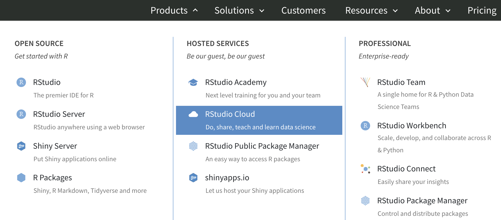
```


---
## Install RStudio Cloud
.lab[
- *Step 2*: Click **GET STARTED FOR FREE**. 
- *Step 3*: **Free > Sign Up**. Sign up using your Marquette email address or the one you prefer.
]
```{r echo=FALSE, out.width="60%", fig.align="center"}
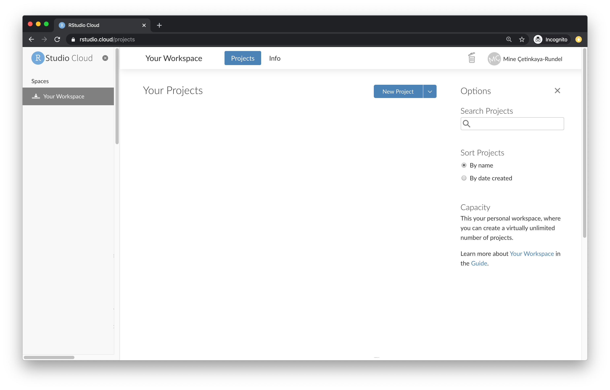
```


---
## New Projects

In RStudio Cloud, click **New Project > New RStudio Project**, then you are all set!

.pull-left-wide[
```{r echo=FALSE, out.width="80%", fig.align="center"}
knitr::include_graphics("img/new-project-cloud.png")
```
]

.pull-right-narrow[
**New RStudio Project**  
**New Project from Git Repo**
```{r echo=FALSE, out.width="100%", fig.align="center"}
knitr::include_graphics("img/new-project-option.png")
```
]

- We will talk about Git/GitHub shortly.


---
exclude:true
## New Projects

.pull-left[
A new project in RStudio Cloud
```{r echo=FALSE, out.width="110%", fig.align="center"}
knitr::include_graphics("img/new-project-cloud.png")
```
]
.pull-right[
is a new project in RStudio IDE
```{r echo=FALSE, out.width="90%", fig.align="center"}
knitr::include_graphics("img/new-project-local.png")
```
]

.alert[
If you use RStudio, use projects! Trust me, you won’t regret it. Find out more on [R for Data Science](https://r4ds.had.co.nz/workflow-projects.html).
]


---
exclude:true
## New Projects from Git

.pull-left[
A new project from Git repo in RStudio Cloud
```{r echo=FALSE, out.width="110%", fig.align="center"}
knitr::include_graphics("img/new-project-git-cloud.png")
```
]
.pull-right[
is the same as a new project from Git in RStudio IDE
```{r echo=FALSE, out.width="90%", fig.align="center"}
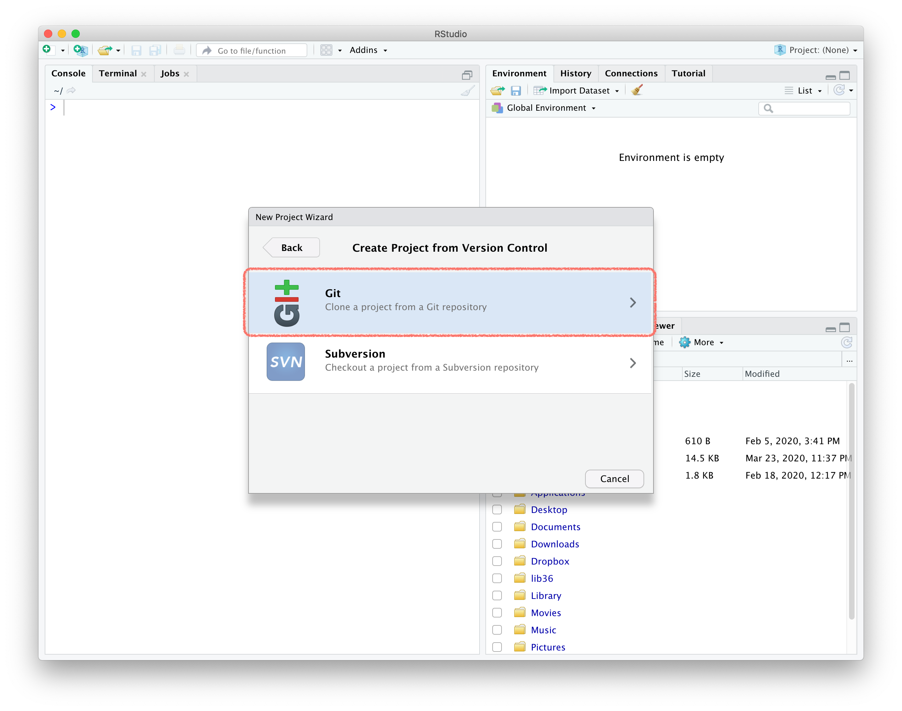
```
]

Both options `clone` a Git repo. 

We will talk more about using Git/GitHub in RStudio next week.


---
exclude:true
## Workspaces

- When you create an account on RStudio Cloud you get a **workspace** of your own.
- You can add a new workspace (click **+ New Space** in sidebar) and control its permissions.
```{r echo=FALSE, out.width="70%", fig.align="center"}
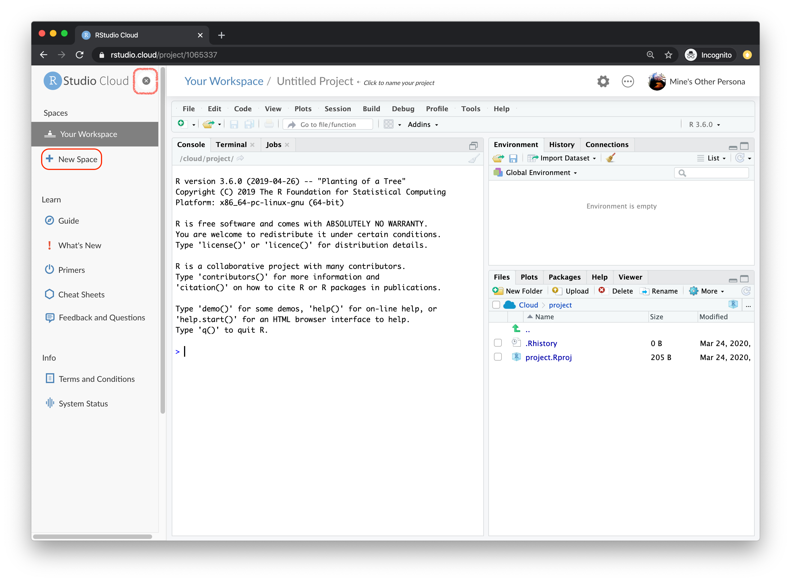
```


---
## First R Code in RStudio Cloud!
- Give your project a nice name (click Untitled Project), **math-4720** for example.
- First R code: `"Hello WoRld!"` or `2 + 4` after `>` in the **Console** pane.
- Change the editor theme: **Tools > Global Options > Appearance**

```{r echo=FALSE, out.width="80%", fig.align="center"}
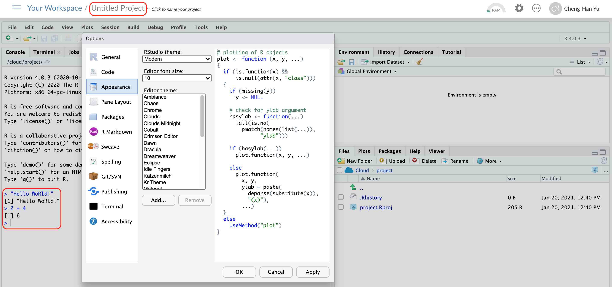
```


---
exclude:true
## More Tips

- Read the [RStudio Cloud guide](https://rstudio.cloud/learn/guide)

```{r echo=FALSE, out.width="80%", fig.align="center"}
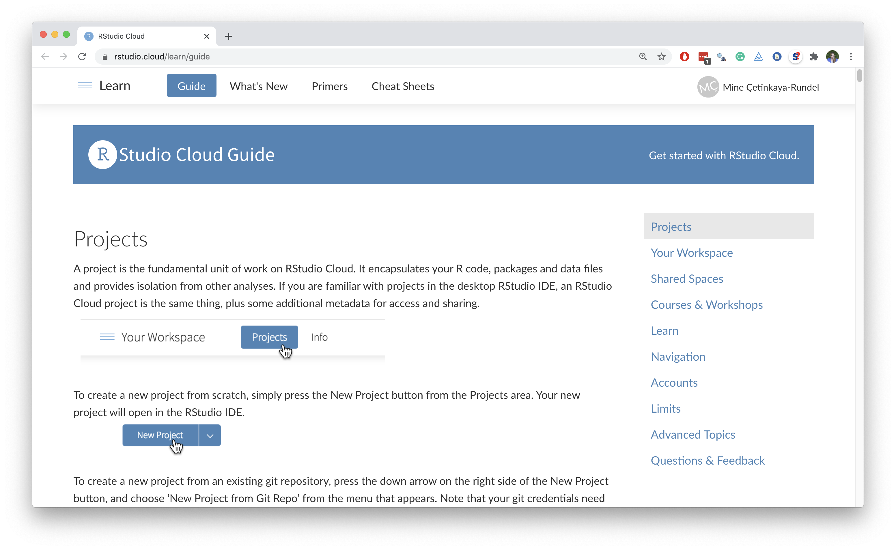
```


---
class: center, middle, inverse

# Working in RStudio/RStudio Cloud

---
## RStudio Panes

```{r rstudio-panes, echo=FALSE, fig.cap="RStudio 4 panes", out.width="85%",fig.align='center'}
knitr::include_graphics("./img/rstudio_panes.png")
```


---
## R Script
- A R script is a **.R** file that contains R code.
<!-- - You type code into the Console if the code is short or you want to do some quick calculations or analysis. -->
<!-- - Try to write your code in R scripts in the source pane, so the code can be saved and reused.  -->
- To create a R script, go to **File > New > R Script**, or click the green-plus icon on the topleft corner, and select R Script.

```{r run1, echo=FALSE, out.width="100%",fig.align='center'}
knitr::include_graphics("./img/script.png")
```


---
## Run Code
- <span style="color:blue"> **Run** </span>: run the **current line** or **selection of code**. 
- <span style="color:blue"> **Icon right to the Run** </span>: re-run the **previous** selected code. 

<!-- - <span style="color:blue"> **Source with Echo** </span>: run **all** the code in the R script *and show output* -->
<!--   + `option+ ctrl + enter` (Windows) or `shift + cmd + enter` (Mac) -->
```{r run2, echo=FALSE, out.width="100%",fig.align='center'}
knitr::include_graphics("./img/script.png")
```
<!-- {height=400px width=500px} -->


---
## Environment Tab
- The (global) environment is our workspace (*NOT* the RStudio Cloud workspace).
- Anything created or imported into the current R session is stored in our environment and shown in the **Environment** tab.
- After we run the R script, objects stored in the environment are
  + Data set `mtcars`
  + Object `x` storing integer values 1 to 10.
  + Object `y` storing three numeric values 3, 5, 9.

```{r env, echo=FALSE, out.width="96%",fig.align='center'}
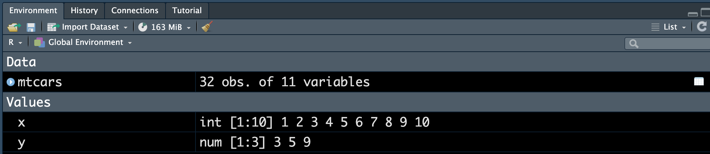
```
<!-- {height=450px width=900px} -->


---
exclude:true
## History Tab
- The **History** tab keeps a record of all previous commands.
  + <span style="color:blue">**save icon**</span>: save all history to a file
  + <span style="color:blue">**To Console**</span>: send the selected commands to the R console.
  + <span style="color:blue">**To Source** </span>: inserted the selected commands into the current R script.

```{r history, echo=FALSE, out.width="96%",fig.align='center'}
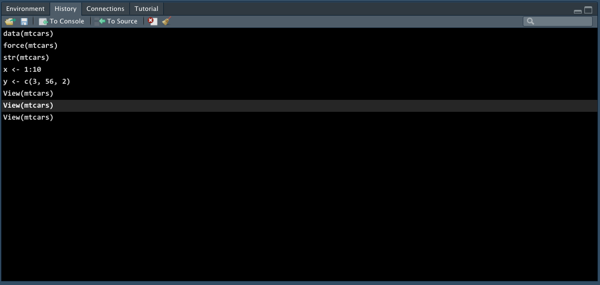
```
<!-- {height=450px width=900px} -->

---
exclude:true
## History Tab
- The **History** tab keeps a record of all previous commands.
  + <span style="color:blue">**save icon**</span>: save all history to a file
  + <span style="color:blue">**To Console**</span>: send the selected commands to the R console.
  + <span style="color:blue">**To Source** </span>: inserted the selected commands into the current R script.

.tip[
In R Console pane, use `r emo::ji('arrow_up')`  to show the previous commands.
]


---
exclude:true
## R Packages `r emo::ji('package')`
- R **packages** are a collection of reusable R functions, code and data. 
- When we start a R session, only built-in packages like `base`, `stats`, etc are available.
- Installing a package is an easy way to access to others data and functions.


---
exclude:true

background-image: url(./img/hex_laptop.jpeg)
background-position: 50% 50%
background-size: cover
class: center, bottom

###### ohi-science.org/news/takeaways-from-rstudioconf


---
exclude:true
## Installing R Packages `r emo::ji('package')`
.pull-left[
- To install a package, for example, the [`ggplot2` package](https://ggplot2.tidyverse.org/), we use the command
```{r package, echo=5, eval=FALSE}
# install.packages("car", repos = "http://cran.us.r-project.org")
r = getOption("repos")
r["CRAN"] = "http://cran.us.r-project.org"
options(repos = r)
install.packages("ggplot2")
# install.packages("car")
```
- **Packages > Install**
]


.pull-right[
<p align="center">
  
</p>
]


---
exclude:true
## Loading R Packages `r emo::ji('package')`
.pull-left[
- To use any function or data in **ggplot2**, we write `ggplot2::` followed by the name of the function or data.

```{r eval=FALSE}
ggplot2::ggplot(ggplot2::mpg, 
                ggplot2::aes(
                    x = displ, 
                    y = hwy, 
                    colour = class)
                ) + 
    ggplot2::geom_point()
```

.question[
What happened when you run
```{r, eval=FALSE}
ggplot(mpg, aes(x = displ, 
                y = hwy, 
                colour = class)) + 
    geom_point()
```
]
]

.pull-right[
- We can load the package into our R session using `library()`. 
- **With library(ggplot2)**, R knows the function and data are from the ggplot2 package.
```{r, eval=FALSE}
library(ggplot2)
ggplot(mpg, aes(x = displ, 
                y = hwy, 
                colour = class)) + 
    geom_point()
```
]


---
exclude:true
## Installing and Loading R Packages
- Now we are able to use the functions and data stored in the **ggplot2** package. For example, the data set `USPop` is stored in the `carData` package, and we can simply type its name to see the data:

```{r mpg}
mpg
```


---
exclude:true
## Package Tab
- The package tab shows the list of packages installed in your computer.
- If checked, the package is loaded into R. If not, any command related to that package won't work unless you call the package explicitly, for example `carData::USPop`.
- To load a package you want, simply check the box of that package (same as `library()`).
- You can also install other packages by clicking on the **Install** icon.


---
## Help
- Don't know how a function works or what a data set is about `r emo::ji('question')` 
- `r emo::ji('point_right')` Simply type `?` followed by the data name or function name like
```{r help}
?mean
?mtcars
```

- A document will show up in the **Help** tab, teaching you how to use the function or explaining the data set.

--

.question[
What does the function `mean()` do?
]


---
exclude:true
## Running R Script
.lab[
- Install and load R package **ggplot2** into your RStudio.
- Create a new R script file named `lab01-run-script.R` in your project **lab-yourname**, then copy the following code into the script, and save it.
```{r, eval=FALSE}
x <- 4
y <- 3
ggplot(data = mpg) + 
  geom_point(mapping = aes(x = displ, y = hwy))
```
- Source the script. What happened?
- Change `4` to `12` and `3` to `20`. Hit Run line by line. What happened?
- Use `?mpg` to see what `displ` and `hwy` mean, and use `?ggplot` and `?geom_point` to see more on creating a ggplot.
]


---
## Resources
In RStudio Cloud sidebar,
- R and RStudio [**Cheat Sheats**](https://rstudio.cloud/learn/cheat-sheets)
- Learn more RStudio and statistical data science: [**Primers**](https://rstudio.cloud/learn/primers)
.center[
```{r echo=FALSE, out.width="70%"}
knitr::include_graphics("img/primers.png")
```
]


---
.your-turn[
- What is the size of `mtcars` data? 
- Type `mtcars` and hit Enter in the Console to see the data set.
- Discuss data type of each variable.
- Type `mtcars[, 1]` and hit Enter in the Console. What do you see?
]


---
class: center, middle, inverse

# Install R and RStudio Locally to Your Computer

---
## Install R -- Step 1
- Go to <https://cloud.r-project.org>
- Click Download R for [your operating system]

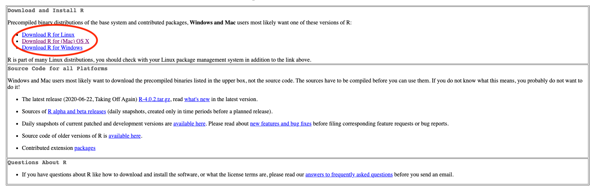


---
## Install R -- Step 2

- If you are a Mac user, you should see the page as below. You are recommended to download and install the *latest* version of R (now **R-4.2.1 (Funny-Looking Kid)**), if your OS version allows to do so. Otherwise, choose a previous version, R-3.6.3. 
- If you are a Windows user, after clicking Download R for Windows, please choose **base** version, then click **Download R-4.2.1 for Windows**. 
<!-- - If you are a Linux user, after clicking Download R for Linux, please choose the distribution you are using, ubuntu for example, and then follow the instruction to complete the installation. -->


---
## Install R -- Step 3
- Once you install R successfully, when you open R, you should be able to see the following R terminal or console:

.pull-left[
**Windows**

]
.pull-right[
**Mac**
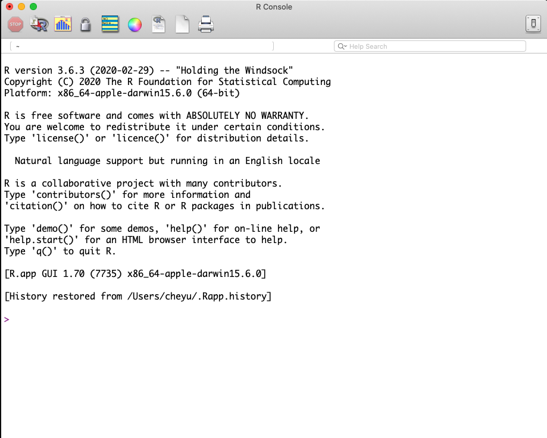
]

---
## Welcome to the R World! 
- Now you are ready to use R to do statistical computation. 
- You can use R like a calculator. After typing your formula, simply hit Enter, you get the answer! For example,

```{r calculator}
1 + 2
30 * 42 / 3
log(5) - exp(3) * sqrt(7)
```

<!-- --- -->
<!-- ## Install RStudio -->

<!-- - [RStudio](https://rstudio.com/) is an integrated development environment (IDE) mainly for R.  -->
<!-- - It provides lots of useful features that help us do statistical analysis and data science projects more efficiently.  -->


---
## Install RStudio -- Step 1
- In the [RStudio website](https://www.rstudio.com/), please choose **Products > RStudio** as shown below.


---
## Install RStudio -- Step 2
- Choose **RStudio Desktop** and click **DOWNLOAD RSTUDIO DESKTOP** for the *free* version.
```{r echo=FALSE, out.width="67%"}
knitr::include_graphics("./img/rstudio_desktop.png")
```
<!-- {height=500px width=700px} -->


---
## Install RStudio -- Step 3
- Click **DOWNLOAD RSTUDIO FOR [YOUR SYSTEM]**. Then follow standard installation steps, you should get the software soon. 
- Be careful that R should be installed successfully in your computer before you download and install RStudio.
- **[Note]**: The latest version of RStudio is **2022.07.1+554**.


```{r echo=FALSE, out.width="57%"}
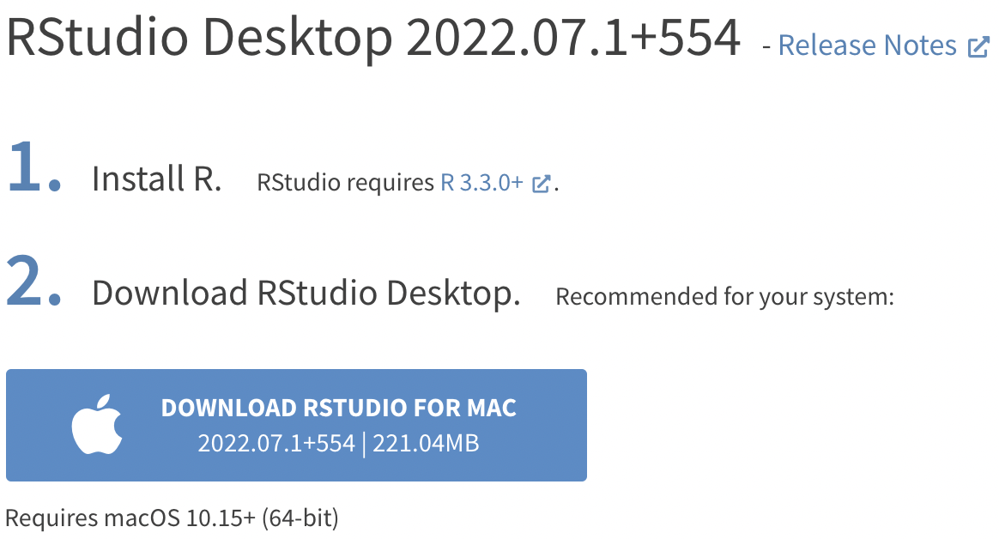
```
<!--  -->


---
## RStudio Screen
- When you open RStudio, you should see something similar to the figure below.
- If you do, congratulations! You are able to do every statistical computation in R using RStudio locally in your computer. 
```{r echo=FALSE, out.width="78%", fig.align="center"}
knitr::include_graphics("./img/rstudio_ubuntu.png")
```

