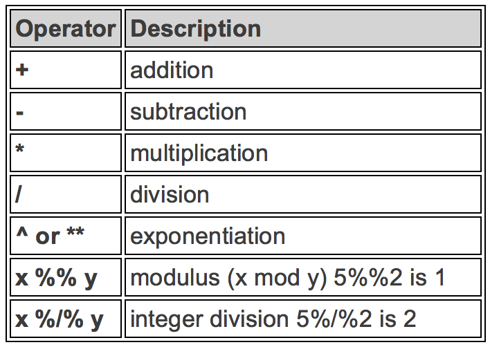
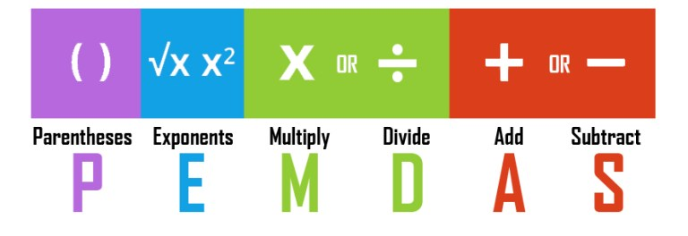
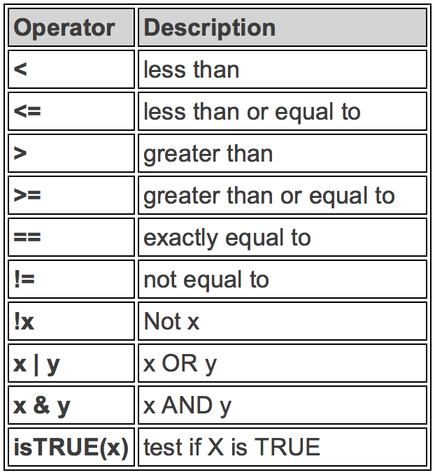
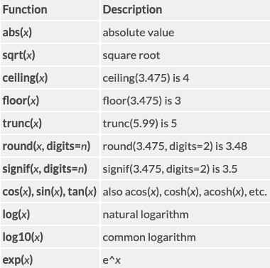
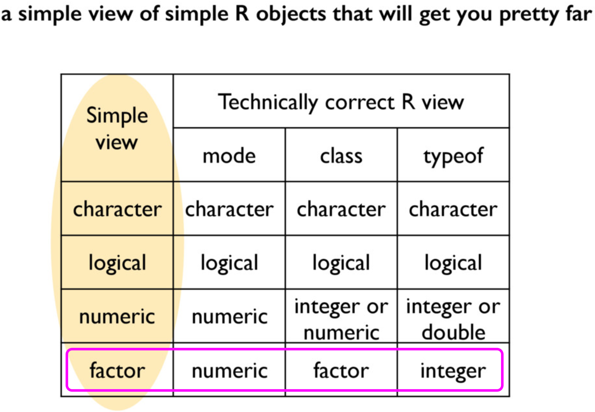
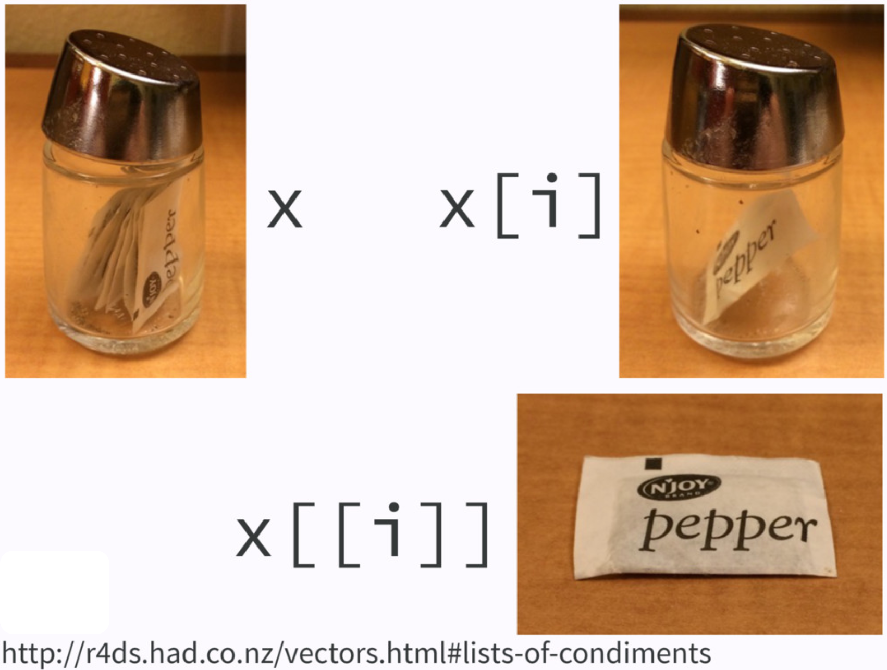

```{r child = "./setup.Rmd"}
```

```{r packages, echo=FALSE, message=FALSE, warning=FALSE}
library(tidyverse)
library(fontawesome)
library(fields)
library(knitr)
```


```{r, echo=FALSE, message=FALSE, warning=FALSE}
knitr::opts_knit$set(global.par = TRUE)
```


```{r, echo=FALSE, message=FALSE, warning=FALSE}
par(mar = c(4, 4, 2, 1))
```

## R is a Calculator - Arithmetic Operators

```{r arithmetic-operator, echo=FALSE, out.width="70%", fig.align='center'}

```


---


## R is a Calculator - Examples

```{r, arithmetic-example}
2 + 3 * 5 + 4
2 + 3 * (5 + 4)
```


--

- We have to do the operation in the parenthesis first

```{r, echo=FALSE, out.width="80%", fig.align='center'}

```


---


## R Does Comparisons - Logical Operators

```{r logical-operator, echo=FALSE, out.width="40%", fig.align='center'}

```


---
## R Can Do Comparisons - Examples

.pull-left[
```{r, logical-example}
5 <= 5
5 <= 4
# Is 5 is NOT equal to 5? FALSE
5 != 5
```
]


--

.pull-right[
```{r}
## Is TRUE not equal to FALSE?
TRUE != FALSE
## Is not TRUE equal to FALSE?
!TRUE == FALSE
## TRUE if either one is TRUE or both are TRUE
TRUE | FALSE
```
]

--

.question[
What does `TRUE & FALSE` return?
]


---
exclude:true
## R Can Do Comparisons - Examples Cont'd

```{r}
## When doing AND/OR comparisons, all nonzero values are treated as TRUE and 0 as FALSE.
1 | 0
2 | 0
0 | 0
0 & 0
1 & 0
1 & 1
```


---
exclude:true
## Truth table

```{r boolean, echo=FALSE, out.width="100%", fig.align='center'}
knitr::include_graphics("./img/boolean.png")
```


---

## Build-in Functions

- R has lots of built-in functions, especially for mathematics, probability and statistics.

```{r numeric-fcns, echo=FALSE, out.width="45%", fig.align='center'}

```


---


## Build-in Functions - Examples

.pull-left[
```{r builtin-fcns}
sqrt(144)
exp(1)  ## Euler's number
sin(pi/2)
abs(-7)
```
]

--

.pull-right[
```{r}
factorial(5)
## without specifying base value
## it is a natural log with base e
log(100)
## log function and we specify base = 2
log(100, base = 10)
```
]


---
## Commenting
.question[
You've seen comments a lot! How do we write a comment in R?
]

--
- Use `#` to add a comment so that the text after `#` is not read as an R command.
- Writing (good) comments is highly recommended: help readers and more importantly yourself understand what the code is doing.
- Comments should explain the **why**, not the what.


---
.pull-left[
```{r, echo=FALSE, out.width="100%", fig.align='center', fig.cap="https://www.reddit.com/r/ProgrammerHumor/comments/8w54mx/code_comments_be_like/"}
knitr::include_graphics("./img/cat_comment.png")
```
]

.pull-right[
```{r, echo=FALSE, out.width="100%", fig.align='center'}
knitr::include_graphics("./img/stop_comment.png")
```
]


---

## Objects and Funtions in R
> <span style="color:red"> Everything that **exists** is an **object**. </span>  
<span style="color:red"> Everything that **happens** is a **function call**. </span>  
  -- *[John Chambers](https://bit.ly/3yJJGrC), the creator of the S programming language*.

- We have made lots of things happened!
- Even arithmetic and logical operators are functions!
```{r}
`+`(x = 2, y = 3)
`&`(TRUE, FALSE)
```


---
## Creating Variables

- A variable stores a value that can be changed according to our need.
- Use `<-` operator to **assign** a value to the variable. (Highly recommended`r emo::ji('+1')`)

```{r assignment}
x <- 5  ## we create an object, value 5, and call it x, which is a variable.
x  ## type the variable name to see the value stored in the object x
```

<!-- - Can also use `=` symbol to do assignment. (`r emo::ji('x')` Does not work in some situations) -->

```{r variable}
(x <- x + 6)  # We can reassign any value to the variable we created
x == 5  # We can perform any operations on variables
log(x) # Variables can also be used in any built-in functions
```


---
exclude:false
background-image: url("./img/r_assign_syntax.jpg")
background-position: 50% 50%
background-size: contain
class: center, bottom, inverse

[Why do we use arrow as an assignment operator](https://colinfay.me/r-assignment/)


---


## Bad Naming
- `r emo::ji('x')` Unless you have a very good reason, don't create a variable whose name is the same as any R [*built-in constant*](https://stat.ethz.ch/R-manual/R-devel/library/base/html/Constants.html) or function!
- `r emo::ji('worried')` It causes lots of confusion when your code is long and when others read your code.

```{r bad-naming}
## THIS IS BAD CODING! DON'T DO THIS!
pi  ## pi is a built-in constant
(pi <- 20)
abs ## abs is a built-in function
(abs <- abs(pi))
```


---
class: center, middle, inverse

# Object Types


---
exclude:true
```{r simpleview, echo=FALSE, out.width="80%", fig.align='center',fig.cap="https://speakerdeck.com/jennybc/simple-view-of-r-objects?slide=3"}

```


---

## Types of Variables
- Use **`typeof()`** to check which type a variable belongs to.
- Common types include **`character`**, **`double`**, **`integer`** and **`logical`**.
- Check if it’s of a specific type: **`is.character()`**, **`is.double()`**, **`is.integer()`**, **`is.logical()`**.
<!-- - To specify an integer, we type a number followed by letter `L`.  -->

.pull-left[
```{r type}
typeof(5)
typeof(5L)
typeof("I_love_stat!")
```
]
.pull-right[
```{r}
typeof(1 > 3)
is.double(5L)
```
]


---
## Variable Types in R and in Statistics
- Type `character` and `logical` correspond to **categorical** variables.
- Type `logical` is a special type of categorical variables that has only two categories (**binary**). 
<!-- - We usually call it a **binary** variable. -->
- Type `double` and `integer` correspond to **numerical** variables. (an exception later)
  + Type `double` is for **continuous** variables
  + Type `integer` is for **discrete** variables.


---


class: center, middle, inverse

# R Data Structures

## Vector
## Factor
## List
## Matrix
## Data Frame


---


## (Atomic) Vector
- To create a vector, use `c()`, short for *concatenate* or *combine*.
- **All** elements of a vector must be of the **same type**. 

.pull-left[
```{r vector}
(dbl_vec <- c(1, 2.5, 4.5)) 
(int_vec <- c(1L, 6L, 10L))
## TRUE and FALSE can be written as T and F
(log_vec <- c(TRUE, FALSE, F))  
(chr_vec <- c("pretty", "girl"))
```
]

.pull-right[
```{r}
## check how many elements in a vector
length(dbl_vec) 
## check a compact description of 
## any R data structure
str(dbl_vec) 
```
]

---
exclude:true
## Sequence of Numbers
- Use `:` to create a *sequence of integers*.
- A general way to create a sequence of numbers is to use `seq()` function.
- Vectors created by `seq()` are of type `double`.

```{r seq}
## use `:` to create a sequence of integers
(vec <- 1:10) 
typeof(vec)

# a sequence of numbers from 1 to 10 with increment 2
(seq_vec <- seq(from = 1, to = 10, by = 2))
typeof(seq_vec)
```

```{r, echo=FALSE, eval=FALSE}
# a sequence of numbers from 1 to 10
# with 12 elements
seq(from = 1, to = 10, length.out = 12)
```

---


## Operations on Vectors
- We can do any operations on vectors as we do on a *scalar* variable (vector of length 1).

.pull-left[
```{r vector-arithmetic}
# Create two vectors
v1 <- c(3, 8)
v2 <- c(4, 100) 

## All operations happen element-wisely
# Vector addition
v1 + v2
# Vector subtraction
v1 - v2
```
]
.pull-right[
```{r}
# Vector multiplication
v1 * v2
# Vector division
v1 / v2
sqrt(v2)
```
]


---

## Recycling of Vectors
- If we apply arithmetic operations to two vectors of **unequal** length, the elements of the shorter vector will be **recycled** to complete the operations.
<!-- - Beware of recycling! -->
<!-- - The concept of *recycling* helps us write more concise code. -->

```{r recycle}
v1 <- c(3, 8, 4, 5)
# The following 2 operations are the same
v1 * 2
v1 * c(2, 2, 2, 2)
v3 <- c(4, 11)
v1 + v3  ## v3 becomes c(4, 11, 4, 11) when doing the operation
```

 
---


## Subsetting Vectors
- To extract element(s) in a vector, use a pair of brackets `[]` with element indexing.
- The indexing **starts with 1**.

.pull-left[
```{r subsetting}
v1
v2
## The first element
v1[1] 
## The second element
v2[2]  
```
]
.pull-right[
```{r}
v1[c(1, 3)]
## extract all except a few elements
## put a negative sign before the vector of 
## indices
v1[-c(2, 3)] 
```

```{r, echo = FALSE, eval=FALSE}
x <- c(1, 5, 2, 6)
names(x) <- letters[1:4]
x["c"]
```
]


---


## Factor
- A vector of type `factor` can be *ordered in a meaningful way.* 
- Create a factor by `factor()`. It is a type of **integer**, not **character**. `r emo::ji('astonished')`  `r emo::ji('roll_eyes')` 

```{r factor, echo=-1}
## Create a factor from a character vector using function factor()
fac <- factor(c("med", "high", "low"))
typeof(fac)
levels(fac) ## Each level represents an integer, ordered from the vector alphabetically.
str(fac)  ## The integers show the level each element in vector fac belongs to.
order_fac <- factor(c("med", "high", "low"), levels = c("low", "med", "high"))
str(order_fac)
```


---


## List (Generic Vectors)
- Lists are different from vectors: Elements can be of **any type**, including lists.
- Construct a list by using **`list()`** instead of `c()`.

.pull-left[
```{r list}
## a list of 3 elements of different types
x_lst <- list(idx = 1:3, 
              "a", 
              c(TRUE, FALSE))
x_lst
```
]

.pull-right[
```{r}
str(x_lst)
names(x_lst)
length(x_lst)
```
]

---


## Subsetting a List

```{r}
x_lst <- list(idx = 1:3, 
              "a", 
              c(TRUE, FALSE))
```

.pull-left[
<br>
**Return an <span style="color:red"> element </span> of a list**

```{r}
## subset by name (a vector)
x_lst$idx  
## subset by indexing (a vector)
x_lst[[1]]  
typeof(x_lst$idx)
```
]

--

.pull-right[
<br>
**Return a <span style="color:red"> sub-list </span> of a list**


```{r}
## subset by name (still a list)
x_lst["idx"]  
## subset by indexing (still a list)
x_lst[1]  
typeof(x_lst["idx"])
```
]


---
```{r list_condiment, echo=FALSE, out.width="80%", fig.align='center'}

```


---

> If list `x` is a train carrying objects, then `x[[5]]` is
> the object in car 5; `x[4:6]` is a train of cars 4-6.
>
> --- \@RLangTip, <https://twitter.com/RLangTip/status/268375867468681216>

```{r, echo=FALSE, out.width="100%", fig.align='center'}
knitr::include_graphics("https://raw.githubusercontent.com/hadley/adv-r/master/diagrams/subsetting/train.png")
```

```{r, echo=FALSE, out.width="100%", fig.align='center'}
knitr::include_graphics("https://raw.githubusercontent.com/hadley/adv-r/master/diagrams/subsetting/train-single.png")
```


---
## Matrix

- A matrix is a *two-dimensional analog of a vector*.
- Use command `matrix()` to create a matrix.

```{r matrix, tidy=FALSE}
## Create a 3 by 2 matrix called mat
(mat <- matrix(data = 1:6, nrow = 3, ncol = 2)) 
dim(mat); nrow(mat); ncol(mat)
```


---
exclude:true
## Row and Column Names
```{r}
mat
## assign row names and column names
rownames(mat) <- c("A", "B", "C")
colnames(mat) <- c("a", "b")
mat
rownames(mat)
colnames(mat)
```


---


## Subsetting a Matrix
- To extract a sub-matrix, use the same indexing approach as vectors on rows and columns.
- Use comma `,` to separate row and column index.
- `mat[2, 2]` extracts the element of the second row and second column.

.pull-left[
```{r matrix-indexing}
mat
## all rows and 2nd column
## leave row index blank
## specify 2 in coln index
mat[, 2]
```
]
.pull-right[
```{r}
## 2nd row and all columns
mat[2, ] 
## The 1st and 3rd rows
mat[c(1, 3), ] 
```
]


---
exclude:true
## One-row and One-column Matrix
- When a single row or single column is extracted, the one-row or one-column matrix is reduced to a vector.
- To keep its matrix property, we use `drop = FALSE` when subsetting a matrix.

.pull-left[
```{r reduce-vector}
(one_col_vec <- mat[, 2])
class(one_col_vec)
```
]

.pull-right[
```{r}
(one_col_mat <- mat[, 2, 
                    drop = FALSE]) #<<
class(one_col_mat)
```
]
---


## Binding Matrices
- We can generalize `c()` used in vectors to `cbind()` (binding matrices by adding columns) and `rbind()` (binding matrices by adding rows) for matrices.
- When matrices are combined by columns (rows), they should have the same number of rows (columns).

.pull-left[
```{r matrix-bind}
mat
mat_c <- matrix(data = c(7, 0, 0, 8, 2, 6), 
                nrow = 3, ncol = 2)
## should have the same number of rows
cbind(mat, mat_c)  
```
]

.pull-right[
```{r}
mat_r <- matrix(data = 1:4, 
                nrow = 2, 
                ncol = 2)
## should have the same number of columns
rbind(mat, mat_r)  
```
]


---
## Data frame: The Most Common Way of Storing Data

- A data frame is of type **list** of *equal-length* vectors, having a *2-dimensional* structure.
- More general than matrix: Different columns can have different types.
- To create a data frame, use `data.frame()` that takes *named* vectors as input.

.pull-left[
```{r dataframe}
## data frame w/ an dbl column named  
## and char column named grade.
(df <- data.frame(age = c(19,21,40), 
                  gender = c("m","f","m")))

## a data frame has a list structure
str(df)  
```
]

--

.pull-right[
```{r}
## must set column names
## or they are ugly and non-recognizable
data.frame(c(19, 21, 40), c("m","f", "m")) 
```
]


---
## Properties of Data Frames
- Data frame has properties of matrix and list.

.pull-left[
```{r df-fcns, echo=1:5}
names(df)  ## df as a list
colnames(df)  ## df as a matrix
length(df) ## df as a list
ncol(df) ## df as a matrix
dim(df) ## df as a matrix

# typeof(df)
# class(df)
```
]
.pull-right[
```{r}
## rbind() and cbind() can be used on df

df_r <- data.frame(age = 10, 
                   gender = "f")
rbind(df, df_r)

df_c <- 
    data.frame(col = c("red","blue","gray"))
(df_new <- cbind(df, df_c))
```
]


---
## Subsetting a Data Frame
- When we subset data frames, we can use either list or matrix subsetting methods.

.pull-left[
```{r df-subset}
df_new
## Subset rows
df_new[c(1, 3), ]
## select the row where age == 21
df_new[df_new$age == 21, ]
```
]

.pull-right[
```{r, echo=1:6, eval=1:6}
## Subset columns
## like a list
df_new$age
df_new[c("age", "gender")] 
## like a matrix
df_new[, c("age", "gender")]
str(df["age"])  ## a data frame with one column
str(df[, "age"])  ## becomes a vector by default
```
]


---
.your-turn[
- Create a vector object called `x` that has 5 elements 3, 6, 2, 9, 14.
- Compute the average of elements of `x`.
- Subset the `mtcars` data set by selecting variables `mpg` and `disp`.
- Select the cars (rows) in `mtcars` that have 4 cylinders.
]


---
exclude:true
## Object Type Summary
.lab[
- Go to your **lab-yourname** project under our course workspace **2021-spring-math-3570** in RStudio Cloud.
- Create a R script named **lab03-objecttype.R**.
- In the R script, create R objects vector, factor, list, matrix and data frame.
- Examine `typeof()`, `mode()` and `class()` of those objects.
- Create a list to store your results.
]


<!-- - Vectors' elements named -->
<!-- - Vectors coercion -->
<!-- str(df["var1"])  ## a data frame with one column -->
<!-- str(df[, "var1"])  ## becomes a vector by default -->


<!-- --- -->
<!-- ## Readings -->

<!-- - r4ds: [Vectors](https://r4ds.had.co.nz/vectors.html) -->
<!-- - ids: [R basics](https://rafalab.github.io/dsbook/r-basics.html) -->

---
exclude:true
```{r, echo=FALSE, eval=TRUE}
vector_type <- c(type = typeof(v1), mode = mode(v1), class = class(v1))
factor_type <- c(type = typeof(fac), mode = mode(fac), class = class(fac))
list_type <- c(type = typeof(x_lst), mode = mode(x_lst), class = class(x_lst))
matrix_type <- c(type = typeof(mat), mode = mode(mat), class = class(mat))
df_type <- c(type = typeof(df), mode = mode(df), class = class(df))
list(vector_type = vector_type,
     factor_type = factor_type,
     list_type = list_type,
     matrix_type = matrix_type,
     df_type = df_type)
```

