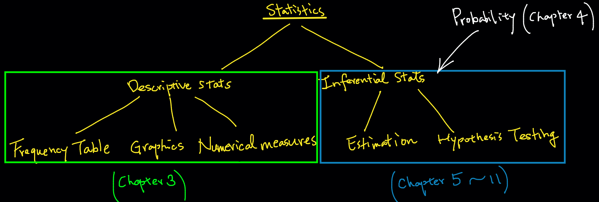
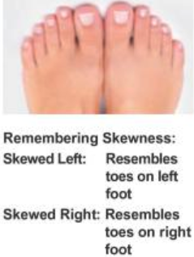
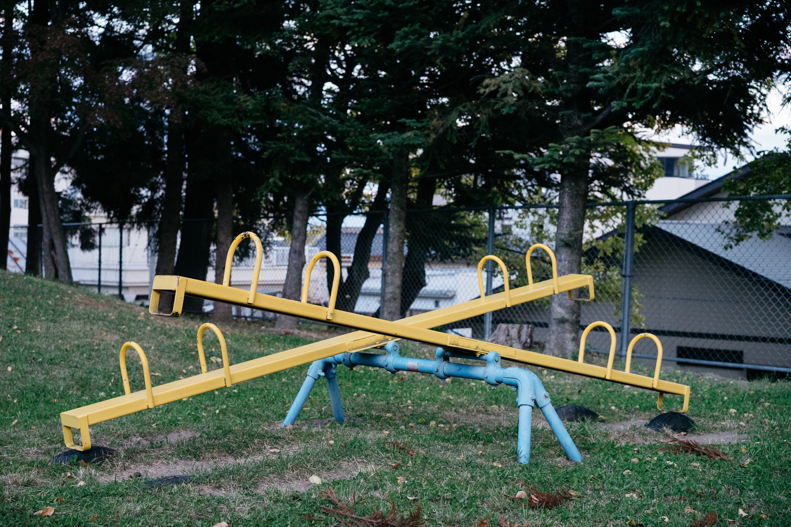
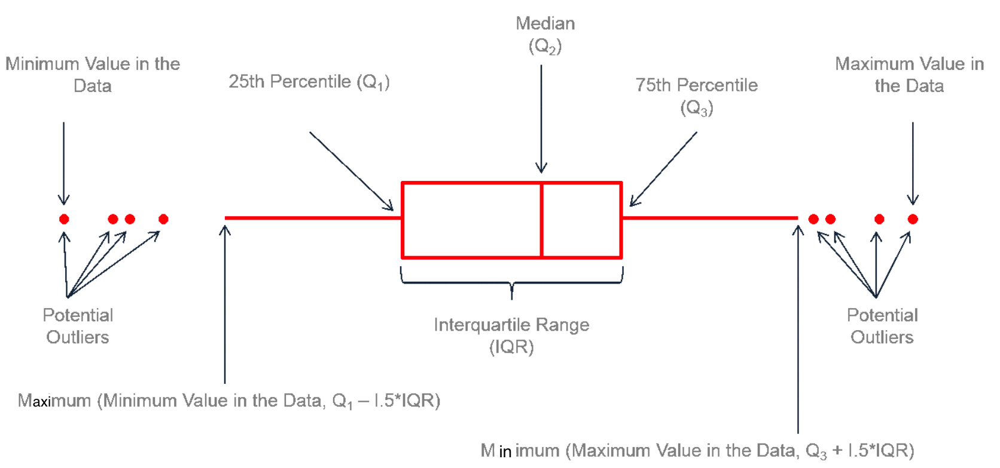

```{r child = "./setup.Rmd", purl=FALSE}

```


```{r packages, echo=FALSE, message=FALSE, warning=FALSE, purl=FALSE}
library(tidyverse)
library(fontawesome)
library(fields)
library(microbenchmark)
library(openintro)
```

```{r, echo=FALSE, message=FALSE, warning=FALSE, purl=FALSE}
library(knitr)
knitr::opts_knit$set(global.par = TRUE)
# options(reindent.spaces = 4)
```

```{r, echo=FALSE, message=FALSE, warning=FALSE, purl=FALSE}
par(mar = c(4, 4, 2, 1))
```


background-image: url(./img/data_description.jpg)
background-position: 50% 50%
background-size: cover
class: center, middle, inverse

# Descriptive Statistics
## Data Summary in Tables, Graphics and Numerical Values

---
## Descriptive Statistics (Data Summary)
- Before doing inferential statistics, let's first learn to understand our data by describing or summarizing it using a **table**, **graph**, or some important **values**, so that appropriate methods can be performed for better inference results.

```{r, echo=FALSE, out.width="100%",fig.align='center', eval=FALSE, purl=FALSE}

```

```{r data_type, cache=TRUE, echo=FALSE, out.width="70%", purl=FALSE}
par(mar = c(0,0,0,0))
plot(c(-0.15, 1.15), c(0, 0.9), type = 'n', axes = FALSE)

text(0.6, 0.85, 'Statistics', font = 2, cex = 1.2)
rect(xleft = 0.4, ybottom = 0.8, xright = 0.8, ytop = 0.9)

text(0.25, 0.55, 'Descriptive Statistics', font = 2, cex = 1.2, col = "red")
rect(-0.05, 0.5, 0.55, 0.6)
arrows(x0 = 0.45, y0 = 0.78, x1 = 0.34, y1 = 0.62, length = 0.08)

text(0.9, 0.55, 'Inferential Statistics', font = 2, cex = 1.2, col = "red")
rect(0.6, 0.5, 1.2, 0.6)
arrows(0.76, 0.78, 0.85, 0.62, length = 0.08)


text(-0.1, 0.23, 'Frequency', font = 2, col = "blue")
text(-0.1, 0.17, 'Table', font = 2, col = "blue")
# rect(-0.15, 0.15, -0.05, 0.25)
arrows(0.1, 0.5, -0.05, 0.25, length = 0.08)
# 
text(0.2, 0.2, 'Graphics', font = 2, col = "blue")
# rect(0.11, 0.15, 0.29, 0.25)
arrows(0.2, 0.5, .2, 0.25, length = 0.08)

text(0.45, 0.23, 'Numerical', font = 2, col = "blue")
text(0.45, 0.17, 'Measures', font = 2, col = "blue")
# rect(0.31, 0.15, 0.49, 0.25)
arrows(0.35, 0.5, .45, 0.25, length = 0.08)

# 
text(0.7, 0.2, 'Estimation', font = 2, col = "blue")
# rect(0.6, 0.15, 0.8, 0.25)
arrows(0.75, 0.5, 0.7, 0.25, length = 0.08)

text(1, 0.23, 'Hypothesis', font = 2, col = "blue")
text(1, 0.17, 'Testing', font = 2, col = "blue")
# rect(0.88, 0.15, 1.12, 0.25)
arrows(0.9, 0.5, 1, 0.26, length = 0.08)


text(1.1, 0.75, 'Probability', font = 2, col = "green4")
# rect(0.9, 0.7, 1.3, 0.8)
arrows(1.05, 0.73, 0.9, 0.61, length = 0.08)
```


---
## Frequency Table for Categorical Variable
- A **frequency table (frequency distribution)** lists variable values individually for categorical data along with their corresponding number of times occurred in the data (**frequencies** or **counts**).
- Frequency table for categorical data with $n$ the number of data values:

| Category name | Frequency     | Relative Frequency |
|:-------------:|:-------------:|:------------------:|
| $C_1$         | $f_1$         | $f_1/n$ |
| $C_2$         | $f_2$         | $f_2/n$ |
| ...           | ...           | ...     |
| $C_k$         | $f_k$         | $f_k/n$ |


---
## Frequency Table for Categorical Variable
- A **frequency table (frequency distribution)** lists variable values individually for categorical variable data along with their corresponding number of times occurred in the data (**frequencies** or **counts**).
- Example: A categorical variable **color** that has three categories

| Category name | Frequency     | Relative Frequency |
|:-------------:|:-------------:|:------------------:|
|  Red   `r emo::ji('red_circle')`       | 8             | 8/50 = 0.16    |
|  Blue  `r emo::ji('blue_circle')`       | 26            | 26/50 = 0.52   |
|  Black  `r emo::ji('black_circle')`      | 16            | 16/50 = 0.32   |


---
## Categorical Frequency Table in R: `loan50` [OI]

```{r loan50, highlight.output = c(1, 5)}
# install.packages("openintro")
library(openintro)
str(loan50)
```

---
## Categorical Frequency Table in R: `homeownership`
```{r}
# 50 values (rent, mortgage, own) of categorical homeownership in loan50 data
(x <- loan50$homeownership)
## frequency table
table(x)
```

--

.question[
If we want to create a frequency table shown in definition, which R data structure we can use?
]


---
## Categorical Frequency Table in R: `homeownership`
```{r}
freq <- table(x)
rel_freq <- freq / sum(freq)
cbind(freq, rel_freq)
```


---
exclude:true
## Categorical Frequency Table in R: `homeownership`
.pull-left[
```{r}
## convert a vector to a matrix
(freq_table <- as.matrix(table(x)))
colnames(freq_table) <- "freq"
freq_table
```
.question[
How do we add relative frequency to the `freq_table`?
]
]


.pull-right[
```{r}
## create relative frequency vector
(rel_freq <- freq_table[, 1] / 50)
```


```{r}
## combine freq_table with rel_freq
(rel_freq_tbl <- cbind(freq_table, 
                       rel_freq))
```

.question[
How do we add total information at the bottom?
]
]


---
exclude:true
## Categorical Frequency Table in R: `homeownership`
.pull-left[
```{r}
# Add total information at the bottom
rbind(rel_freq_tbl, total = c(50, 1))
```
]

.pull-right[
```{r, echo=FALSE, out.width="100%", purl=FALSE}
knitr::include_graphics("./img/mortgage.jpeg")
```
]


---
## Visualizing a Frequency Table: Bar Chart

```{r, echo=-1}
par(mar = c(4, 4, 2, 1))
barplot(height = table(x), main = "Bar Chart", xlab = "Homeownership")
```


---
exclude:true
## Bar Chart for Two Categorical Variables
<!-- - We'll learn statistical inference for 2 categorical variables in Week 12. -->
- A table that summarizes two categorical variable data is called a **contingency table**.

.pull-left[
```{r, echo=FALSE, purl=FALSE}
tab <- table(loans_full_schema[, c("application_type", "homeownership")])[2:3, 3:5]
tab
tab <- t(tab)
rp <- prop.table(tab, 1)
cp <- prop.table(tab, 2)
```
]


.pull-right[
**Stacked bar chart**
```{r, echo=FALSE, out.width="100%", purl=FALSE}
ylim <- c(0, max(apply(tab, 1, sum)))
barplot(apply(tab, 1, sum), col = COL[3], ylim = ylim)
tabTemp <- tab[,1]
names(tabTemp) <- NULL
barplot(tabTemp, col = COL[1], add = TRUE, axes = FALSE)
# abline(h = 0)
legend("topright", fill = COL[c(3,1)], bty = "n", 
       legend = c("joint", "individual"))
par(las = 0)
mtext("Frequency", 2, 2.9)
```
]


---
exclude:true
## Side-by-side and Standardized Stacked Bar Chart
.pull-left[
**Side-by-side bar chart**
```{r, echo=FALSE, out.width="100%", purl=FALSE}
barplot(t(tab), ylim = ylim, col = COL[c(1, 3)], beside = TRUE)
# abline(h = 0)
legend("topright", fill = COL[c(3,1)], bty = "n",
       legend = c("joint", "individual"))
par(las = 0)
mtext("Frequency", 2, 2.9)
```
]

.pull-right[
**Standardized stacked bar chart**
```{r, echo=FALSE, out.width="100%", purl=FALSE}
barplot(apply(tab, 1, sum) / apply(tab, 1, sum), col = COL[3])
tabTemp <- rp[, 1]
names(tabTemp) <- NULL
barplot(tabTemp, col = COL[1], add = TRUE, axes = FALSE)
legend(2.65, 0.3, fill = COL[c(3,1)], 
       legend = c("joint", "individual"), bg = "white")
# abline(h = 0)
par(las = 0)
mtext("Proportion", 2, 2.9)
```
]


---
## Pie Chart
```{r, echo=2}
par(mar = c(0, 0, 1, 0))
pie(x = table(x), main = "Pie Chart")
```

---
## Frequency Distribution for Numerical Variables
- Divide the data into $k$ **non-overlapping groups of intervals** (**classes**).
- Convert the data into $k$ categories with an associated **class interval**.
- Count the number of measurements falling in a given class interval (**class frequency**).

| Class       | Class Interval  | Frequency     | Relative Frequency |
|:-----------:|:---------------:|:-------------:|:------------------:|
| $1$         | $[a_1, a_2]$    | $f_1$          | $f_1/n$ |
| $2$         | $(a_2, a_3]$    | $f_2$          | $f_2/n$ |
| ...         |    ...          | ...            | ...     |
| $k$         | $(a_k, a_{k+1}]$| $f_k$          | $f_k/n$ |

- $(a_2 - a_1) = (a_3 - a_2) = \cdots = (a_{k+1} - a_k)$. **All class widths are the same**!

---
.question[
Can our grade conversion be used for creating a frequency distribution?
]

```{r, echo=FALSE, fig.align='center', out.height="100%", purl=FALSE}
letter <- c("A", "A-", "B+", "B", "B-", "C+", "C", "C-",
                       "D+", "D", "F")
percentage <- c("[94, 100]", "[90, 94)", "[87, 90)", "[83, 87)", "[80, 83)",
                "[77, 80)", "[73, 77)", "[70, 73)", 
                "[65, 70)", "[60, 65)", "[0, 60)")
grade_dist <- data.frame(Grade = letter, Percentage = percentage)
library(kableExtra)
knitr::kable(grade_dist, longtable = TRUE, format = "html", align = 'l') %>% kable_styling(position = "center", font_size = 28)
```

---
exclude:true
## IQ Scores
.pull-left[
```{r, echo=FALSE, purl=FALSE}
library(readxl)
iq_lead_data <- read_excel("../../../triola_data_xlsx/08 - IQ and Lead.xlsx")
k <- 5
class_width <- 20
lower_limit <- 50

class_boundary <- lower_limit + 0:k * class_width
class_int <- paste(class_boundary[1:k], class_boundary[2:(k+1)], sep = " - ")

iq <- iq_lead_data[iq_lead_data$LEAD == 1, ]$`IQ FULL`
freq_info <- hist(iq, 
                  breaks = class_boundary, 
                  plot = FALSE)
freq_dist <- data.frame("Class" = as.character(1:k), 
                        "Class_Intvl" = class_int, 
                        "Freq" = freq_info$counts, 
                        "Rel_Freq" = round(freq_info$counts / length(iq), 2))
print(freq_dist, row.names = FALSE)
```
```{r}
range(iq)
```
]


.pull-right[
```{r, echo=FALSE, out.width="80%", purl=FALSE}
knitr::include_graphics("./img/iq_test.jpeg")
```
]

- All class widths are the same!
- Number of classes $k$ should not be too big or too small.
- The *lower* limit of the 1st class **should not be greater** than the *minimum* value of the data.
- The *upper* limit of the last class **should not be smaller** than the *maximum* value of the data.


---
## Interest Rate in Data `loan50` [OI]
```{r}
(int_rate <- round(loan50$interest_rate, 1))
```


```{r, echo=FALSE, out.width="50%", purl=FALSE}

```


---
## Frequency Distribution of Interest Rate

.pull-left[
```{r, echo=FALSE, purl=FALSE}
k <- 9
class_width <- 2.5
lower_limit <- 5

class_boundary <- lower_limit + 0:k * class_width
class_int <- paste(paste0(class_boundary[1:k], "%"),
                   paste0(class_boundary[2:(k+1)], "%"), 
                   sep = "-")

freq_info <- hist(int_rate, 
                  breaks = class_boundary, 
                  plot = FALSE)
freq_dist <- data.frame("Class" = as.character(1:k), 
                        "Class_Intvl" = class_int, 
                        "Freq" = freq_info$counts, 
                        "Rel_Freq" = round(freq_info$counts / length(int_rate), 2))
print(freq_dist, row.names = FALSE)
```
```{r}
range(int_rate)
```


]

.pull-right[
- All class widths are the same!
- Number of classes should not be too big or too small.
- The *lower* limit of the 1st class **should not be greater** than the *minimum* value of the data.
- The *upper* limit of the last class **should not be smaller** than the *maximum* value of the data.
]

.question[
Wonder how we choose the number of classes or the class width?
]

--
.alert[
R decide the number for us when we visualize the frequency distribution by a **histogram**.
]


---
exclude:true
## The Number of Classes
.question[
Do you wonder how we choose the number of classes or equivalently the class width?
]
.alert[
- Read [BIO] Ch 2.1 for the idea. 
- R decide the number for us when we visualize the frequency distribution by a **histogram**
]

---
## Visualizing Frequency Distribution by a Histogram
.pull-left[
**Use default breaks (no need to specify)**
```{r freq_hist, tidy=FALSE, echo=-1, out.width="90%"}
par(mar = c(4, 4, 2, 1))
hist(x = int_rate, 
     xlab = "Interest Rate (%)",
     main = "Hist. of Int. Rate (Defualt)")
```
]

--

.pull-right[
**Use customized breaks**
.midi[
```{r out.width="90%"}
class_boundary
hist(x = int_rate, 
     breaks = class_boundary, #<<
     xlab = "Interest Rate (%)",
     main = "Hist. of Int. Rate (Ours)")
```
]
]

---
exclude:true
## Too Many or Too Few Cells

.pull-left[
```{r, tidy=FALSE, out.width="100%"}
hist(x = int_rate, 
     breaks = 1,
     xlab = "Interest Rate (%)",
     main = "Hist. of Int. Rate (Too few)")
```
]

.pull-right[
```{r, tidy=FALSE, out.width="100%"}
hist(x = int_rate, 
     breaks = 100,
     xlab = "Interest Rate (%)",
     main = "Hist. of Int. Rate (Too many)")
```
]

.alert[
Check the help page `?hist` to learn more.
]


---
## Skewness

- Key characteristics of distributions includes **shape**, **center** and **spread**.
- Skewness provides a way to summarize the shape of a distribution.
```{r skewness, echo=FALSE, out.width="68%", purl=FALSE}
normal_data <- rnorm(2000)
beta_data_right <- rbeta(2000, 2, 5)
beta_data_left <- rbeta(2000, 5, 2)
normal_data_2 <- rnorm(2000, mean = 5)
par(mfrow = c(2, 2))
par(mar = c(4, 4, 2, 1))
hist(beta_data_right, main = "Skewed to the right", xlab = "x", 
     col = "blue", border = "white", breaks = 20)
hist(normal_data, main = "Symmetric, unimodal", xlab = "x", 
     col = "blue", border = "white", breaks = 20)
hist(beta_data_left, main = "Skewed to the left", xlab = "x", 
     col = "blue", border = "white", breaks = 20)
hist(c(normal_data, normal_data_2), main = "Symmetric, bimodal", xlab = "x", 
     col = "blue", border = "white", breaks = 20)
```


---
## Remembering Skewness
.pull-left[
.question[
Is the interest rate histogram left skewed or right skewed?
]

```{r, echo=FALSE, out.width="100%", purl=FALSE}
par(mar = c(4, 4, 2, 1))
par(mfrow = c(1, 1))
hist(x = int_rate, breaks = class_boundary, xlab = "Interest Rate (%)", las = 1,
     main = "Histogram of Interest Rate")
```

]


--

.pull-right[
```{r, echo=FALSE, out.width="70%",fig.align='center', fig.cap="Biostatistics for the Biological and Health Sciences p.53", purl=FALSE}

```
]


---
exclude:true
.your-turn[
For the `mtcars` data,
- Make a histogram of car horsepower. Great if you decorate it!
- Is the histogram right or left-skewed?
- Make a bar chart of the number of gears. Make it beautiful!
]

---
exclude:true
.pull-left[
```{r, out.width="100%"}
hist(mtcars$hp,
     main = "Histogram", 
     xlab = "Horsepower",
     col = 3, 
     border = 2)
```

]

.pull-right[
```{r, out.width="100%"}
barplot(table(mtcars$gear), 
        main = "Bar Chart", 
        xlab = "Number of Gears", 
        ylab = "Frequency",
        col = 2, 
        border = 4, 
        las = 1)
```
]


---
## Scatterplot for Two Numerical Variables
<!-- - We'll learn statistical methods for 2 numerical variables in Week 11. -->
- A **scatterplot** provides a case-by-case view of data for two numerical variables.

```{r, out.width="55%"}
plot(x = loan50$total_income, y = loan50$loan_amount,
     xlab = "Total income", ylab = "Loan amount",
     pch = 16, col = 4)
```


---
## Numerical Summaries of Data

.pull-left[
```{r, echo=FALSE, out.width="100%", purl=FALSE}
knitr::include_graphics("./img/number.jpeg")
```
.question[
If you need to choose one value that represents the entire data, what value would you choose?
]
]

--

.pull-right[
- **Measure of Center**: We typically use the **middle** point. (What does ``middle" mean?) 
- **Measure of Variation**: What values tell us how much variation a variable has?

]


---
## Measures of Center: Mean
- The **(arithmetic) mean or average** is adding up all of the values, then dividing by the total number of them.
- Let $x_1, x_2, \dots, x_n$ denote the measurements observed in a sample of size $n$. Then the **sample mean** is defined as $$\overline{x} = \frac{\sum_{i=1}^{n} x_i}{n} = \frac{x_1 + x_2 + \dots + x_n}{n}$$
- In the interest rate example,
$$\overline{x} = \frac{10.9\% + 9.9\% + \cdots + 6.1\%}{50} = 11.56\%$$
<!-- - The corresponding **population mean**, is denoted as $\mu$. -->

```{r}
mean(int_rate)
```

---
## Balancing Point
- Think of the mean as the **balancing point** of the distribution.

.pull-left[
```{r, echo=FALSE, cache=TRUE, out.width="100%", purl=FALSE}
par(mar = c(4, 0, 0, 0))
par(mfrow = c(1, 1))
round.to <- 1
binned <- round.to * round(int_rate / round.to)
tab <- table(binned)
cex <- 1
xlim <- c(0.9 * min(int_rate), 1.05 * max(int_rate))
plot(0,
     type = "n",
     xlab = "Interest Rate, Rounded to Nearest Percent",
     ylab = "",
     axes = FALSE,
     xlim = xlim,
     ylim = c(-1, 1.5 * max(tab)))
for (i in 1:length(tab)) {
  points(rep(as.numeric(names(tab[i])), tab[i]),
         1.5 * (1:tab[i]) - 0.4,
         pch = 19,
         col = 4,
         cex = 2 * cex)
}
abline(h = 0)
openintro::AxisInPercent(1, pretty(c(0, int_rate)))
M <- mean(int_rate)
polygon(M + c(-1, 1, 0) * 1,
        c(-1.2, -1.2, -0.1),
        border = "red",
        col = 2)
```
]


.pull-right[
```{r, echo=FALSE, out.width="100%", purl=FALSE}

```
]


---
## Measures of Center: Median
- **Median**: the *middle value* when data values are *sorted*.
- Half of the values are less than or equal to the median, and the other half are greater than it. 
- To find the median, we first sort the values.
- $n$ is **odd**: the median is located in the *exact middle* of the ordered values.
   + <span style="color:blue"> Data: (0, 2, 10, 14, 8) </span>
   + <span style="color:blue"> Sorted Data: (0, 2, <span style="color:red">8</span>, 10, 14) </span>
   + <span style="color:blue"> The median is $8$ </span>


--
- $n$ is **even**: the median is the *average of the two middle numbers*.
   + <span style="color:blue"> Data: (0, 2, 10, 14, 8, 12) </span>
   + <span style="color:blue"> Sorted Data: (0, 2, <span style="color:red">8, 10</span>, 12, 14) </span>
   + <span style="color:blue"> The median is $\frac{8 + 10}{2} = 9$ </span>
   

   
   
   
---
## Calculate Median in R
```{r median, dependson='mean', tiny=FALSE}
median(int_rate)  ## Compute the median using command median()
``` 

```{r}
## Compute the median using definition
(sort_rate <- sort(int_rate))  ## sort data
length(int_rate)  ## Check sample size is odd or even
(sort_rate[25] + sort_rate[26]) / 2  ## Verify the answer
```

--
```{r}
(int_rate[25] + int_rate[26]) / 2  ## Using un-sorted data leads to a wrong answer!!
```


---
## Measures of Center: Mode
- **Mode**: the value that occurs *most frequently*.
- For continuous numerical data, it is common to have **no** observations with the same value.
- Practical definition:  A mode is represented by a **prominent peak** in the distribution.

```{r mode, echo = 1:2}
## Create a frequency table 
(table_data <- table(int_rate))
# sort_table_data <- sort(table_data, decreasing = TRUE)
# sort_table_data
# print(paste("The mode is",names(sort_table_data)[1]))
``` 

--

```{r}
## Sort the table to find the mode that occurs most frequently
## the number that happens most frequently will be the first one
sort(table_data, decreasing = TRUE)
```


---
exclude:true
## Measures of Center: Mode
```{r}
## Sort the table to find the mode that occurs most frequently
## the number that happens most frequently will be the last one
sort(table_data)  
```


---
## Comparison of Mean, Median and Mode
- Mean is sensitive to extreme values (outliers). 
- Median/mode is more **robust** than mean.
```{r, tidy = FALSE, echo = -(1:2), highlight.output=1}
data_extreme <- int_rate; data_extreme[1] <- 90 ## replace the first 3 values with 3 large values 
## In the original data, the maximum value is 42.
data_extreme
```
```{r}
mean(data_extreme)  ## Large mean! Original mean is 11.56
median(data_extreme)  ## Median does not change!
names(sort(table(data_extreme), decreasing = TRUE))[1] ## Mode does not change too!
```

---
## Comparison of Mean, Median and Mode
- Mode is applicable for both categorical and numerical data, while median and mean work for numerical data only.
- There may be more than one mode, but there is only one median and one mean.

```{r, echo=FALSE, results='hide', out.width="100%",fig.align='center', fig.asp=0.4, purl=FALSE}
# knitr::include_graphics("./img/skew_mean_median_mode.png")
par(mfrow = c(1, 3), mar = c(0.3, 0, 2, 0))
p <- seq(0, 1, length = 100)
a <- 2; b <- 5
max_d <- max(dbeta(p, a, b))
plot(p, dbeta(p, a, b), type = 'l', axes = FALSE, xlab = "", ylab = "", lwd = 3, ylim = c(0, max_d + 0.2)) + 
    title(main = "Right-Skewed") + 
    abline(v = (a - 1) / (a + b - 2), lty = 1, col = 1) + 
    abline(v = (a - 1/3) / (a + b - 2/3), lty = 2, col = 2) + 
    abline(v = a /(a + b), lty = 3, col = 4) + 
    text(x = (a - 1) / (a + b - 2)*0.7, y = max_d + 0.2, 
         labels = "Mode", col = 1) + 
    text(x = (a - 1/3) / (a + b - 2/3), y = max_d+0.08, 
         labels = "Median", col = 2) + 
    text(x = a /(a + b)*1.3, y = max_d-0.2, 
         labels = "Mean", col = 4)
axis(1, labels = FALSE, tick = TRUE)

x <- seq(-4, 4, length = 1000)
plot(x, dnorm(x), type = "l", ylim = c(0, 0.45), 
     main = "Symmetric", axes = FALSE, xlab = "", 
     ylab = "", lwd = 3)
abline(v = 0, lty = 2)
text(1.2, dnorm(0) + 0.02, "Mean = Median = Mode")
axis(1, labels = FALSE, tick = TRUE)


p <- seq(0, 1, length = 100)
a <- 5; b <- 2
max_d <- max(dbeta(p, a, b))

plot(p, dbeta(p, a, b), type = 'l', ylim = c(0, max_d + 0.2),
     axes = FALSE, xlab = "", ylab = "", lwd = 3) + 
    title(main = "Left-Skewed") + 
    abline(v = (a - 1) / (a + b - 2), lty = 1, col = 1) + 
    abline(v = (a - 1/3) / (a + b - 2/3), lty = 2, col = 2) + 
    abline(v = a /(a + b), lty = 3, col = 4) + 
    text(x = (a - 1) / (a + b - 2)*1.15, y = max_d + 0.2,
         labels = "Mode", col = 1) + 
    text(x = (a - 1/3) / (a + b - 2/3), y = max_d + 0.08, 
         labels = "Median", col = 2) + 
    text(x = a /(a + b)*0.85, y = max_d - 0.2, 
         labels = "Mean", col = 4)
axis(1, labels = FALSE, tick = TRUE)
```


---
## Measures of Variation
```{r variation, echo=FALSE, cache=TRUE, out.width="75%", purl=FALSE}
normal_small <- rnorm(5000, 0, 0.1)
normal_median <- rnorm(5000, 0, 0.5)
normal_large <- rnorm(5000, 0, 0.9)
par(mfrow = c(3, 1))
par(mar = c(1,1,1,1))
hist(normal_small, xlim = c(-3.6, 3.6), breaks = 20, main = "Small Variation", 
     col = "#003366", border = "white", axes = FALSE, ylab = "", ylim = c(0, 1000))
abline(v = 0, col = "#FFCC00", lwd = 3)
hist(normal_median, xlim = c(-3.6, 3.6), breaks = 30, main = "Median Variation", 
     col = "#003366", border = "white", axes = FALSE, ylab = "", ylim = c(0, 1000))
abline(v = 0, col = "#FFCC00", lwd = 3)
hist(normal_large, xlim = c(-3.6, 3.6), breaks = 60, main = "Large Variation", 
     col = "#003366", border = "white",axes = FALSE, ylab = "", ylim = c(0, 1000))
abline(v = 0, col = "#FFCC00", lwd = 3)
```


---
## Measures of Variation: *p*-th percentile
.pull-left[
- **p-th percentile (quantile)**: a data value such that 
  + at most $p\%$ of the values are below it
  + at most $(1-p)\%$ of the values are above it

.question[
- Two datasets with the same mean 20. 
  + One data set has 99-th percentile = 30, and 1-st percentile = 10. 
  + The other has 99-th percentile = 40, and 1-st percentile = 0. 
- Which data have larger variation?
]
]

.pull-right[
```{r, echo=FALSE, out.width="36%",fig.align='center', fig.cap="https://en.wikipedia.org/wiki/ACT_(test)", purl=FALSE}
knitr::include_graphics("./img/act_math_percentile.png")
```
]


---
## Measures of Variation: Interquartile Range (IQR)
- **First Quartile (Q1)**: the <span style="color:red">25-th</span> percentile
- **Second Quartile (Q2)**: the <span style="color:red">50-th</span> percentile (Median)
- **Third Quartile (Q3)**: the <span style="color:red">75-th</span> percentile
- **Interquartile Range (IQR)**: Q3 - Q1

.pull-left[
```{r, iqr-1, tidy=FALSE}
## Use quantile() to find any percentile 
## through specifying the probability
quantile(x = int_rate, 
         probs = c(0.25, 0.5, 0.75))
## IQR by definition
quantile(x = int_rate, probs = 0.75) - 
  quantile(x = int_rate, probs = 0.25) 
```
]
.pull-right[
```{r, iqr-2, tidy=FALSE}
## IQR()
IQR(int_rate)  
## summary() to get the numeric summary
summary(int_rate)
```

.question[
Larger IQR means more or less variation?
]
]


---
## Variance and Standard Deviation 
-  The distance of an observation from its mean, $x_i - \overline{x}$, its **deviation**.
- **Sample Variance** is defined as $$ s^2 = \frac{\sum_{i=1}^n(x_i - \overline{x})^2}{n-1} $$
- **Sample Standard Deviation (SD)** is defined as the square root of the variance 
 $$ s = \sqrt{\frac{\sum_{i=1}^n(x_i - \overline{x})^2}{n-1}} $$
<!-- - The corresponding population variance and SD are $\sigma^2$ and $\sigma$ respectively. -->
- Variance is the average of squared deviation from the sample mean $\overline{x}$ or the **mean squared deviation** from the mean.
- SD is the **root mean squared deviation** from the mean. It measures, on average, **how far the data spread out around the average**.


---
exclude:true
## But Still, Why Divide by $n-1$?
- The smaller our data, the less likely we capture the size of the variation of the data.
- Unless our sample size is big, we underestimate the variance that's really there.
- Make the estimates of variance and SD a little bigger, dividing by $n-1$ instead of $n$.
- With this correction, the sample variance is more reliable and useful. (MATH 4700/4710)


```{r, fig.asp=0.3, echo=FALSE, out.width="100%", purl=FALSE}
par(mfrow = c(1, 1))
par(mar = c(2, 5, 0, 0))
library(scales)
nor_pop <- rnorm(1000)
nor_sample <- rnorm(30)
plot(nor_pop, y = jitter(rep(0.5, length(nor_pop))), ylim = c(0.15, 0.55),
     xlab = "", ylab = "", axes=FALSE, cex = 1, pch = 19,
     col = alpha("black", 0.2))
axis(1, at=seq(-4, 4, 2), pos=0.15)
points(x = nor_sample, y = jitter(rep(0.2, length(nor_sample)), factor = 0.5), 
       col = alpha("red", 0.3), pch = 19, cex = 1)
axis(2, at=c(0.5, 0.2), labels = c("population", "sample"), las = 1)
```


---
## Compute Variance and SD
```{r}
var(int_rate)
sqrt(var(int_rate))
sd(int_rate)
```


---
## Visualizing Data Variation: Boxplot
When plotting the whiskers,
- minimum means the minimal value that is not an potential outlier.
- maximum means the maximal value that is not an potential outlier.

```{r, out.width="80%", echo=FALSE, purl=FALSE, fig.cap="https://www.leansigmacorporation.com/box-plot-with-minitab/"}

```


---
## Interest Rate Boxplot
```{r, echo=FALSE, out.width="75%", cache=TRUE, purl=FALSE}
par(mar = c(0, 4, 0, 0))
par(mfrow = c(1, 1))
the.seed <- 2
openintro::boxPlot(int_rate,
        ylab = 'Interest Rate',
        xlim = c(0.3, 3),
        axes = FALSE,
        ylim = range(int_rate) + sd(int_rate) * c(-1, 1) * 0.2)
openintro::AxisInPercent(2, c(0, pretty(int_rate)), las = 1)
arrows(2, min(int_rate) + 1, 1.35, min(int_rate), length = 0.08)
text(2, min(int_rate) + 1, 'lower whisker (min)', pos = 4)
arrows(2, quantile(int_rate, 0.25) + sd(int_rate) / 7,
       1.35, quantile(int_rate, 0.25),
       length = 0.08)
text(2, quantile(int_rate, 0.25) + sd(int_rate) / 6.5,
     expression(Q[1]~~'(first quartile)'), pos = 4)
m <- median(int_rate)
arrows(2, m + sd(int_rate) / 5, 1.35, m, length = 0.08)
text(2,m + sd(int_rate) / 4.7, 'median', pos = 4)

q <- quantile(int_rate, 0.75)
arrows(2, q + sd(int_rate) / 4, 1.35, q, length = 0.08)
text(2, q + sd(int_rate) / 3.8,
     expression(Q[3]~~'(third quartile)'), pos = 4)

arrows(2, rev(sort(int_rate))[3] - sd(int_rate) / 4,
       1.35, rev(sort(int_rate))[3], length = 0.08)
text(2, rev(sort(int_rate))[3] - sd(int_rate) / 3.8,
     'upper whisker', pos = 4)

y <- quantile(int_rate, 0.75) + 1.5 * IQR(int_rate)
arrows(2, y - 0.1 * sd(int_rate),
       1.35, y, length = 0.08)
lines(c(0.72, 1.28), rep(y, 2),
      lty = 3, col = '#00000066')
text(2, y - 0.1 * sd(int_rate),
     'max whisker reach', pos = 4)
text(2, y + 0.05 * sd(int_rate),
     'Q3 + 1.5 IQR', pos = 4)

m <- rev(tail(sort(int_rate), 5))
s <- m[1] - 0.3 * sd(m)
arrows(2, s, 1.1, m[1] - 0.2, length = 0.08)
arrows(2, s, 1.1, m[2] + 0.3, length = 0.08)
text(2, s, 'suspected outliers', pos = 4)

set.seed(the.seed)
pt.jitter <- 0.05
nco <- 50
cutoffs <- seq(0.9 * min(int_rate), max(int_rate), length.out = nco)
for (i in 2:nco) {
  these <- which(cutoffs[i - 1] < int_rate & int_rate <= cutoffs[i])
  lt <- length(these)
  if (lt == 0) {
    next
  }
  x <- pt.jitter * (1:lt)
  x <- x - mean(x)
  points(rep(0.4, lt) + x, int_rate[these],
      col = rep(COL[1, 3], 25), pch = 19)
}
```


---
## Boxplot in R
.pull-left[
```{r boxplot, echo=-c(1, 2), out.width="100%"}
par(mar = c(0,4,0,0))
par(mfrow = c(1, 1))
boxplot(int_rate,ylab ="Interest Rate (%)")
```
]


.pull-right[
```{r}
sort(int_rate, decreasing = TRUE)[1:5]
sort(int_rate)[1:5]
Q3 <- quantile(int_rate, probs = 0.75, 
               names = FALSE)
Q1 <- quantile(int_rate, probs = 0.25, 
               names = FALSE)
IQR <- Q3 - Q1
Q1 - 1.5 * IQR
Q3 + 1.5 * IQR
```
]

---
exclude:true
.your-turn[
For the `mtcars` data,
- Make a boxplot of the horsepower. Is there any suspected outlier? If yes, find it's value.
- Find the mean, median, and standard deviation of the horsepower. Mean or median is larger? Why?
]


---
exclude:true
.pull-left[
```{r, out.width="100%"}
boxplot(mtcars$hp)
max(mtcars$hp)
```
]

.pull-right[
```{r}
mean(mtcars$hp)
median(mtcars$hp)
sd(mtcars$hp)
```
]


---
exclude:true
## Data Summary
```{r}
summary(int_rate)
## Tukey's five number summary (minimum, lower-hinge, median, upper-hinge, maximum)
fivenum(int_rate) 
## min and max
range(int_rate) 
```
- Check [the five-number summary](https://en.wikipedia.org/wiki/Five-number_summary) on Wiki.
