```{r child = "./setup.Rmd"}

```


```{r packages, echo=FALSE, message=FALSE, warning=FALSE}
library(emo)
library(openintro)
library(countdown)
```


class: center, bottom
background-image: url("./img/dies.jpg")
background-size: cover
background-position: 50% 50%
# Language of Uncertainty


---
class: center, middle, inverse

<!-- # Welcome Aboard! -->

# Probability Fundamentals
## Interpretation
## Operations
## Conditional Probability
## Independence
## Bayes Formula
<!-- ## Random Variables -->


---
## Why Study Probability
- We live in a world full of chances and uncertainty! (Sept 19, 2022)
```{r, echo=FALSE, out.width="50%"}
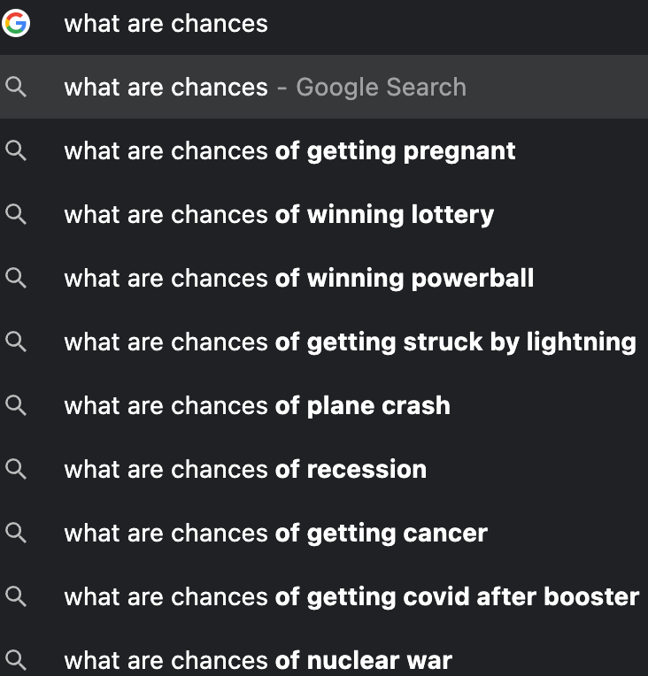
```


---
.pull-left[
```{r, echo=FALSE, out.width="100%"}
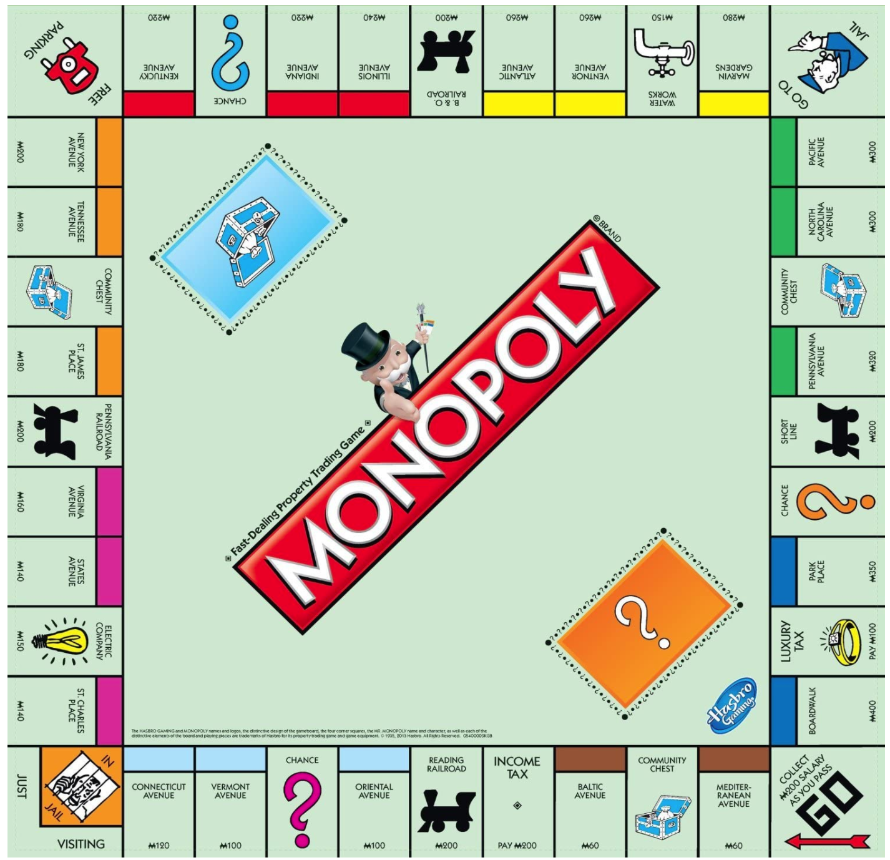
```
]


.pull-right[
```{r, echo=FALSE, out.width="100%"}
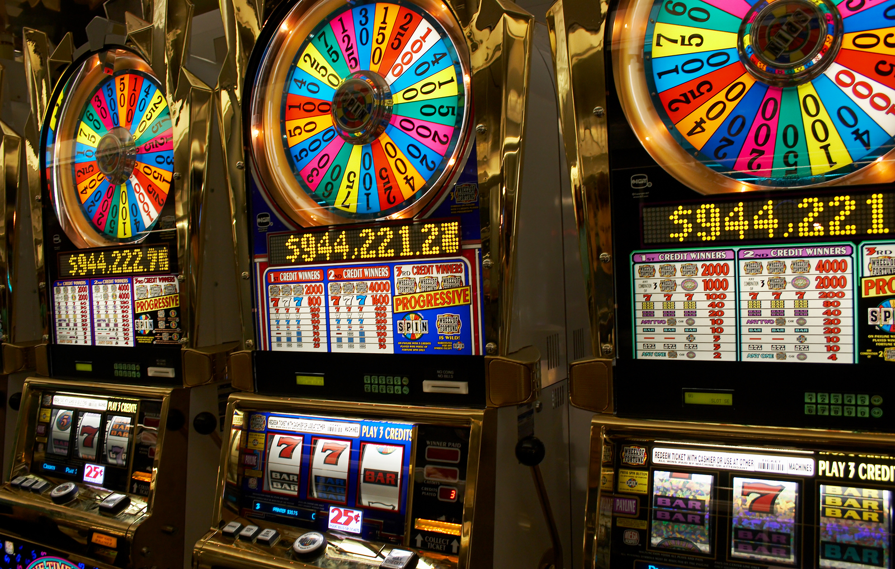
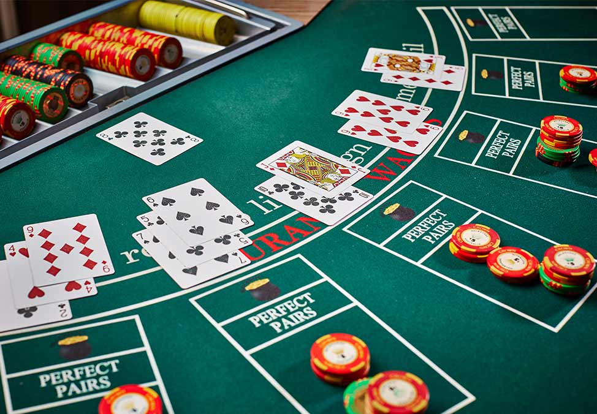
```
]


---
## Why Probability Before Statistics?
<!-- - Probability is the language of statistical inference and prediction.  -->
- <span style="color:blue"> **Probability** </span>: We *know* the process generating the data and are interested in properties of observations.
- <span style="color:blue"> **Statistics** </span>: We *observed* the data (sample) and are interested in determining what is the process generating the data (population).
```{r, echo=FALSE, out.width="67%",fig.align='center'}
# 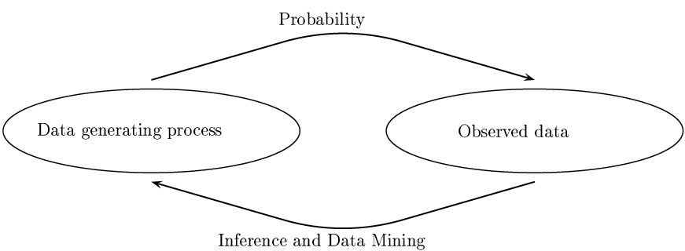
# fig.cap="Figure 1.1 in All of Statistics (Wasserman 2003)"
par(mar = c(0, 0, 0, 0))
plot(0, 0, type = "n", axes = FALSE, xlab = "", ylab = "")
plotrix::draw.ellipse(x = -0.56, y = 0, a = 0.52, b = 0.4, lwd = 2)
plotrix::draw.ellipse(x = 0.56, y = 0, a = 0.45, b = 0.34, lwd = 2)
text(x = -0.56, y = 0, labels = "Data Generating Process", cex = 1.5)
text(x = 0.56, y = 0, labels = "Observed Data", cex = 1.5)
diagram::curvedarrow(from = c(-0.56, 0.47), to = c(0.56, 0.47), 
                     curve = -0.2, arr.pos = 0.98)
diagram::curvedarrow(from = c(0.56, -0.47), to = c(-0.56, -0.47), 
                     curve = -0.2, arr.pos = 0.98)
text(x = 0, y = 0.8, labels = "Probability", cex = 1.5)
text(x = 0, y = -0.8, labels = "Statistical Inference", cex = 1.5)

plot(0, 0, type = "n", axes = FALSE, xlab = "", ylab = "")
plotrix::draw.ellipse(x = -0.3, y = 0.5, a = 0.65, b = 0.45, lwd = 2)
plotrix::draw.ellipse(x = -0.3, y = 0.4, a = 0.35, b = 0.2, lwd = 2, lty = 2)
text(x = -0.3, y = 0.7, labels = "Set of all measurements: Population", cex = 1.2)
plotrix::draw.ellipse(x = 0.5, y = -0.5, a = 0.36, b = 0.21, lwd = 2, lty = 1)
diagram::curvedarrow(from = c(-0.3, 0.4), to = c(0.5, -0.3), 
                     curve = -0.2, arr.pos = 0.98)
text(x = 0.5, y = -0.5, labels = "Sample", cex = 1.2)
text(x = 0, y = -0.4, labels = "Set of data selected from the population:", cex = 1.2)
```


---
background-image: url(https://upload.wikimedia.org/wikipedia/commons/1/1c/6sided_dice_%28cropped%29.jpg)
background-position: 50% 50%
background-size: cover
class: center, middle, inverse

# Interpretation of Probability


---
## Interpretation of Probability: **Relative Frequency**
- <span style="color:blue"> **Relative Frequency** </span>: The probability that some outcome of a process will be obtained is interpreted as the **relative frequency** with which that outcome would be obtained _if the process were repeated **a large number of times** independently under **similar conditions**._

```{r toss_coin, echo=FALSE}
rel_freq_head <- rep(0, 2)
times <- c(10, 1000)
for (i in 1:2) {
  x <- sample(c("Heads", "Tails"), times[i], replace = TRUE)
  freq_table <- as.matrix(table(x)); colnames(freq_table) <- "Frequency"
  rel_freq_table <- cbind(freq_table, "Relative Frequency" = freq_table[, 1] / times[i])
  rel_freq_table <- rbind(rel_freq_table, Total = apply(rel_freq_table, 2, sum))
  print(rel_freq_table)
  cat("---------------------\n")
  rel_freq_head[i] <- rel_freq_table[1, 2]
}
```
- If we repeat tossing the coin 10 times, the probability of obtaining a head is `r rel_freq_head[1] * 100`%. 
- If 1000 times, the probability is `r rel_freq_head[2] * 100`%.


--

.question[
Any issue of relative frequency probability?
]

---
## Issues of **Relative Frequency**
- `r emo::ji('confused')` How large of a number is large enough? 

--
- `r emo::ji('confused')` Meaning of "under similar conditions"


--
- `r emo::ji('confused')` The relative frequency is reliable under identical conditions?


--
- `r emo::ji('point_right')`  We only obtain an approximation instead of exact value.

--
- `r emo::ji('joy')`  How do you compute the probability that Chicago Cubs wins the World Series next year? 

```{r, echo=FALSE, out.width="50%"}
knitr::include_graphics("https://media.giphy.com/media/EKURBxKKkw0uY/giphy.gif")
```


---
## Interpretation of Probability: **Classical Approach**
- <span style="color:blue"> **Classical** probability </span>: The probability is based on the concept of **equally likely** outcomes. 
- If the outcome of some process must be one of $n$ different outcomes, the probability of each outcome is $1/n$. 

--

- Example: 
  + toss a fair coin (2 outcomes) 🪙
  + roll a well-balanced die (6 outcomes)  `r emo::ji('game_die')` 
  + draw one from a deck of cards (52 outcomes) `r emo::ji('black_joker')` 

--

.question[
Any issue of classical probability?
]

--
- _The probability that *[you name it]* wins the World Series next year is **1/30**_?!

```{r, echo=FALSE, out.width="15%"}
knitr::include_graphics("./img/nick_young.png")
```


---
## Interpretation of Probability: **Subjective Approach**
- <span style="color:blue"> **Subjective** probability </span>: The probability is assigned or estimated using people's **knowledge, beliefs and information** about the data generating process.
- A person's *subjective* probability of an outcome, rather than the *true* probability of that outcome.

--

- I think *"the probability that Milwaukee Brewers wins the World Series this year is 30%"*.

--
- My probability that Milwaukee Brewers wins the World Series next year is *different* from an ESPN MLB analyst's probability. 

.pull-left[
```{r, echo=FALSE, out.width="75%"}

```
]

.pull-right[
```{r echo=FALSE, out.width="100%"}
knitr::include_graphics("https://upload.wikimedia.org/wikipedia/en/2/2e/ESPN_Major_League_Baseball_TV_logo.jpg")
```
]

---
class: center, middle, inverse

## **Any probability operations and rules do NOT depend on interpretation of probability!**


---
background-image: url(https://upload.wikimedia.org/wikipedia/commons/1/1c/6sided_dice_%28cropped%29.jpg)
background-position: 50% 50%
background-size: cover
class: center, middle, inverse

# Probability Operations and Rules

---
## Experiments, Events and Sample Space
- **Experiment**: any process in which the possible **outcomes** can be identified *ahead of time*. 
- **Event**: a set of possible outcomes of the experiment.
- **Sample space** $(\mathcal{S})$ of an experiment: the collection of **ALL** possible outcomes of the experiment.

Experiment    | Possible Outcomes | Some Events                                  | Sample Space
------------- | ----------------- | -------------------------------------------  | -------------
Flip a coin  🪙 | Heads, Tails      | {Heads}, {Heads, Tails}, ...                 | {Heads, Tails}
Roll a die  `r emo::ji('game_die')`   | 1, 2, 3, 4, 5, 6  | {1, 3, 5}, {2, 4, 6}, {2}, {3, 4, 5, 6}, ... | {1, 2, 3, 4, 5, 6}


--

.question[
Is the sample space also an event?
]

--

- Yes, the sample space itself is an event because it is also a set of possible outcomes of the experiment.


---
## Set Concept: Example of **Rolling a six-side balanced die**
.tip[
Draw a [**Venn Diagram**](http://www.stat.ucla.edu/~vlew/stat11/lectures/venn/venn.html) every time you get stuck!
]

- <span style="color:black"> **Complement** </span> of an event (set) $A$, <span style="color:black"> $A^c$ </span>: a set of **all** outcomes (elements) of $\mathcal{S}$ in which $A$ does **not** occur.
  + <span style="color:blue">Let $A$ be an event that a number greater than 2. Then $A = \{3, 4, 5, 6\}$ and $A^c = \{1, 2\}$.</span> 


--

- <span style="color:black"> **Union** $(A \cup B)$ </span>: a set of all outcomes of $\mathcal{S}$ in $A$ **or** $B$.


--
  + <span style="color:blue">Let $B$ be an event that an even number is obtained.</span>  (What is $B$ in terms of a set?)

--

  + <span style="color:blue"> $B = \{2, 4, 6\}$, $A \cup B = \{2, 3, 4, 5, 6\}$.</span>

  
--

- <span style="color:black"> **Intersection** $(A \cap B)$ </span>: a set of all outcomes of $\mathcal{S}$ in both $A$ **and** $B$.


--
  + <span style="color:blue"> $A \cap B = \{4, 6\}$.</span> 
  


---
## Set Concept: Example of **Rolling a six-side balanced die**
- $A$ and $B$ are **disjoint** (or **mutually exclusive**) if they have **no outcomes in common** $(A \cap B = \emptyset)$.
  + $\emptyset$ means an empty set, $\{\}$, i.e., no elements in the set.
  + <span style="color:blue"> Let $C$ be an event that an odd number is obtained. Then $C = \{1, 3, 5\}$ and $B \cap C = \emptyset$. </span> 

--

- **Containment** $(A \subset B)$: every elements of $A$ also belongs to $B$. If $A$ occurs then so does $B$.
```{r, cache=TRUE, echo=FALSE, out.width="20%"}
par(mar = c(0,0,0,0))
plot(c(0, 1), c(0, 1), type = 'n', axes = FALSE, xlab = "", ylab = "")
temp <- seq(0, 2 * pi, 2 * pi / 100)
x <- 0.5 + 0.5 * cos(temp)
y <- 0.5 + 0.5 * sin(temp)
lines(x, y, lwd = 15, col = 2)

text(0.5, 0.6, 'A', pos = 3, font = 2, cex = 6)
lines((x - 0.5) * 2 * sqrt(0.07) + 0.55,
      (y - 0.5) * 2 * sqrt(0.07) + 0.68, lwd = 15, col = 4)

text(0.55, 0.3, 'B', pos = 1, font = 2, cex = 6)
```
  + <span style="color:blue"> $B$ is an event that an even number is obtained. </span>
  + <span style="color:blue"> $D$ is an event that a number greater than 1 is obtained. </span>
  + <span style="color:blue"> $B = \{2, 4, 6\}$ and $D = \{2, 3, 4, 5, 6\}$. </span>
  
--

.question[
$B \subset D$ or $D \subset B$?
]

<!-- -- -->

<!-- - <span style="color:blue"> $B \subset D$ or $D \supset B$. </span> -->


<!-- In other words, they cannot occur at the same time when the experiment is performed. -->


---
## Probability Rules
Denote the probability of an event $A$ on a sample space $\mathcal{S}$ as $P(A)$.

.tip[
Treat the probability of an event as the **area** of the event in the Venn diagram.
]

- **Axioms**
  + $P(\mathcal{S}) = 1$
  + For any event $A$, $P(A) \ge 0$
  + If $A$ and $B$ are **disjoint**, $P(A \cup B) = P(A) + P(B)$
- **Properties**
  + $P(\emptyset) = 0$. 
  + $0 \le P(A) \le 1$
  + $P(A^c) = 1 - P(A)$
  + $P(A \cup B) = P(A) + P(B) - P(A \cap B)$  (Addition Rule)
  + If $A \subset B$, then $P(A) \le P(B)$ 

---
## Venn Diagram Illustration
- **Addition Rule**: $P(A \cup B) = P(A) + P(B) - P(A \cap B)$

```{r, echo=FALSE, out.width = "100%"}
# ```{r, echo=FALSE, fig.show = "hold", out.width = "25%", fig.align = "default"}
# 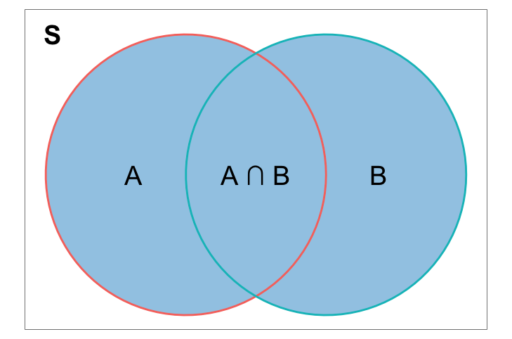
# 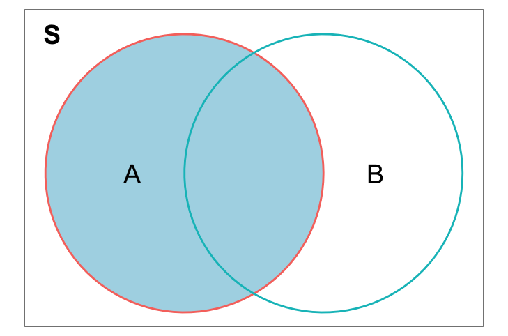
# 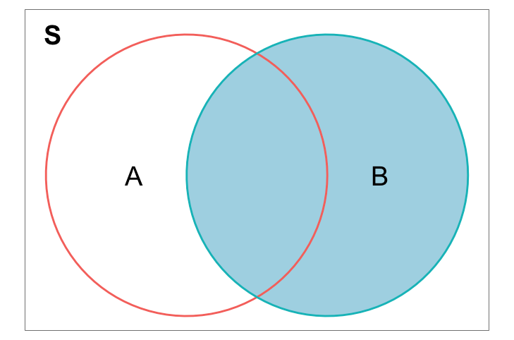
# 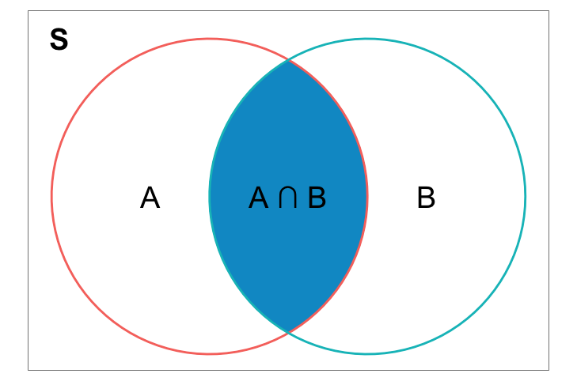
# ```
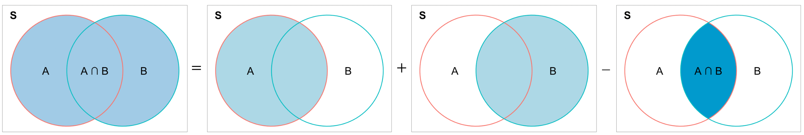
```

--

- **Disjoint case**: $P(A \cup B) = P(A) + P(B)$ because $P(A \cap B) = 0$!


```{r, echo=FALSE, out.width = "100%"}
# 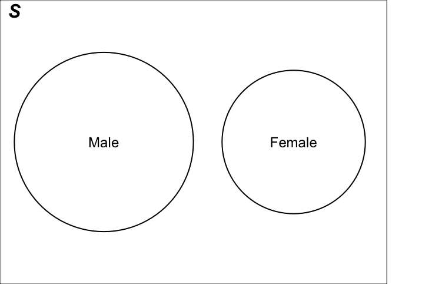
# 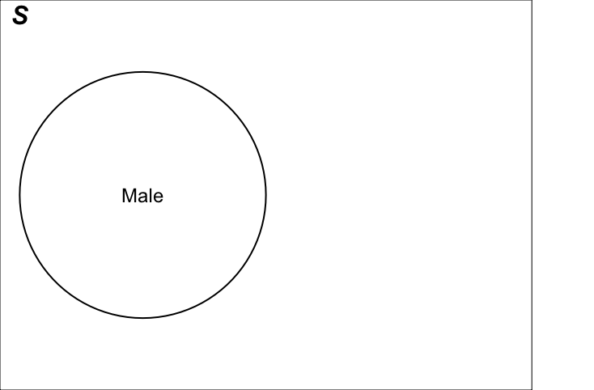
# 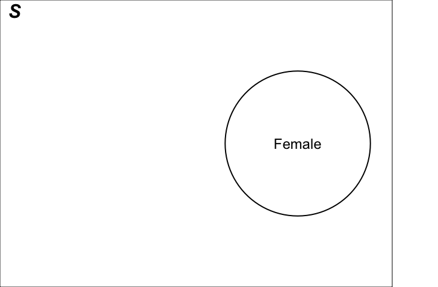
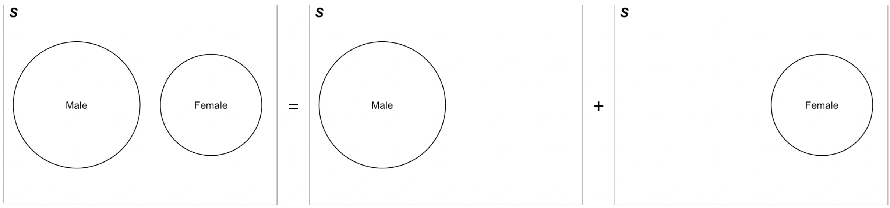
```


---
## Example: M&M Colors
The makers of the candy M&Ms report that their plain M&Ms are composed of 
  + 15% Yellow; 10% Red; 20% Orange; 25% Blue; 15% Green; 15% Brown
  
  
.pull-left[
```{r, out.width="80%", echo=FALSE}
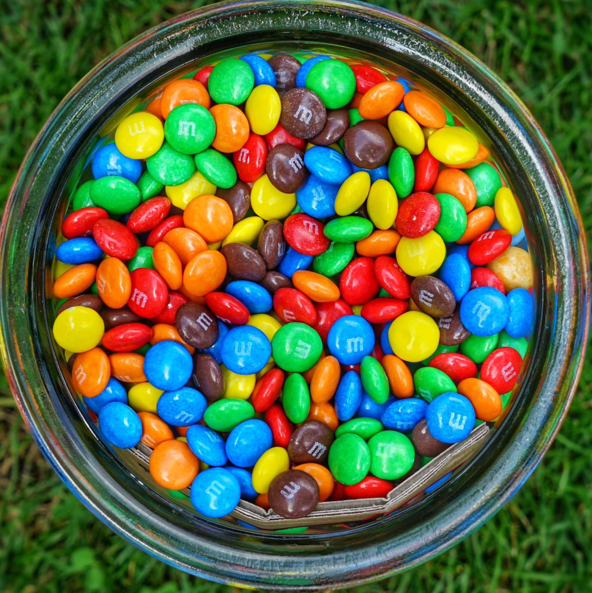
```
]

.pull-right[
.question[
If you randomly select an M&M, what is the probability of the following? 
  + (1) It is brown. 
  + (2) It is red or green. 
  + (3) It is not blue. 
  + (4) It is red and brown.
]
]

```{r, echo=FALSE}
countdown(minutes = 1, seconds = 0)
```


---
## Example: M&M Colors
- 15% Yellow; 10% Red; 20% Orange; 25% Blue; 15% Green; 15% Brown

.pull-left-narrow[
.question[
If you randomly select an M&M, what is the probability of the following? 
  + (1) It is brown. 
  + (2) It is red or green. 
  + (3) It is not blue. 
  + (4) It is red and brown.
]
]

.pull-right-wide[
- $P(\mathrm{Brown}) = 0.15$
- $\small \begin{align} P(\mathrm{Red} \cup \mathrm{Green}) &= P(\mathrm{Red}) + P(\mathrm{Green}) - P(\mathrm{Red} \cap \mathrm{Green}) \\ &= 0.10 + 0.15 - 0 = 0.25 \end{align}$
- $P(\text{Not Blue}) = 1 - P(\text{Blue}) = 1 - 0.25 = 0.75$
- $P(\text{Red and Brown}) = P(\emptyset) = 0$
]

--

.question[
By the way, which interpretation of probability is used in this question?
]


---
exclude:true
## Misuse of Probability Exists in Daily Lives
- Paulos (1988) tells the story of a weather forecaster on American TV who reported that there was a **50% chance of rain on Saturday**, and a **50% chance of rain on Sunday**, from which he concluded that there was a **100% chance of rain on the weekend**. <sup>1</sup> 

<br>
- *New Scientist* reported a story about an inspector in the Food and Drug Administration who visited a restaurant in Salt Lake City famous for its quiches made from four fresh eggs. The inspector told the owner that according to FDA research **every fourth egg has salmonella bacteria**, so the restaurant should **only use three eggs** in a quiche. <sup>2</sup>  

.footnote[
[1] Paulos JA (1988) *Innumeracy: Mathematical illiteracy and its consequences*. Vintage Books, New York

[2] http://www.edge.org/3rd_culture/gigerenzer03/gigerenzer_print.html
]


---
background-image: url(https://upload.wikimedia.org/wikipedia/commons/1/1c/6sided_dice_%28cropped%29.jpg)
background-position: 50% 50%
background-size: cover
class: center, middle, inverse
# Conditional Probability and Independence


---
## Conditional Probability
- The **conditional probability of $A$ given $B$** is
$$ P(A \mid  B) = \frac{P(A \cap B)}{P(B)} $$ if $P(B) > 0$, and it is undefined if $P(B) = 0$.
<!-- - Read $A | B$ as "$A$ given $B$" -->
- "Given $B$" means that event $B$ *has already occurred*. 

--
```{r, echo=FALSE, out.width = "100%"}
# 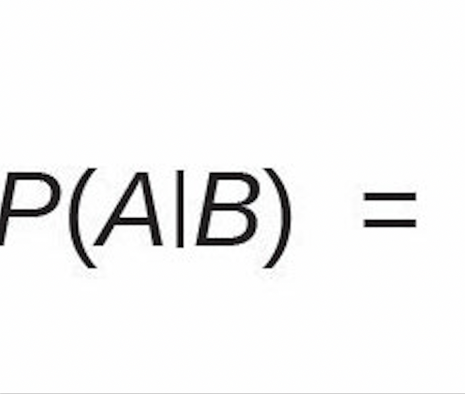
# 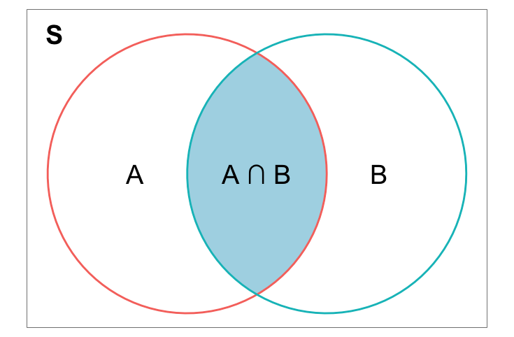
# 
knitr::include_graphics("./img/conditional.jpg")
```

<!-- At this moment $P(B)$ is 1. -->
<!-- - $P(B)$ is scaled up by $1 / P(B)$ so that $P(B) \times \frac{1}{P(B)} = 1$. -->
--

- **Multiplication Rule**: $P(A \cap B) = P(A \mid  B)P(B) = P(B \mid  A)P(A)$
- $P(A)$ and $P(B)$ are **unconditional** or **marginal probabilities**.


---
## Difference Between $P(A)$ and $P(A \mid B)$
<!-- - The marginal probability $P(A)$ is the ratio of area of $A$ and the area of the sample space. -->
<!-- - The conditional probability $P(A|B)$ is the ratio of area of $A \cap B$ and the area of $B$. -->

```{r, echo=FALSE, out.width="100%"}
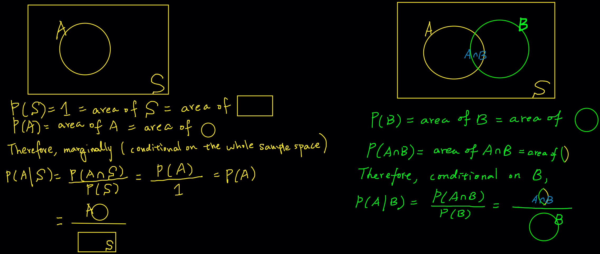
```


---
## Example: Peanut Butter and Jelly
- Suppose 80% of people like peanut butter, 89% like jelly, and 78% like both.
- Given that a randomly sampled person likes peanut butter, what’s the probability that she also likes jelly?

.pull-left[

```{r, echo=FALSE, fig.show='hold', out.width="100%", fig.align='default'}
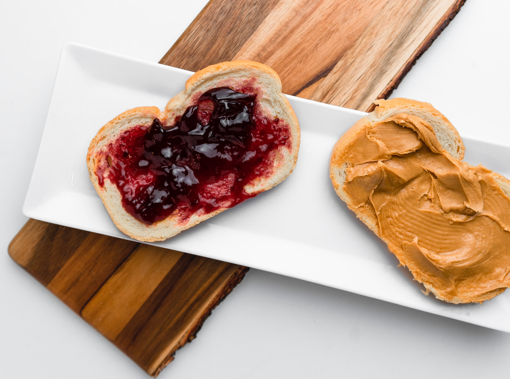
```

]

--

.pull-right[
- We want $P(J\mid PB) = \frac{P(PB \cap J)}{P(PB)}$.
- From the problem we have $P(PB) = 0.8$, $P(J) = 0.89$, $P(PB \cap J) = 0.78$
- $P(J\mid PB) = \frac{P(PB \cap J)}{P(PB)} = \frac{0.78}{0.8} = 0.975$.

.alert[
.small[
- If we **don't** know if the person loves peanut butter, the probability that she loves jelly is 89%.
- If we **do** know she loves peanut butter, the probability that she loves jelly is going up to 97.5%.
]
]
]


---
exclude:true
## Example: Smallpox in Boston, 1721
- Two variables
  + **inoculated: yes, no**
  + **result: lived, died**

.pull-left[
|          | `yes`   | `no`  | Total |
| -------- |:-------:| -----:|------:|
| `lived`  | 238     | 5136  | 5374  |
| `died`   | 6       |  844  | 850   |
| Total    | 244     |  5980 | 6224  |
]

.pull-right[
|          | `yes`   | `no`   | Total |
| -------- |:-------:| ------:|------:|
| `lived`  | 0.0382  | 0.8252 | 0.8634|
| `died`   | 0.001   | 0.1356 | 0.1366|
| Total    | 0.392   | 0.9608 | 1.0000|
]

.footnote[
[1] I chose not to insert a smallpox picture. Fortunately the disease is eradicated. `r emo::ji('thumbsup')`
]

.question[
- What is $P(\texttt{inoculated = no})$?
- What is $P(\texttt{result = lived} \text{ and } \texttt{inoculated = no})$?
- What is $P(\texttt{result = lived | inoculated = no})$?
]


---
exclude:true
## Tree Diagrams
- Tree diagrams are a tool to organize outcomes and probabilities. 
- They are useful when two or more processes *occur in a sequence* and *each process is conditioned on its predecessors*.

```{r, echo=FALSE, out.width="60%"}
par(mar = c(0, 0, 0, 2))
treeDiag(c('Inoculated', 'Result | Inoculated'),
         c(0.0392, 0.9608),
         list(c(0.9754, 0.0246),
              c(0.8589, 0.1411)),
         textwd = 0.2,
         solwd = 0.35,
         cex.main = 1.2,
         c('yes', 'no'),
         c('lived', 'died'),
         digits = 4,
         col.main = 2,
         showWork = TRUE)
```

---
## Independence
- $A$ and $B$ are **independent** if 
$\begin{align} P(A \mid  B) &= P(A) \text{ or }\\ P(B \mid  A) &= P(B) \text{ or } \\P(A\cap B) &= P(A)P(B)\end{align}$  $\text{ if } P(A) > 0 \text{ and } P(B) > 0$
- Intuition: *Knowing $B$ occurs does not change the probability that $A$ occurs, and vice versa.*


--

.question[
Can we compute $P(A \cap B)$ if we only know $P(A)$ and $P(B)$?
]

--

- No, we cannot compute $P(A \cap B)$ since we do not know if $A$ and $B$ are independent. 
- We could only if $A$ and $B$ were independent.
- In general, we need the multiplication rule $P(A \cap B) = P(A \mid B)P(B)$.

---
## Venn Diagram Explanation of Independence
```{r, echo=FALSE, out.width="100%"}
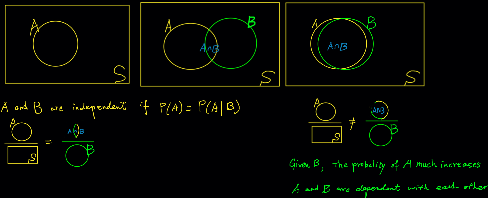
```


---
## Independence Example
.question[
- Assuming that events $A$ and $B$ are **independent**. $P(A) = 0.3$ and $P(B) = 0.7$.
  + $P(A \cap B)$?
  + $P(A \cup B)$?
  + $P(A \mid B)$?
  
<!-- - If $P(A \cap B)= 0.1$, are $A$ and $B$ independent? -->
<!-- - If $P(A \cap B)= 0.1$, what is $P(A \mid B)$? -->
```{r, echo=FALSE}
countdown(minutes = 0, seconds = 30, font_size = "3em")
```
]

--

- $P(A \cap B) = P(A)P(B)=0.21$

--

- $P(A \cup B) = P(A)+P(B)-P(A\cap B) = 0.3+0.7-0.21=0.79$

--

- $P(A \mid B) = P(A) = 0.3$

<!-- -- -->

<!-- - If $P(A \cap B)= 0.1$, $A$ and $B$ are not independent because $P(A \cap B) \ne P(A)P(B)$ -->

<!-- -- -->

<!-- - $P(A \mid B) =\frac{P(A\cap B)}{P(B)} = \frac{0.1}{0.7} = 0.143$. -->

---
background-image: url(./img/Bayes.gif)
background-position: 50% 50%
background-size: cover
class: center, middle, inverse
# Bayes' Formula

---
## Why Bayes' Formula?
- Often, we know $P(B \mid A)$ but are much more interested in $P(A \mid B)$.
- Example: diagnostic tests provide $P(\text{positive test result}  \mid \text{COVID})$, but we are interested in $P(\text{COVID} \mid \text{positive test result})$

.pull-left[

<br>

```{r, echo=FALSE, out.width="70%"}
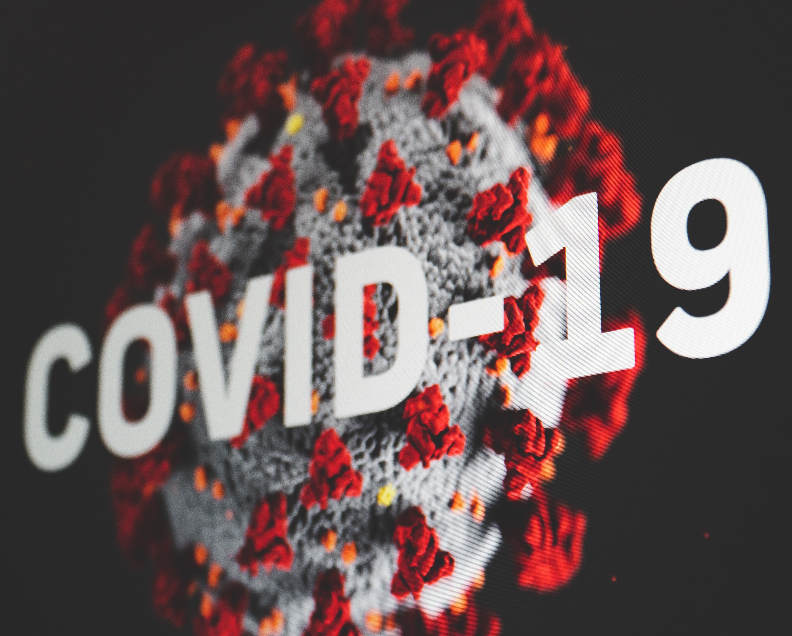
```
]

.pull-right[
```{r, echo=FALSE, out.width="70%"}
knitr::include_graphics("./img/test_table.png")
```
]

--

- Bayes' formula provides a way for finding $P(A \mid B)$ from $P(B \mid A)$


---
## Bayes' Formula
- If $A$ and $B$ are any events whose probabilities are not 0 or 1, then
$$\begin{align*} P(A \mid B) &= \frac{P(A \cap B)}{P(B)} \quad ( \text{def. of cond. prob.}) \\ &= \frac{P(A \cap B)}{P((B \cap A) \cup (B \cap A^c))} \quad ( \text{partition } B) \\ &= \frac{P(B \mid A)P(A)}{P(B \mid A)P(A) + P(B \mid A^c)P(A^c)}  \quad ( \text{multiplication rule}) \end{align*}$$

<!-- - Idea: <span style="color:blue"> Partition $B$ as $B = (B \cap A) \cup (B \cap A^c)$ and apply the multiplication rule.</span>  -->

```{r, echo=FALSE, out.width="30%"}
# 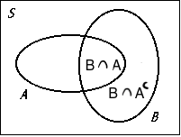
par(mar = c(0, 0, 0, 0), mfrow = c(1, 1))
plot(0, 0, type = "n", axes = FALSE, xlab = "", ylab = "")
box(lwd = 4)
plotrix::draw.ellipse(x = -0.2, y = 0, a = 0.8, b = 0.6, lwd = 2)
plotrix::draw.ellipse(x = 0.56, y = 0, a = 0.4, b = 1, lwd = 2)
text(x = -0.5, y = 0.62, labels = "A", cex = 2)
text(x = .92, y = 0.62, labels = "B", cex = 2)
text(x = 0.36, y = 0, labels = "B ∩ A", cex = 2)
text(x = 0.66, y = -0.45, 
     labels = expression(paste("B ", intersect(A^c))), cex = 2)
text(x = -1, y = 1, labels = "S", cex = 2, font = 4)
```

---
## Example: Passing Rate
.pull-left[
After taking MATH 4720, $80\%$ of students understand the Bayes' formula. 
- Of those who understand the Bayes' formula,
  + $95\%$ passed
- Of those who do not understand the Bayes' formula,
  + $60\%$ passed
]

.pull-right[

```{r, echo=FALSE, out.width="100%"}
knitr::include_graphics("./img/test_pass.jpeg")
```
]

.question[
Calculate the probability that a student understand the Bayes' formula given the fact that she passed.
]


---
## Bayes Formula: Step-by-Step
- $80\%$ of students understand the Bayes' formula. 
- Of those who understand the Bayes' formula, $95\%$ passed ( $5\%$ failed).
- Of those who do not understand the formula, $60\%$ passed ( $40\%$ failed).
.small[
$$P(A \mid B) = \frac{P(B \mid A)P(A)}{P(B \mid A)P(A) + P(B \mid A^c)P(A^c)}$$
]

--

- <span style="color:blue"> Step 1: Formulate what we would like to compute  </span>

--
- $P(\text{understand} \mid \text{passed})$

--
- <span style="color:blue"> Step 2: Define relevant events in the formula: $A$, $A^c$ and $B$ </span>

--
- Let $A =$ understand. $B =$ passed. Then $A^c =$ don't understand and $P(\text{understand} \mid \text{passed}) = P(A \mid B)$.

--
- <span style="color:blue"> Step 3: Find probabilities in the Bayes' formula using provided information. </span>

--
- $P(B \mid A) = P(\text{passed} \mid \text{understand}) = 0.95$, $P(B \mid A^c) = P(\text{passed} \mid \text{don't understand}) = 0.6$  
$P(A) = P(\text{understand}) = 0.8$, $P(A^c) = 1 - P(A) = 0.2$.


---
## Bayes Formula: Step-by-Step
- $80\%$ of students understand the Bayes' formula. 
- Of those who understand the Bayes' formula, $95\%$ passed ( $5\%$ failed).
- Of those who do not understand the formula, $60\%$ passed ( $40\%$ failed).
.small[
$$P(A \mid B) = \frac{P(B \mid A)P(A)}{P(B \mid A)P(A) + P(B \mid A^c)P(A^c)}$$
]

- <span style="color:blue"> Step 3: Find probabilities in the Bayes' formula using provided information. </span>

- $P(B \mid A) = P(\text{passed} \mid \text{understand}) = 0.95$, $P(B \mid A^c) = P(\text{passed} \mid \text{don't understand}) = 0.6$  
$P(A) = P(\text{understand}) = 0.8$, $P(A^c) = 1 - P(A) = 0.2$.

--
- <span style="color:blue"> Step 4: Apply Bayes' formula. </span>
$\small P(\text{understand} \mid \text{passed}) = P(A \mid B) = \frac{P(B \mid A)P(A)}{P(B \mid A)P(A) + P(B \mid A^c)P(A^c)} = \frac{(0.95)(0.8)}{(0.95)(0.8) + (0.6)(0.2)} = 0.86$


---
## Bayes Formula: Tree Diagram Illustration
- $80\%$ of students understand the Bayes' formula. 
- Of those who understand the Bayes' formula, $95\%$ passed ( $5\%$ failed).
- Of those who do not understand the formula, $60\%$ passed ( $40\%$ failed).

.pull-left[
```{r, echo=FALSE, out.width="120%"}
knitr::include_graphics("./img/bayestree.png")
```
]

.pull-right[
$$\begin{align*} & P(\text{yes} \mid \text{pass}) \\ &= \frac{P(\text{yes and }  \text{pass})}{P(\text{pass})} \\ &= \frac{P(\text{yes and }  \text{pass})}{P(\text{pass and yes}) + P(\text{pass and no})}\\ &= \frac{P(\text{pass | yes})P(\text{yes})}{P(\text{pass | yes})P(\text{yes}) + P(\text{pass | no})P(\text{no})} \\ &= \frac{0.76}{0.76 + 0.12} = 0.86 \end{align*}$$
]

---
exclude:true
## Law of Total Probability
- If $A_1 \dots, A_n$ are disjoint, each event has positive probability and one of the events must occur, then $P(B) = \sum_{i=1}^n P(B\mid A_i)P(A_i)$.
- We've seen this with $n = 2$ in the denominator of Bayes' formula! Let $A_1 = A$ and $A_2 = A^c$, $P(B) = P(B \mid A)P(A) + P(B \mid A^c)P(A^c) = P(B \mid A_1)P(A_1) + P(B \mid A_2)P(A_2)$
- How about $n = 3$? Note that $B = (B \cap A_1) \cup (B \cap A_2) \cup (B\cap A_3)$ and this can be generalized to arbitrary $n$.
```{r, echo=FALSE, out.width="35%"}
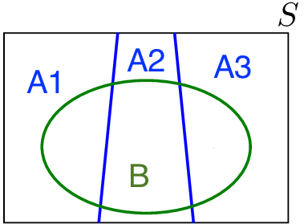
```

---
exclude:true
## General Bayes' Formula
- If $P(B) > 0$, the previous result implies 
$$P(A_k \mid B) = \frac{P(B \mid A_k)P(A_k)}{\sum_{i=1}^n P(B \mid A_i)P(A_i)}$$
- **Example 4.33**: Of all homes having wood-burning furnaces, 30% own a type 1 furnace, 25% a type 2 furnace, 15% a type 3, and 30% other types. Over 3 years, 5% of type 1 furnaces, 3% of type 2, 2% of type 3, and 4% of other types have resulted in fires. If a fire occurs in a particular home, what is the probability that a type 1 furnace is in the home?

--
exclude:true
- <span style="color:blue"> Step 1: Formulate what we would like to compute  </span>: $P(\text{type 1} \mid \text{fire occurs})$

--
exclude:true
- <span style="color:blue"> Step 2: Define relevant events </span>: Let $B =$ fire occurs, $A_i =$ type $i$ furnace, $i = 1, 2, 3$ and $A_4 =$ other furnaces.

--
exclude:true
- <span style="color:blue"> Step 3: Find probabilities in the Bayes' formula. </span>: You do it.

--
exclude:true
- <span style="color:blue"> Step 4: Apply Bayes' formula. </span> Your answer should be 0.4.


---
exclude:true
background-image: url(https://upload.wikimedia.org/wikipedia/commons/1/1c/6sided_dice_%28cropped%29.jpg)
background-position: 50% 50%
background-size: cover
class: center, middle, inverse
# Random Variables


---
exclude:true
## Random Variables
- Recap: A **variable** in a data set is a characteristic that varies from one to another.
  + A variable can be either categorical or numerical.
  + Numerical variables can be either **discrete** or **continuous**.
- A **random variable**, usually written as $X$ <sup>1</sup>, is a variable whose possible values are **numerical** outcomes determined by **chance** or **randomness** of a procedure or experiment.
  + Toss a coin 2 times. $X$ = # of heads. 
  + $X$ = # of accidents in W. Wisconsin Ave. per day.

  <!-- + $X$ = time (in minutes) until next accident in W. Wisconsin Ave. -->

- A random variable has a **probability distribution** associated with it, accounting for its randomness. 


.footnote[
[1] A capital $X$ represents a random variable and a small $x$ is used to represent a possible realized value of $X$.
]


---
exclude:true
## Discrete and Continuous Random Variables
- A **discrete** random variable takes on a **finite** or **countable** number of values.
- A **continuous** random variable has **infinitely** many values, and the collection of values is **uncountable**.
- <span style="color:blue"> The number of relationships you've ever had is **discrete** variable because we can count the number and it is finite.</span>
  + If we can further determine the probability that the number is 0, 1, 2, or any possible number, it is a **discrete random variable**.
- <span style="color:blue"> Height is **continuous** because it can be any number within a range. </span> 
  + If we have a way to quantify the probability that the height is from any value $a$ to any value $b$, it is a **continuous random variable**.


