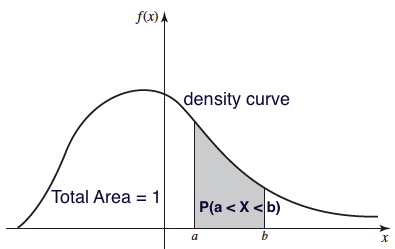
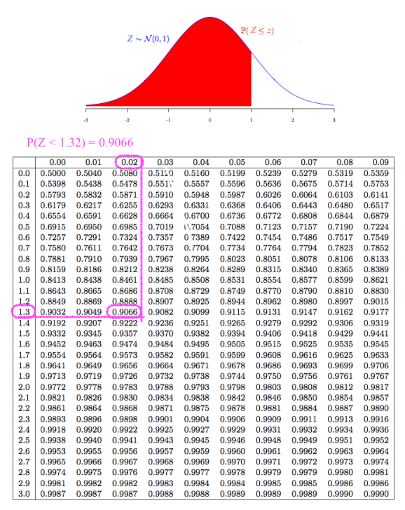

<script type="text/x-mathjax-config">
MathJax.Hub.Config({
  TeX: {
    Macros: {
      var: "{\\mathrm{Var}}",
      cov: "{\\mathrm{Cov}}",
      bsbeta: "{\\boldsymbol{\\beta}}",
      bsalpha: "{\\boldsymbol{\\alpha}}",
      bsep: "{\\boldsymbol{\\epsilon}}"
    }
  }
});
</script>


```{r child = "./setup.Rmd"}

```


```{r packages, echo=FALSE, message=FALSE, warning=FALSE}
library(emo)
library(knitr)
library(kableExtra)
library(openintro)
```


```{r, echo=FALSE, message=FALSE, warning=FALSE}
knitr::opts_knit$set(global.par = TRUE)
# options(reindent.spaces = 4)
```

background-image: url(https://upload.wikimedia.org/wikipedia/commons/1/1c/6sided_dice_%28cropped%29.jpg)
background-position: 50% 50%
background-size: cover
class: center, middle, inverse
# Random Variables


---
## Random Variables
- Recap: A **variable** in a data set is a characteristic that varies from one to another.
  + A variable can be either categorical or numerical.
  + Numerical variables can be either **discrete** or **continuous**.
  
--

- A **random variable**, usually written as $X$ <sup>1</sup>, is a variable whose possible values are **numerical** outcomes determined by **chance** or **randomness** of a procedure or experiment.
  + <span style="color:blue"> Toss a coin 2 times. $X$ = # of heads. </span> 
  + <span style="color:blue"> $X$ = # of accidents in W. Wisconsin Ave. per day.</span>

  <!-- + $X$ = time (in minutes) until next accident in W. Wisconsin Ave. -->

- A random variable has a **probability distribution** associated with it, accounting for its randomness. 

.footnote[
[1] Usually in statistics, a capital $X$ represents a random variable and a small $x$ represents a realized value of $X$.
]


---
## Discrete and Continuous Random Variables
- A **discrete** random variable takes on a **finite** or **countable** number of values.
- A **continuous** random variable has **infinitely** many values, and the collection of values is **uncountable**.
- <span style="color:blue"> The number of relationships you've ever had is **discrete** variable because we can count the number and it is finite.</span>
  + If we can further determine the probability that the number is 0, 1, 2, or any possible number, it is a **discrete random variable**.
- <span style="color:blue"> Height is **continuous** because it can be any number within a range. </span> 
  + If we have a way to quantify the probability that the height is from any value $a$ to any value $b$, it is a **continuous random variable**.


---
class: center, middle, inverse

<!-- # Welcome Aboard! -->

# Probability Distributions
## Discrete Distributions
## Continuous Distributions

---
## A Statistician Should Know
```{r echo=FALSE, out.width="50%", fig.cap="https://github.com/rasmusab/distribution_diagrams"}
include_graphics("img/common_dist.png")
```


---
class: center, middle
## What We Learn Here
### Binomial Distribution
### Poisson Distribution
### Normal Distribution


---
exclude: true
## Discrete and Continuous Random Variables
- A **discrete** random variable takes on a **finite** or **countable** number of values.
- A **continuous** random variable has **infinitely** many values, and the collection of values is **uncountable**.
- <span style="color:blue"> The number of relationships you ever had is **discrete** variable because we can count the number and it is finite.</span> If we can further determine the probability that the number is 0, 1, 2, or any possible number, it is a **discrete random variable**.
- <span style="color:blue"> Height is **continuous** because it can be any number within a range. </span> If we have a way to quantify the probability that the height is from any value $a$ to any value $b$, it is a **continuous random variable**.

---
background-image: url(./img/Poisson.jpg)
background-position: 50% 50%
background-size: cover
class: center, middle, inverse
# Discrete Probability Distributions

---

## Discrete Probability Distribution

- The **probability (mass) function** of a discrete random variable (rv) $X$ is a function $P(X = x)$ (or $p(x)$) that assigns a probability for **every** possible number $x$. 
- The **probability distribution** for a discrete r.v. $X$ *displays* its **probability function**.
- The display can be a *table*, *graph*, or *mathematical formula* of $P(X = x)$. 

--

<span style="color:blue"> **Example:** 🪙🪙 Toss a fair coin twice independently and $X$ is the number of heads. </span>
- The probability distribution of $X$ as a table is 

```{r discrete_prob_dist_table, echo=FALSE}
prob_function <- cbind("x" = c(0, 1, 2), "P(X = x)" = c(0.25, 0.5, 0.25))
# kable(prob_function, format = "pipe")
# kable(print(as.data.frame(prob_function), row.names = FALSE))
prob_function_horizontal <- rbind("x" = c("0", "1", "2"), "P(X = x)" = c(0.25, 0.5, 0.25))
# print(as.data.frame(t(prob_function)), row.names = FALSE)
# print(unname(as.data.frame(prob_function_horizontal)))
kable(prob_function_horizontal)
```


--

.alert[
`r emo::ji('point_right')` $\{X = x\}$ is an event corresponding to an event of some experiment.
]

--

.question[
What is the event that $\{X = 0\}$ corresponds to?
]

--

.question[
How do we get $P(X = 0)$, $P(X=1)$ and $P(X=2)$ ?
]


---
## Discrete Probability Distribution as a Graph 
<!-- - Probability Histogram -->
```{r discrete_prob_dist_graph, echo=FALSE, out.width="40%", fig.asp=0.5}
par(mar = c(4, 4, 0, 0))
plot(c("0", "1", "2"), c(0.25, 0.5, 0.25), type = "h", ylim = c(0, 0.75),
     lwd = 5, col = "#003366", ylab = "P(X = x)", xlab = "x", las = 1, axes = F)
points(c("0", "1", "2"), c(0.25, 0.5, 0.25), pch = 16, cex = 2, col = "#FFCC00")
axis(1, 0:2, c("0", "1", "2"), col.axis = "black")
axis(2, seq(0, 0.75, by = 0.25), col.axis = "black", las = 2)
```
- $0 \le P(X = x) \le 1$ for every value $x$ of $X$.
  + <span style="color:blue"> $x = 0, 1, 2$ </span>
  
--

- $\sum_{x}P(X=x) = 1$, where $x$ assumes all possible values.
  + <span style="color:blue"> $P(X=0) + P(X = 1) + P(X = 2) = 1$ </span>
  
--

- The probabilities for a discrete r.v. are **additive** because $\{X = a\}$ and $\{X = b\}$ are *disjoint* for any possible values $a \ne b$.
  + <span style="color:blue"> $P(X = 1 \text{ or } 2) = P(\{X = 1\} \cup \{X = 2\}) = P(X = 1) + P(X = 2)$. </span>


---
## Mean of a Discrete Random Variable
- Suppose $X$ takes values $x_1, \dots, x_k$ with probabilities $P(X = x_1), \dots, P(X = x_k)$.
- The **mean** or **expected value** of $X$ is the sum of each outcome multiplied by its corresponding probability:
$$E(X) := x_1 \times P(X = x_1) + \dots + x_k \times P(X = x_k) = \sum_{i=1}^kx_iP(X=x_i)$$
- The Greek letter $\mu$ may be used in place of the notation $E(X)$.


--
.alert[
`r emo::ji('point_right')` The mean of a discrete random variable $X$ is the **weighted average** of possible values $x$ *weighted by their corresponding probability*.
]


--

.question[
What is the mean of $X$ (the number of heads) in the previous example?
]


---
## Variance of a Discrete Random Variable
- Suppose $X$ takes values $x_1, \dots , x_k$ with probabilities $P(X = x_1), \dots, P(X = x_k)$ and expected value $\mu = E(X)$.
- The variance of $X$, denoted by $\var(X)$ or $\sigma^2$, is $$\small \var(X) := (x_1 - \mu)^2 \times P(X = x_1) + \dots + (x_k - \mu)^2 \times P(X = x_k) = \sum_{i=1}^k(x_i - \mu)^2P(X=x_i)$$
- The standard deviation of $X$, $\sigma$, is the square root of the variance.


--
.alert[
`r emo::ji('point_right')` The variance of a discrete random variable $X$ is the *weighted sum of squared deviation* from the mean weighted by probability values.
]

--
.question[
What is the variance of $X$ (the number of heads) in the previous example?
]


---
class: center, middle, inverse
# Binomial Distribution

---
## Binomial Experiment and Random Variable
- A **binomial experiment** is the one having the following properties:
  1. `r emo::ji('point_right')` The experiment consists of a **fixed** number of **identical** trials $n$.
  2. `r emo::ji('point_right')` Each trial results in one of **exactly two** outcomes (*success* (S) and *failure* (F)).
  3. `r emo::ji('point_right')` Trials are **independent**, meaning that the outcome of any trial does not affect the outcome of any other trial.
  4. `r emo::ji('point_right')` The probability of success is **constant** for all trials.
- If $X$ is defined as  <span style="color:blue"> the number of successes observed in $n$ trials </span>, $X$ is a binomial random variable.

--

.alert[
- The word *success* just means one of the two outcomes, and *does not necessarily mean something good. *
- `r emo::ji('astonished')` Can define *Drug abuse* as success and *No drug abuse* as failure.
]


---
## Binomial Distribution
- The probability function $P(X = x)$ of a binomial r.v. $X$ can be *fully* determined by 
  + the number of trials $n$
  + probability of success $\pi$
- Different $(n, \pi)$ pairs generate different binomial probability distributions.
- $X$ is said to follow a binomial distribution with **parameters** $n$ and $\pi$, written as $\color{blue}{X \sim binomial(n, \pi)}$.
- The binomial probability function is 
$$ \color{blue}{P(X = x \mid n, \pi) = \frac{n!}{x!(n-x)!}\pi^x(1-\pi)^{n-x}, \quad x = 0, 1, 2, \dots, n}$$ with mean $\mu = E(X) = n\pi$ and variance $\sigma^2 = \var(X) = n\pi(1-\pi)$.


--

.question[
Tossing a fair coin two times independently. Let $X =$ # of heads. Is $X$ a binomial r.v.?
]


---
## Binomial Distribution Example
.pull-left-wide[
Assume that 20% of all drivers have a blood alcohol level above the legal limit. For a random sample of 15 vehicles, compute the probability that:
  1. Exactly 6 of the 15 drivers will *exceed* the legal limit.
  
  2. Of the 15 drivers, 6 or more will *exceed* the legal limit.
]


.pull-right-narrow[
```{r, echo=FALSE, out.width="60%"}

```
]


--

- Suppose it is a binomial experiment with $n = 15$ and $\pi = 0.2$. 
- Let $X$ be the number of drivers exceeding limit. 
- $X \sim binomial(15, 0.2)$.

$$ \color{blue}{P(X = x \mid n=15, \pi=0.2) = \frac{15!}{x!(15-x)!}(0.2)^x(1-0.2)^{15-x}, \quad x = 0, 1, 2, \dots, n}$$


---
## Binomial Distribution Example $X \sim binomial(15, 0.2)$

```{r binomial_plot_noshow, echo = FALSE, out.width="80%"}
par(mar = c(4, 4, 2, 0), mgp = c(2.7, 1, 0), las = 1)
plot(x = 0:15, y = dbinom(0:15, size = 15, prob = 0.2), type = 'h', xlab = "x", 
     ylab = "P(X = x)", lwd = 5, main = "Binomial(15, 0.2)")
```


---
## Binomial Distribution Example
.pull-left-wide[
Assume that 20% of all drivers have a blood alcohol level above the legal limit. For a random sample of 15 vehicles, compute the probability that:
  1. Exactly 6 of the 15 drivers will *exceed* the legal limit.
  2. Of the 15 drivers, 6 or more will *exceed* the legal limit.
]


.pull-right-narrow[
```{r, echo=FALSE, out.width="60%"}

```
]


--

  1. $\small P(X = 6) = \frac{n!}{x!(n-x)!}\pi^x(1-\pi)^{n-x} = \frac{15!}{6!(15-6)!}(0.2)^6(1-0.2)^{15-6} = 0.043$
  
--

  2. $\small P(X \ge 6) = p(6) + \dots + p(15) = 1 - P(X \le 5) = 1 - (p(0) + p(1) + \dots + p(5)) = 0.0611$
  


--

.tip[
Never do this by hand. We compute them using R!
]


---
## Binomial Example Computation in R
<!-- - R Shiny app is at [Binomial Calculator](http://sctc.mscs.mu.edu:3838/sample-apps/Calculator/) -->
- With `size` the number of trials and `prob` the probability of success,
  + **`dbinom(x, size, prob)`** to compute $P(X = x)$
  + **`pbinom(q, size, prob)`** to compute $P(X \le q)$
  + **`pbinom(q, size, prob, lower.tail = FALSE)`** to compute $P(X > q)$
  
.pull-left[
```{r binomial_r_1}
## 1. P(X = 6)
dbinom(x = 6, size = 15, prob = 0.2) 
## 2. P(X >= 6) = 1 - P(X <= 5)
1 - pbinom(q = 5, size = 15, prob = 0.2) 
```
]

.pull-right[
```{r binomial_r_2}
## 2. P(X >= 6) = P(X > 5)
pbinom(q = 5, size = 15, prob = 0.2, 
       lower.tail = FALSE)  
```
]


---
## Binomial(15, 0.2)
```{r binomial_plot, echo = -1, out.width="67%"}
par(mar = c(4, 4, 2, 0), mgp = c(2.7, 1, 0), las = 1)
plot(x = 0:15, y = dbinom(0:15, size = 15, prob = 0.2), 
     type = 'h', xlab = "x", ylab = "P(X = x)", 
     lwd = 5, main = "Binomial(15, 0.2)")
```


---
class: center, middle, inverse
# Poisson Distribution


---
## Poisson Random Variables
- If we like to count **the number of occurrences of some event over a unit of time or space (region)** and its associated probability, we could consider the **Poisson distribution**.
  + Number of COVID patients arriving at ICU in one hour
  + Number of Marquette students logging onto D2L in one day
  + Number of dandelions per square meter in Marquette campus

--

- Let $X$ be a Poisson r.v. Then $\color{blue}{X \sim Poisson(\lambda)}$, where $\lambda$ is the parameter representing the **mean** number of occurrences of the event in the interval.
$$\color{blue}{P(X = x \mid \lambda) = \frac{\lambda^x e^{-\lambda}}{x!}, \quad x = 0, 1, 2, \dots}$$ with both mean and variance being equal to $\lambda$.


---
## Assumptions and Properties of Poisson Variables
- `r emo::ji('point_right')` **Events occur one at a time**; two or more events do not occur at the same time or in the same space or spot.
- `r emo::ji('point_right')` The occurrence of an event in a given period of time or region of space is **independent** of the occurrence of the event in a **nonoverlapping** time period or region of space.
- `r emo::ji('point_right')` $\lambda$ is **constant** of any period or region.


--

.question[
Can you find the difference between binomial and Poisson distributions?
]


--
- The Poisson distribution
  + is determined by one single parameter $\lambda$
  + has possible values $x = 0, 1, 2, \dots$ with no upper limit (countable), while a binomial variable has possible values $0, 1, 2, \dots, n$ (finite)


---
## Poisson Distribution Example 
.pull-left-wide[
Last year there were 4200 births at the University of Wisconsin Hospital. Assume $X$ be the number of births in a given day at the center, and $X \sim Poisson(\lambda)$. Find
  1. $\lambda$, the mean number of births **per day**.
  2. the probability that on a randomly selected day, there are exactly 10 births.
  3. $P(X > 10)$? 
]

.pull-right-narrow[
```{r, echo=FALSE, out.width="100%"}
knitr::include_graphics("./img/baby.jpeg")
```
]

--

1. $\small \lambda = \frac{\text{Number of birth in a year}}{\text{Number of days}} = \frac{4200}{365} = 11.5$

--

2. $\small P(X = 10 \mid \lambda = 11.5) = \frac{\lambda^x e^{-\lambda}}{x!} = \frac{11.5^{10} e^{-11.5}}{10!} = 0.113$

--

3. $\small P(X > 10) = p(11) + p(12) + \dots + p(20) + \dots$ (No end!)
$\small P(X > 10) = 1 - P(X \le 10) = 1 - (p(1) + p(2) + \dots + p(10))$.


---
## Poisson Example Compuatation in R
<!-- - R Shiny app is at [Poisson Calculator](http://sctc.mscs.mu.edu:3838/sample-apps/Calculator/) -->
<!-- P(X <= 10) = 0.392 -->
- With `lambda` the mean of Poisson distribution, 
  + **`dpois(x, lambda)`** to compute $P(X = x)$
  + **`ppois(q, lambda)`** to compute $P(X \le q)$
  + **`ppois(q, lambda, lower.tail = FALSE)`** to compute $P(X > q)$

.pull-left[
```{r poisson_r_1}
(lam <- 4200 / 365)
## P(X = 10)
dpois(x = 10, lambda = lam)  
```
]

.pull-right[
```{r poisson_r_2}
## P(X > 10) = 1 - P(X <= 10)
1 - ppois(q = 10, lambda = lam)  
## P(X > 10)
ppois(q = 10, lambda = lam, 
      lower.tail = FALSE) 
```
]


---
## Poisson(11.5)
- $X$ has no upper limit. The graph is *truncated* at $x = 24$. 
```{r poisson_plot, out.width="60%"}
plot(0:24, dpois(0:24, lambda = lam), type = 'h', lwd = 5, 
     ylab = "P(X = x)", xlab = "x", main = "Poisson(11.5)")
```


---
exclude:true
## Poisson as Approximation to Binomial
- When $n \ge 100$, $\pi \le 0.01$ and $n\pi \le 20$, $binomial(n, \pi) \approx Poisson(\mu = n\pi)$.

```{r poisson_approx, echo=FALSE, fig.asp=0.5, out.width='95%'}
par(mfcol = c(2, 2))
n <- 10
p <- 0.5
par(mar = c(2, 2, 1, 0), mgp = c(1, 0.1, 0), las = 1)
plot(0:n, dbinom(0:n, size = n, prob = p), type = 'h', ylim = c(0, 0.25),
      ylab = "P(X = x)", xlab = "x", las = 1, axes = F, lwd = 3, main = "binomial(10, 0.5)")
points(0:n, dbinom(0:n, size = n, prob = p), pch = 16, cex = 0.8, col = "#FFCC00")
axis(1, 0:n, col.axis = "black", cex.axis = 0.6, tck = 0.01)
axis(2, seq(0, 0.2, by = 0.05), col.axis = "black", las = 2, tck = 0.01,
     cex.axis = 0.6)

plot(0:n, dpois(0:n, lambda = n * p), type = 'h', ylim = c(0, 0.25),
      ylab = "P(X = x)", xlab = "x", las = 1, axes = F, lwd = 3, main = "Poisson(10*0.5)")
points(0:n, dpois(0:n, lambda = n * p), pch = 16, cex = 0.8, col = "#FFCC00")
axis(1, 0:n, col.axis = "black", cex.axis = 0.6, tck = 0.01)
axis(2, seq(0, 0.2, by = 0.05), col.axis = "black", las = 2, tck = 0.01, 
     cex.axis = 0.6)

n <- 100
plot(0:15, dbinom(0:15, size = n, prob = 0.01), type = 'h', ylim = c(0, 0.4),
      ylab = "P(X = x)", xlab = "x", las = 1, axes = F, lwd = 3, main = "binomial(100, 0.01)")
points(0:15, dbinom(0:15, size = n, prob = 0.01), pch = 16, cex = 0.8, col = "#FFCC00")
axis(1, 0:15, col.axis = "black", cex.axis = 0.6, tck = 0.01)
axis(2, seq(0, 0.4, by = 0.1), col.axis = "black", las = 2, tck = 0.01,
     cex.axis = 0.6)

plot(0:15, dpois(0:15, lambda = n * 0.01), type = 'h', ylim = c(0, 0.4),
      ylab = "P(X = x)", xlab = "x", las = 1, axes = F, lwd = 3, main = "Poisson(100*0.01)")
points(0:15, dpois(0:15, lambda = n * 0.01), pch = 16, cex = 0.8, col = "#FFCC00")
axis(1, 0:n, col.axis = "black", cex.axis = 0.6, tck = 0.01)
axis(2, seq(0, 0.4, by = 0.1), col.axis = "black", las = 2, tck = 0.01,
     cex.axis = 0.6)

```


---
background-image: url(./img/Gauss.jpg)
background-position: 50% 50%
background-size: cover
class: center, middle, inverse
# Continuous Probability Distributions

---
## Continuous Probability Distributions
- A continuous r.v. can take on **any** values from *an interval of the real line*.
- Instead of probability functions, a continuous r.v. $X$ has the **probability density function (pdf)** $f(x)$ such that for any real value $a < b$,
$$P(a < X < b) = \int_{a}^b f(x) dx$$
- The **cumulative distribution function (cdf)** of $X$ is defined as
$$F(x) := P(X \le x) = \int_{-\infty}^x f(t)dt$$
--

- Every pdf must satisfy <span style="color:blue"> (1) $f(x) \ge 0$ for all $x$; (2) $\int_{-\infty}^{\infty} f(x) dx = 1$ </span>

--

`r emo::ji('sunglasses')` Luckily we don't deal with integrals in this course.


---
## Density Curve
- A pdf generates a graph called the **density curve** that shows the *likelihood* of a random variable at all possible values.
- $P(a < X < b) = \int_{a}^b f(x) dx$: **The area under the density curve between $a$ and $b$.**
- $\int_{-\infty}^{\infty} f(x) dx = 1$: **The total area under any density curve is equal to 1.**

```{r, echo=FALSE, out.width="50%"}
# 
par(mar = c(2, 2, 0, 0), mgp = c(0.5, 0.2, 0), mfrow = c(1, 1))
x = seq(0,10,length=1000)
y = dgamma(x, 2, 1/2)
plot(x, y, type = "l", lwd = 3, col = "blue", axes = FALSE, 
     ylab = "f(x)", las = 1, cex.lab = 1.4)
axis(1, at = c(2, 4), labels = c("a", "b"), tick = TRUE)
axis(2, tick = FALSE, labels = FALSE)
abline(h = 0)
abline(v = 0)
x = seq(2, 4, length = 100)
y = dgamma(x, 2, 1/2)
polygon(c(2, x, 4), c(0, y, 0), col = "lightblue")
text(3, dgamma(2, 2, 1/2)/2, "P(a < X < b)", cex = 1.4)
text(6, dgamma(6, 2, 1/2)/3, "Total Area = 1", cex = 1.8)
text(7.5, dgamma(5.6, 2, 1/2), "density curve", cex = 1.8)
```


---
## Commonly Used Continuous Distributions
- R Shiny app is at [Continuous Distribution](http://sctc.mscs.mu.edu:3838/sample-apps/Calculator/)
- In this course, we will touch **normal (Gaussian)**, **student's t**, **chi-square**, **F**
- Some other common distributions include **uniform**, **exponential**, **gamma**, **beta**, **inverse gamma**, **Cauchy**, etc. (MATH 4700)


---
## Normal (Gaussian) Distribution
-  The normal distribution, $N(\mu, \sigma^2$), has the pdf given by
$$\small f(x) = \frac{1}{\sqrt{2\pi}\sigma}e^{\frac{-(x-\mu)^2}{2\sigma^2}}, \quad -\infty < x < \infty$$
  + Two parameters mean $\mu$ and variance $\sigma^2$ (standard deviation $\sigma$)
  + Always bell shaped, and symmetric about the mean $\mu$
  + When $\mu = 0$ and $\sigma = 1$, $N(0, 1)$ is called **standard normal**.

```{r normal_density, echo=FALSE, out.width='35%'}

par(mfrow = c(1, 1))
par(mar = c(1.8, 0, 1.2, 0), mgp = c(0.5, 0.2, 0), las = 1)
mean=100; sd=15
# lb=80; ub=120
x <- seq(-4,4,length=100)*sd + mean
hx <- dnorm(x,mean,sd)
plot(x, hx, type="n", xlab="x", ylab="",
  main=expression(N(100, 15^2)), axes=FALSE)
# i <- x >= lb & x <= ub
lines(x, hx, col = "#003366", lwd = 3)
# polygon(c(lb,x[i],ub), c(0,hx[i],0), col="red")
# area <- pnorm(ub, mean, sd) - pnorm(lb, mean, sd)
# result <- paste("P(",lb,"< IQ <",ub,") =",
#    signif(area, digits=3))
# mtext(result,3)
axis(1, at=seq(40, 160, 20), pos=0, tick = -0.005)
```

---
## Normal Density Curves
```{r normal_densities, echo=FALSE, out.width='75%'}
mean=100; sd=10
x <- seq(-4,4,length=100)*sd + mean
hx <- dnorm(x,mean,sd)
plot(x, hx, type="n", xlab="x", ylab="", xlim = c(-30, 160), bty = "n",
     main="normal densities", yaxt = "n", xaxt = "n")
axis(1, at=seq(-30, 160, 20), pos=0, tick = -0.005)
lines(x, hx, col = "#003366", lwd = 3)
mean=100; sd=15
x <- seq(-4,4,length=100)*sd + mean
hx <- dnorm(x,mean,sd)
lines(x, hx, col = "#FFCC00", lwd = 3)
mean=20; sd=10
x <- seq(-4,4,length=100)*sd + mean
hx <- dnorm(x,mean,sd)
lines(x, hx, col = 2, lwd = 3)
legend("topright", c(expression(N(100, 10^2)), 
                     expression(N(100, 15^2)), 
                     expression(N(20, 10^2))), 
       col = c("#003366", "#FFCC00", 2), lwd = 3, bty = "n")
```


---
exclude:true
## The Empirical Rule
- Approximately 68% of the observations fall within $\sigma$ of the mean $\mu$.
- Approximately 95% of the observations fall within $2\sigma$ of the mean $\mu$.
- Approximately 99.7% of the observations fall within $3\sigma$ of the mean $\mu$.
```{r 689599, echo=FALSE, out.width='60%'}
data(COL)
X <- seq(-4, 4, 0.01)
Y <- dnorm(X)
par(mar = c(2, 0, 0, 0), mgp = c(1, 0.2, 0), las = 1)
plot(X, Y, ylab = "",
     type = 'n', 
     axes = FALSE,
     xlim = c(-3.2, 3.2),
     ylim = c(0, 0.4))
abline(h = 0, col = COL[6])
at <- -3:3
labels <- expression(mu - 3 * sigma,
                     mu - 2 * sigma,
                     mu - sigma,
                     mu,
                     mu + sigma,
                     mu + 2 * sigma,
                     mu + 3 * sigma)
axis(1, at, labels, tick = 0.01)
for (i in 3:1) {
  these <- (i - 1 <= X & X <= i)
  polygon(c(i - 1, X[these], i),
          c(0, Y[these], 0),
          col = COL[i],
          border = COL[i])
  these <- (-i <= X & X <= -i + 1)
  polygon(c(-i, X[these], -i + 1),
          c(0, Y[these], 0),
          col = COL[i],
          border = COL[i])
}

# _____ Label 99.7 _____ #
arrows(-3, 0.03,
       3, 0.03,
       code = 3,
       col = '#444444',
       length = 0.15)
text(0, 0.02, '99.7%', pos = 3)

# _____ Label 95 _____ #
arrows(-2, 0.13,
       2, 0.13,
       code = 3,
       col = '#444444',
       length = 0.15)
text(0, 0.12, '95%', pos = 3)

# _____ Label 68 _____ #
arrows(-1, 0.23,
       1, 0.23,
       code = 3,
       col = '#444444',
       length = 0.15)
text(0, 0.22, '68%', pos = 3)

lines(X, Y, col = '#888888')
abline(h = 0, col = '#AAAAAA')
```


---
## Standardization and Z-Scores 
- **Standardization**: Convert $N(\mu, \sigma^2)$ to $N(0, 1)$.
- **Why standardization**: Put data onto a *standardized scale*, making comparisons easier!
.question[
|Measure         | SAT               | ACT         |
|:-------------:|:-----------------:|:------------:|
| Mean          | 1100              | 21          |  
| SD            | 200               | 6           |

- The distribution of SAT and ACT scores are both nearly normal. 
- Suppose Anna scored 1300 on her SAT and Tommy scored 24 on his ACT. Who performed better?
]

```{r, echo=FALSE, out.width="50%"}

```


---
## Standardization and Z-Scores
-  If $x$ is an observation from a distribution with mean $\mu$ and standard deviation $\sigma$, the standardized value of $x$ is so-called ** $z$-score **:
$$z = \frac{x - \mu}{\sigma}$$
- A $z$-score tells us how many standard deviations $x$ falls away from the mean, and in which direction.
  + Observations **larger (smaller)** than the mean have **positive (negative)** $z$-scores.
  + A $z$-score -1.2 means that $x$ is 1.2 standard deviations to the **left** of (**below**) the mean.
  + A $z$-score 1.8 means that $x$ is 1.8 standard deviations to the **right** of (**above**) the mean.
- <span style="color:blue">  If $X \sim N(\mu, \sigma^2)$, $Z = \frac{X - \mu}{\sigma}$ follows the standard normal distribution, i.e., $Z \sim N(0, 1)$. </span>


---
## Standardization Illustration
- $X - \mu$ shifts the mean from $\mu$ to 0

```{r standardization_shift, echo=FALSE, out.width='65%', fig.asp=0.3}
mean = 3; sd = 2
par(mar = c(2, 0, 1, 0), mgp = c(1, 0.2, 0), las = 1)
x <- seq(-6, 9, length = 100)
# z <- seq(-3, 13, length = 100)
hx <- dnorm(x, mean, sd)
hz <- dnorm(x, 0, sd)
plot(x, hz, type="n", xlab="x", ylab="", ylim = c(0, dnorm(0, 0, 1)),
  main = "Shift from N(3, 4) to N(0, 4)", axes = FALSE)
lines(x, hz, col = "blue", lwd = 4)
lines(x, hx, col = "#003366", lwd = 4)
axis(1, at = seq(-3, 9, 1), pos=0)
# abline(v = c(0, 3))
segments(x0 = 0, y0 = 0, y1 = dnorm(0, 0, sd), col = "blue", lwd = 2)
segments(x0 = mean, y0 = 0, y1 = dnorm(mean, mean, sd), col = "#003366", lwd = 2)
arrows(x0 = 3, y0 = 0.1, x1 = 0, col = "darkgray", lwd = 2)
```

--

- $\frac{X - \mu}{\sigma}$ scales the variation from 4 to 1

```{r standardization_scale, echo=FALSE, out.width='65%', fig.asp=0.3}
par(mar = c(2, 0, 1, 0), mgp = c(1, 0.2, 0), las = 1)
x <- seq(-6, 9, length = 100)
# z <- seq(-3, 13, length = 100)
hx <- dnorm(x, 0, sd)
hz <- dnorm(x, 0, 1)
plot(x, hz, type="n", xlab="x", ylab="", ylim = c(0, dnorm(0, 0, 1)),
  main = "Scale from N(0, 4) to N(0, 1)", axes = FALSE)
lines(x, hz, col = "red", lwd = 4)
lines(x, hx, col = "blue", lwd = 4)
axis(1, at = seq(-3, 9, 1), pos=0)
segments(x0 = 0, y0 = 0, y1 = dnorm(0, 0, 1), col = "red", lwd = 2)
arrows(x0 = 3, y0 = 0.05, x1 = 2, col = "darkgray", lwd = 2)
arrows(x0 = 0.5, y0 = dnorm(0, 0, 2), x1 = 0.5, y1 = dnorm(0, 0, 1), col = "darkgray", lwd = 2)
```

---
## Standardization Illustration
- A value of $x$ that is 2 standard deviation below $\mu$ corresponds to $z = -2$.
- $z = \frac{x  -\mu}{\sigma} \iff x = \mu + z\sigma$. If $z = -2$, $x = \mu - 2\sigma$.
```{r z_score, echo=FALSE, out.width='70%'}
par(mar = c(4, 0, 0, 0), mgp = c(0, 0.5, 0), las = 1)
z <- seq(-3, 3, length = 100)
hz <- dnorm(z)
plot(z, hz, type="n", xlab="", ylab="", ylim = c(0, dnorm(0, 0, 1)),
  main = "", axes = FALSE)
lines(z, hz, col = 4, lwd = 4)
segments(x0 = 0, y0 = 0, y1 = dnorm(0, 0, 1), col = 4, lwd = 1, lty = 2)
segments(x0 = 1, y0 = 0, y1 = dnorm(1, 0, 1), col = 4, lwd = 1, lty = 2)
segments(x0 = 2, y0 = 0, y1 = dnorm(2, 0, 1), col = 4, lwd = 1, lty = 2)
segments(x0 = 3, y0 = 0, y1 = 5*dnorm(3, 0, 1), col = 4, lwd = 1, lty = 2)
segments(x0 = -1, y0 = 0, y1 = dnorm(-1, 0, 1), col = 4, lwd = 1, lty = 2)
segments(x0 = -2, y0 = 0, y1 = dnorm(-2, 0, 1), col = 4, lwd = 1, lty = 2)
segments(x0 = -3, y0 = 0, y1 = 5*dnorm(-3, 0, 1), col = 4, lwd = 1, lty = 2)
axis(1, at = seq(-3, 3, 1), pos=0, line = 1)
axis(1, at = seq(-3, 3, 1), labels, tick = 0.01, line = 2)
```


---
## SAT and ACT Example
- $z_{A} = \frac{x_{A} - \mu_{SAT}}{\sigma_{SAT}} = \frac{1300-1100}{200} = 1$; $z_{T} = \frac{x_{T} - \mu_{ACT}}{\sigma_{ACT}} = \frac{24-21}{6} = 0.5$.
```{r sat, echo=FALSE, out.width='70%'}
par(mfrow = c(2, 1),
    las = 1,
    mar = c(2.5, 0, 0.5, 0))
# _____ Curve 1 _____ #
m <- 1100
s <- 200
X <- m + s * seq(-6, 6, 0.01)
Y <- dnorm(X, m, s)
plot(X, Y,
     type = 'l',
     axes = FALSE, xlab = "",
     xlim = m + s * 2.7 * c(-1, 1))
axis(1, at = m + s * (-3:3))
abline(h = 0)
lines(c(m, m),
      dnorm(m, m, s) * c(0.01, 0.99),
      lty = 2,
      col = '#EEEEEE')
lines(c(m, m) + s,
      dnorm(m + s, m, s) * c(0.01, 1.25),
      lty = 2, col = COL[1])
text(m + s,
     dnorm(m + s, m, s) * 1.25,
     'Anna',
     pos = 3,
     col = COL[1])


# _____ Curve 2 _____ #
par(mar = c(2, 0, 1, 0))
m <- 21
s <- 6
X <- m + s * seq(-6, 6, 0.01)
Y <- dnorm(X, m, s)
plot(X, Y, xlab = "",
     type = 'l',
     axes = FALSE,
     xlim = m + s * 2.7 * c(-1, 1))
axis(1, at = m + s * (-3:3))
abline(h = 0)
lines(c(m, m),
      dnorm(m, m, s) * c(0.01, 0.99),
      lty = 2,
      col = '#EEEEEE')
lines(c(m, m) + 3,
      dnorm(m + 3, m, s) * c(0.01, 1.2),
      lty = 2,
      col = COL[1])
text(m + 3,
     dnorm(m + 3, m, s) * 1.05,
     'Tommy',
     pos = 4,
     col = COL[1])
```


---
exclude:true
## Example of normal distribution
- The length of human pregnancies from conception to birth varies according to a normal distribution with mean 266 days and standard deviation 16 days. 
  1. Let $X$ be the length (in days) of a random pregnancy. What is the distribution of $X$?
  2. A pregnancy was 250 days long, what is its $z$-score?
  3. A $z$-score is 1.5, what is the corresponding pregnancy length?
  1. <span style="color:blue"> $X \sim N(266, 16^2).$ </span>
  2. <span style="color:blue"> $x = 250$, therefore $z = \frac{x - \mu}{\sigma} = \frac{250 - 266}{16}$ = -1. </span>
  3. <span style="color:blue"> Since $x = \mu + z \cdot \sigma$, $x = 266 + 1.5 \cdot 16 = 290.$</span>


---
## Finding Tail Areas $P(X < x)$
.question[
What fraction of students have an SAT score below Anna's score of 1300?
]
- This is the same as the percentile Anna is at, which is the percentage of cases that have lower scores than Anna.
- Need $P(X < 1300 \mid \mu = 1100, \sigma = 200)$ or $P(Z < 1 \mid \mu = 0, \sigma = 1)$.

```{r tail, echo=FALSE, out.width='50%'}
par(mfrow = c(1, 1), las = 1, mar = c(2.5, 0, 0, 0), mgp = c(0, 1, 0))
normTail(m = 1100, s = 200, L = 1300, col = 4, cex.axis = 1.3)
```


---
exclude:true
## Finding Tail Areas $P(Z < z)$
- Normal table (Table C.1 in OI and A-2 in BIO)
```{r, echo=FALSE, out.width="50%"}

```


---
## Finding Tail Areas $P(X < x)$ in R

- With **`mean`** and **`sd`** representing the mean and standard deviation of a normal distribution
  + **`pnorm(q, mean, sd)`** to compute $P(X \le q)$
  + **`pnorm(q, mean, sd, lower.tail = FALSE)`** to compute $P(X > q)$

--

.pull-left[
```{r, ref.label="tail", echo=FALSE, out.width='100%'}
```
]

.pull-right[
```{r}
pnorm(1, mean = 0, sd = 1)
pnorm(1300, mean = 1100, sd = 200)
```
- The shaded area represents the proportion 84.1% of SAT test takers who had z-score below 1.
]


---
exclude:true
## Finding Tail Areas $P(X < x)$ in R
.pull-left[
```{r, ref.label="tail", echo=FALSE, out.width='100%'}
```
]

.pull-right[
```{r}
pnorm(1, mean = 0, sd = 1)
pnorm(1300, mean = 1100, sd = 200)
```
]

- The shaded area represents the proportion 84.1% of SAT test takers who had z-score below 1.


---
## SAT Example Cont'd
- SAT score follows $N(1100, 200^2)$. Shannon is a SAT taker, and nothing is known about Shannon's SAT aptitude. What is the probability Shannon SAT scores at least 1190?
- <span style="color:red"> Step 1: State the problem </span>
  +  <span style="color:blue"> We like to compute $P(X \ge 1190)$. </span>
- <span style="color:red"> Step 2: Draw a picture
```{r, echo=FALSE, out.width='50%'}
par(mfrow = c(1, 1), las = 1, mar = c(4, 0, 0, 0), mgp = c(1, 1, 0))
normTail(m = 1100, s = 200, U = 1190, col = 4, cex.axis = 1.3)
```

---
## SAT Example Cont'd
```{r echo=FALSE, out.width='100%', fig.asp=0.2}
AddShadedPlot <- function(x, y, offset,
                          shade.start = -8,
                          shade.until = 8, col = 4) {
  lines(x + offset, y)
  lines(x + offset, rep(0, length(x)))
  these <- which(shade.start <= x & x <= shade.until)
  polygon(c(x[these[1]], x[these], x[rev(these)[1]]) + offset,
          c(0, y[these], 0),
          col = 4)
  lines(x + offset, y)
}
# AddText <- function(x, text) {
#   text(x, 0.549283, text, cex = 2)
# }

X <- seq(-3.2, 3.2, 0.01)
Y <- dnorm(X)
par(mfrow = c(1, 1), las = 1, mar = c(0, 0, 0, 0), mgp = c(0, 0, 0))
plot(X, Y, type = 'l', axes = FALSE, xlim = c(-3.4, 16 + 3.4), xlab = "", ylab = "")
AddShadedPlot(X, Y, 0, 0.45, 8)
AddShadedPlot(X, Y, 8)
AddShadedPlot(X, Y, 16, -8, 0.45)
segments(c(3.5, 3.5), c(0.19, 0.23), c(4.5, 4.5), lwd = 3)
# lines(c(3.72, 4.28), rep(0.549283, 2), lwd = 2)
lines(c(11.5, 12.5), c(0.21, 0.21), lwd = 3)
# text(12, 0.549283,' = ', cex = 2)

```

- <span style="color:red"> Step 3: Find $z$-score </span>: 
  + <span style="color:blue"> $z = \frac{1190 - 1100}{200} = 0.45$ and we like to compute $P(X > 1190) = P\left( \frac{X - \mu}{\sigma} > \frac{1190 - 1000}{200} \right) = P(Z > 0.45) = 1 - P(Z \le 0.45)$ </span>
- <span style="color:red"> Step 4: Find the area using `pnorm()` </span>
```{r}
1 - pnorm(0.45)
```

---
## Normal Percentiles in R
- To get the $100p$-th percentile (or the $p$ quantile $q$ ), given probability $p$, we use
  + **`qnorm(p, mean, sd)`** to get a value of $X$, $q$, such that $P(X \le q) = p$ 
  + **`qnorm(p, mean, sd, lower.tail = FALSE)`** to get $q$ such that $P(X \ge q) = p$


---
## SAT Example
- What is the 95th percentile for SAT scores?
- <span style="color:red"> Step 1: State the problem </span>
  +  <span style="color:blue"> We like to find $x$ s.t $P(X < x) = 0.95$. </span>
- <span style="color:red"> Step 2: Draw a picture
```{r, echo=FALSE, out.width='40%'}
par(mfrow = c(1, 1), las = 1, mar = c(2, 0, 0, 0), mgp = c(1, 1, 0))
normTail(m = 1100, s = 200, L = qnorm(0.95, 1100, 200), col = 4, cex.axis = 1.3)
```

.alert[
**Find a $x$ value of the normal distribution, not an area (probability), which is 0.95.**
]

---
## SAT Example Cont'd
- <span style="color:red"> Step 3: Find $z$-score s.t. $P(Z < z) = 0.95$ using `qnorm()`</span>: 
```{r}
(z_95 <- qnorm(0.95))
```

- <span style="color:red"> Step 4: Find the $x$ of the original scale </span>
  + <span style="color:blue"> $z_{0.95} = \frac{x-\mu}{\sigma}$. So $x = \mu + z_{0.95}\sigma$. </span>
```{r}
(x_95 <- 1100 + z_95 * 200)
```
- The 95th percentile for SAT scores is 1429.

--
```{r}
qnorm(p = 0.95, mean = 1100, sd = 200)
```

---
## Finding Probabilties
`r emo::ji('point_right')` **ALWAYS draw and label the normal curve and shade the area of interest.**

- `r emo::ji('point_right')` **Less than**
  + $\small P(X < x) = P(Z < z)$
  + `pnorm(z, mean = 0, sd = 1)`
  + `pnorm(x, mean = mu, sd = sigma)`
- `r emo::ji('point_right')` **Greater than**
  + $\small P(X > x) = P(Z > z) = 1 - P(Z \le z)$
  + `1 - pnorm(z)`

.alert[
- `r emo::ji('point_right')` Standardization is not a must. 
- `r emo::ji('point_right')` We have to specify the mean and SD of the original distribution of $X$, like `pnorm(x, mean = mu, sd = sigma)`.
]

---
## Finding Probabilties

- `r emo::ji('point_right')` **Between two numbers**
  + $\small P(a < X < b) = P(z_a < Z < z_b) = P(Z < z_b) - P(Z < z_a)$
  + `pnorm(z_b) - pnorm(z_a)`
- `r emo::ji('point_right')` **Outside of two numbers** $(a < b)$
$$\small \begin{align} P(X < a \text{ or } X > b) &= P(Z < z_a \text{ or } Z > z_b) \\ &= P(Z < z_a) + P(Z > z_b) \\ &= P(Z < z_a) + 1 - P(Z < z_b) \end{align}$$
  + `pnorm(z_a) + 1 - pnorm(z_b)`
  + `pnorm(z_a) + pnorm(z_b, lower.tail = FALSE)`


.alert[
- `r emo::ji('point_right')` Any probability can be computed using the *"less than"* form (*lower* or *left* tail).
- `r emo::ji('point_right')` If the calculation involves the "greater than" form, add `lower.tail = FALSE` in `pnorm()`.
]


---
## Checking Normality: Normal Quantile Plot
- Many statistical methods assume variables are normally distributed.
- Testing the appropriateness of the normal assumption is a key step.
- A **normal quantile plot (normal probability plot)** or a **Quantile-Quantile plot (QQ plot)** helps us check normality assumption.
  + $X$-axis: Quantiles of the *ordered* data if the data were normally distributed.
  + $Y$-axis: *Ordered* data values
- If the data are like normally distributed, the points on the QQ plot will lie close to a **straight line**.


---
## QQ plot in R
```{r qqplot, fig.height=4.5, out.width='60%', echo = -c(1,2,3, 4, 7)}
par(mfcol = c(2, 2), las = 1, mar = c(3.5, 3.5, 2, 1), mgp = c(2, 0.5, 0))
normal_sample <- rnorm(1000)
right_skewed_sample <- rgamma(1000, 2, 1 / 2)
hist(normal_sample, col = 4, main = "Normal data", breaks = 20, border = "white")
qqnorm(normal_sample, main = "Normal data", col = 4)
qqline(normal_sample)
hist(right_skewed_sample, col = 6, main = "Right-skewed data", breaks = 20, border = "white")
qqnorm(right_skewed_sample, main = "Right-skewed data", col = 6)
qqline(right_skewed_sample)
```


