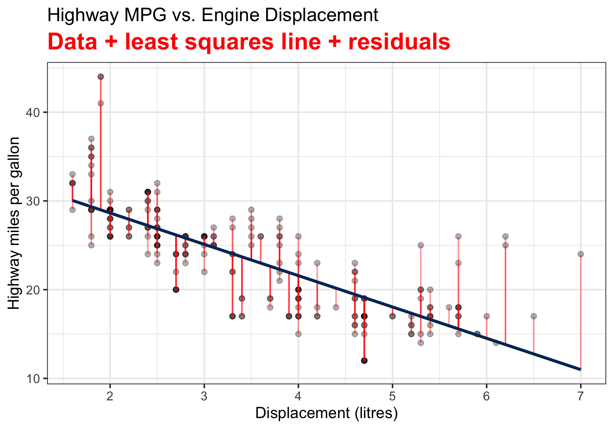

```{r child = "./setup.Rmd"}

```


```{r packages, echo=FALSE, message=FALSE, warning=FALSE}
library(emo)
library(openintro)
```


background-image: url(./img/Bernoulli.jpg)
background-position: 50% 50%
background-size: cover
class: center, middle, inverse

# Sampling Distribution


---
## Parameter
- A **parameter** is a number that describes a probability distribution. 
  + <span style="color:blue"> Binomial: two parameters $n$ and $\pi$ </span>
  + <span style="color:blue"> Poisson: one parameter $\mu$ </span>
  + <span style="color:blue"> Normal: two parameters $\mu$ and $\sigma$ </span>
  
--

- In statistics, we usually assume our target population follows some distribution, but _its parameters are **unknown** to us_.

--

.pull-left[
<span style="color:blue"> Human weight follows $N(\mu, \sigma^2)$ </span>

```{r, echo=FALSE, out.width = "60%"}
# https://unsplash.com/photos/5jctAMjz21A
knitr::include_graphics("./img/weight.jpeg")
```
]
.pull-right[
<span style="color:blue"> # of snowstorms in one year follows $Poisson(\lambda)$ </span>

```{r, echo=FALSE, out.width = "55%"}


```
]

  
  
---
## Treat Each Data Point as a Random Variable
- $n$ random variables: $X_1, X_2, \dots, X_n$.
- Assume $X_1, X_2, \dots, X_n$ follow the **same** distribution.

.alert[
View $X_i$ as *a data point to be drawn* from a population with some distribution, say $N(\mu, \sigma^2)$.
]


```{r sample, cache=TRUE, echo=FALSE, out.width="56%"}
par(mar = 0*c(1,1,1,1))
plot(c(0, 2),
     c(0, 1.1),
     type = 'n',
     axes = FALSE, xlab = "", ylab = "")
temp <- seq(0, 2 * pi, 2 * pi / 100)
x <- 0.5 + 0.5 * cos(temp)
y <- 0.5 + 0.5 * sin(temp)
lines(x, y)

s <- matrix(runif(700), ncol = 2)
S <- matrix(NA, 350, 2)
j <- 0
for (i in 1:nrow(s)) {
  if(sum((s[i, ] - 0.5)^2) < 0.23){
    j <- j + 1
    S[j, ] <- s[i, ]
  }
}
points(S, col = COL[1, 3], pch = 20)
text(0.5, 1, 'Population', pos = 3)

set.seed(50)
N <- sample(j, 25)
lines((x - 0.5) / 2 + 1.5, (y - 0.5) / 2 +  0.5, pch = 20)

SS <- (S[N, ] - 0.5) / 2 + 0.5
these <- c(2, 5, 11, 10, 12)
points(SS[these, 1] + 1,
       SS[these, 2],
       col = COL[4, 2],
       pch = 20,
       cex = 1.5)
text(1.5, 0.75, 'Sample', pos = 3)

for (i in these) {
  arrows(S[N[i], 1], S[N[i], 2],
         SS[i, 1] + 1 - 0.03, SS[i, 2],
         length = 0.08, col = COL[5], lwd = 1.5)
}
```


---
## Treat Each Data Point as a Random Variable
- Assume that $X_1, X_2, \dots, X_n$ are **independent**, i.e., the distribution/value of $X_i$ is not affected by any other $X_j$.
- With the same distribution, $X_1, X_2, \dots, X_n$ are _**i**ndependent and **i**dentically **d**istributed_ (i.i.d.), for example, <span style="color:blue"> $X_1, X_2, \dots, X_n \stackrel{iid}{\sim} N(\mu, \sigma^2)$ </span>
- $(X_1, X_2, \dots, X_n)$ is a **random sample** of size $n$ from the population. 
  + <span style="color:blue"> $X_1, X_2, \dots, X_{50}$ are randomly selected SAT scores from the SAT score population that follows $N(1100, 200^2)$ </span>

--

.alert[
- *Before* we actually collect the data, the data $X_1, X_2, \dots, X_n$ are random variables from the population distribution $N(\mu, \sigma^2)$.
- Once we collect the data, we know the *realized* value of these random variables, $x_1, x_2, \dots, x_n$.
]
  

---
## Sampling Distribution
- Any value computed from a sample $(X_1, X_2, \dots, X_n)$ is called a **(sample) statistic**.
  + <span style="color:blue"> Sample mean $\frac{1}{n}\sum_{i=1}^n X_i$ is a statistic. </span>

.question[
Can you provide another statistic?
]

--

.alert[
<span style="color:blue"> Sample variance $\frac{\sum_{i=1}^n \left(X_i - \overline{X}\right)^2}{n-1}$ is a statistic. </span>
]

--

- Since $X_1, X_2, \dots, X_n$ are random variables, any transformation or function of $(X_1, X_2, \dots, X_n)$, or statistic, is also a random variable. 
- The probability distribution of a statistic is called the **sampling distribution** of that statistic.

--

.question[
Does the sample mean $\overline{X} = \frac{1}{n}\sum_{i=1}^n X_i$ have a sampling distribution?
]


---
## Sampling Distribution
- It is the probability distribution of that statistic if we *__were to repeatedly__ draw samples of the same size from the population*.

```{r, echo=FALSE, out.width="100%", fig.cap="Biostatistics for the Biological and Health Sciences p.241"}

```

---
## Sampling Distribution
- [Sampling Distribution Applet](https://www.statcrunch.com/applets/type3&samplingdist)

.question[
What are the differences between the sampling distribution of $\overline{X}$ and the population distribution each individual r.v. $X_i$ is drawn from?
]

--

- Sample means $(\overline{X})$ are <span style="color:red"> **less variable** </span> than individual observations $X_i$. 
- Sample means $(\overline{X})$ are <span style="color:red"> **more normal** </span> than individual observations $X_i$. 


---
## Example: Sampling Distribution of the Sample Mean
- Roll a fair die 3 times `r emo::ji('game_die')``r emo::ji('game_die')` `r emo::ji('game_die')` independently to obtain 3 values from the population $\{1, 2, 3, 4, 5, 6\}$. 
- Repeat the process 10,000 times and plot the histogram of the sampling mean.

.pull-left[
```{r sampling_dist_population, out.width='100%', echo=FALSE, tidy=FALSE}
plot(c("1", "2", "3", "4", "5", "6"), rep(1/6, 6), type = "h", ylim = c(0, 0.2),
     lwd = 5, col = "#003366", ylab = "P(X = x)", xlab = "x", las = 1, axes = F, 
     main = "Population Distribution")
abline(v = 3.5, col = "#FFCC00", lwd = 5)
axis(1, 1:6, c("1", "2", "3", "4", "5", "6"), col.axis = "black")
axis(2, c(0, 1/3, 1/6), c("0", "1/3", "1/6"), col.axis = "black", las = 2)
```
]

.pull-right[
```{r sampling_dist,  out.width='100%', echo=FALSE, tidy=FALSE}
total_sample <- replicate(10000, sample(1:6, 3, replace = TRUE))
sample_of_sample_mean <- apply(total_sample, 2, mean)
hist(sample_of_sample_mean, main = "Sampling distribution of sample mean", 
     xlab = "sample mean", col = "#003366", border = "white", breaks = 60, las = 1)
abline(v = 3.5, col = "#FFCC00", lwd = 5)
legend("topright", c("population mean"), col = "#FFCC00", lwd = 5, bty = "n")
```
]

---
exclude:true
## Why Large Samples? Law of Large Numbers
- One main task of influential statistics (starting Chapter 5, we're almost there!) is to learn about targeted population properties from our sample data.
  + Example: Learn about the **unknown** population mean $\mu$ from the sample data.
  + Intuitively, we use *sample* mean $\overline{X} = \frac{1}{n}\sum_{i=1}^n X_i$ to **estimate** *population* mean $\mu$.
  
--
exclude:true
.pull-left[
<span style="color:red"> **The Law of Large Numbers** </span>  
- `r emo::ji('thumbsup')` the mean of $\overline{X}$ gets **closer** to $\mu$ as $n$ gets **larger**.
- `r emo::ji('thumbsup')` the variance of $\overline{X}$ gets **smaller** as $n$ gets **larger**. 
]

.pull-right[
```{r law_large_numbers, out.width='100%', echo=FALSE, tidy=FALSE}
par(mar = c(4, 4, 2, 1))
set.seed(30)
x <- rnorm(3000, 3, 5); s <- cumsum(x)
plot(s / (1:3000), type = "l", main = "Law of Large Numbers with population mean 3", 
     xlab = "sample size (n)", ylab = "sample mean", las = 1)
abline(h = 3, col = "red", lwd = 2, lty = 2)
```
]


---
## Sampling Distribution of Sample Mean

<!-- - Assume that the population distribution has mean $\mu$ and standard deviation $\sigma$. -->
- Suppose $(X_1, \dots, X_n)$ is the random sample from a population distribution with mean $\mu$ and standard deviation $\sigma$.
- The mean of the sampling distribution of the sample mean, $\overline{X} = \frac{\sum_{i=1}^nX_i}{n}$, is <span style="color:blue"> $\mu_{\overline{X}} = \mu$ </span>.
- The standard deviation of the sampling distribution of the sample mean $\overline{X}$ is <span style="color:blue"> $\sigma_{\overline{X}} = \frac{\sigma}{\sqrt{n}}$ </span>.
<!-- - $\sigma_{\overline{X}}$ is also known as the **standard error** of $\overline{X}$. -->
- If the population distribution is <span style="color:blue"> $N(\mu, \sigma^2)$ </span>, the sampling distribution of $\overline{X}$ is **exactly** <span style="color:blue"> $N\left(\mu, \frac{\sigma^2}{n} \right)$ </span>.


---
## Sampling Distribution of Sample Mean Illustration

```{r sampling_dist_normal, echo=FALSE, out.width='75%'}
par(mar = c(1, 0, 2, 0), mgp = c(0, 0.5, 0), las = 1)
x <- seq(-5,7,length=100)
hx <- dnorm(x, 1, 2)
n_vec <- c(2, 4, 8)
plot(x, hx, type="n", xlab="", ylab="", axes = FALSE, ylim = c(0, 0.8),
     main = "Sampling distribution of Sample Mean")
lines(x, hx, col = "black", lwd = 3)
lines(x, dnorm(x, 1, 2/sqrt(n_vec[1])), col = "red", lwd = 3)
lines(x, dnorm(x, 1, 2/sqrt(n_vec[2])), col = "blue", lwd = 3)
lines(x, dnorm(x, 1, 2/sqrt(n_vec[3])), col = "green", lwd = 3)
legend("topright", c("Population distribution: N(mean = 1, var = 4)", 
                     expression(paste("Sampling distributioin of ", bar(X), " (n = 2): N(1, 4/2)")), 
                     expression(paste("Sampling distributioin of ", bar(X), " (n = 4): N(1, 4/4)")),
                     expression(paste("Sampling distributioin of ", bar(X), " (n = 8): N(1, 4/8)"))),
       bty = "n", col = c("black", "red", "blue", "green"), lwd = c(3, 3, 3, 3))
# qq <- round(qnorm(c(0.5, 1.5, 2.5, 3.5, 4.5)/5), 2)
axis(1, pos=0, cex.axis = 1)
segments(1, 0, 1, dnorm(1, 1, 2/sqrt(n_vec[3])), lty = 2, lwd = 0.5)
# text(0,-0.05, expression(bold(mu[0])), col = "blue", cex = 1.5)

```

---
## Standardization of Sample Mean 

- For a single random variable $X \sim N(\mu, \sigma^2)$, $Z = \frac{X - \mu}{\sigma} \sim N(0, 1)$.
- For the sample mean of $n$ variables, $\overline{X} \sim N(\mu_{\overline{X}}, \sigma^2_{\overline{X}}) = N(\mu, \frac{\sigma^2}{n})$, and hence <span style="color:blue"> $$Z = \frac{\overline{X} - \mu_{\overline{X}}}{\sigma_{\overline{X}}} = \frac{\overline{X} - \mu}{\sigma/\sqrt{n}} \sim N(0, 1)$$</span>
  <!-- + The solution is the **Central Limit Theorem**! -->
  
  
---
## Example - Psychomotor retardation
.pull-left-wide[
- Psychomotor retardation scores for a group of patients have a normal distribution with a mean of 930 and a standard deviation of 130. 
- What is the probability that the *mean* retardation score of a random sample of 20 patients was between 900 and 960?
]

.pull-right-narrow[
```{r, echo=FALSE, out.width="100%"}

```
]

--
- $X_1, \dots, X_{20}  \stackrel{iid}{\sim} N(930, 130^2)$, then $\overline{X} = \frac{\sum_{i=1}^{20}X_i}{20} \sim N\left(930, \frac{130^2}{20} \right)$.

--
$$\small \begin{align} 
P(900 < \overline{X} < 960) &= P\left( \frac{900-930}{130/\sqrt{20}} < \frac{\overline{X}-930}{130/\sqrt{20}} < \frac{960-930}{130/\sqrt{20}}\right)=P(-1.03 < Z < 1.03)\\
&=P(Z < 1.03) - P(Z < -1.03)
  \end{align}$$

--
```{r}
pnorm(1.03) - pnorm(-1.03)
```

--

```{r}
pnorm(960, mean = 930, sd = 130/sqrt(20)) - pnorm(900, mean = 930, sd = 130/sqrt(20))
```

---
background-image: url(./img/magic.jpg)
background-position: 50% 50%
background-size: cover
class: center, middle, inverse

# Central Limit Theorem


---
## Central Limit Theorem
- We know if $X_i \stackrel{iid}{\sim} N(\mu, \sigma^2)$ , then $\overline{X} \sim N\left(\mu, \frac{\sigma^2}{n} \right)$.
- <span style="color:blue"> What if the population distribution is **NOT** normal? </span> 

--

<br>

<br>

<br>

.center[
.large[
The **central limit theorem (CLT)** gives us the answer!
]
]


---
## Why Use Normal? <span style="color: red">**Central Limit Theorem**</span>
- **Central Limit Theorem (CLT)**: 
Suppose $\overline{X}$ is from a random sample of size $n$ and from a population distribution having mean $\mu$ and standard deviation $\sigma < \infty$. As $n$ increases, the sampling distribution of $\overline{X}$ looks **more and more like $N(\mu, \sigma^2/n)$, regardless of the distribution from which we are sampling!**

.tiny[
```{r echo=FALSE, out.width="85%", fig.cap="https://en.wikipedia.org/wiki/Central_limit_theorem#/media/File:IllustrationCentralTheorem.png"}
knitr::include_graphics("./img/clt.png")
```
]


---

## CLT Illustration: A Right-Skewed Distribution

```{r clt_right_skewed, out.width="100%", echo=FALSE, cache=TRUE, fig.asp=0.3}
par(mfrow = c(1, 4))
par(mar = c(4, 1, 1, 0), mgp = c(2, 0.5, 0), las = 1)
shape <- 1
rate <- 1/2
# gamma_sample <- rgamma(1000, shape = shape, rate = rate)
# hist(gamma_sample, breaks = 30, col = "#FFCC00", border = "white", xlab = "x",
#      main = "Population distr. w/ mean 2 var 4", prob = TRUE)
x <- seq(0, 12, length.out = 1000)
plot(x, dgamma(x, shape = shape, rate = rate), type="n", xlab="x", ylab="", axes = TRUE, ylim = c(0, 0.6),
     main = "Population distr. w/ mean 2 var 4", cex.main = 0.8)
lines(x, dgamma(x, shape = shape, rate = rate), col = "#003366", lwd = 3)
polygon(c(x,rev(x)), c(rep(0, 1000), rev(dgamma(x, shape = shape, rate = rate))), col="#FFCC00")

# lines(density(gamma_sample), col = "red", lwd = 4) 
n_s <- 2
n_m <- 10
n_l <- 1000
sample_s <- replicate(10000, rgamma(n_s, shape = shape, rate = rate))
sample_m <- replicate(10000, rgamma(n_m, shape = shape, rate = rate))
sample_l <- replicate(10000, rgamma(n_l, shape= shape, rate = rate))
sample_mean_s <- apply(sample_s, 2, mean)
sample_mean_m <- apply(sample_m, 2, mean)
sample_mean_l <- apply(sample_l, 2, mean)
x_s <- seq(-6, 8, length.out = 1000)
x_m <- seq(-1, 5, length.out = 1000)
x_l <- seq(1.7, 2.3, length.out = 1000)
hist(sample_mean_s, breaks = 30, col = 4, border = "white", xlim = range(x_s),
     xlab = "sample mean", main = paste0("Distr. of X_bar (n = ", n_s, ")"),
     prob = TRUE, yaxt = "n", ylab = "", cex.main = 0.9)
# lines(x_s, dnorm(x_s, shape/rate, sqrt(shape/rate^2)/sqrt(n_s)), lwd = 3, col = "red")
# lines(density(sample_mean_s), col = "red", lwd = 4) 
hist(sample_mean_m, breaks = 30, col = 4, border = "white", xlim = range(x_m),
     xlab = "sample mean", main = paste0("Distr. of X_bar (n = ", n_m, ")"), 
     prob = TRUE, yaxt = "n", ylab = "", cex.main = 0.9)
# lines(x_m, dnorm(x_m, shape/rate, sqrt(shape/rate^2)/sqrt(n_m)), lwd = 3, col = "red")
# lines(density(sample_mean_m), col = "red", lwd = 4) 
hist(sample_mean_l, breaks = 30, col = 4, border = "white", xlim = range(x_l),
     xlab = "sample mean", main = paste0("Distr. of X_bar (n = ", n_l, ")"), 
     prob = TRUE, yaxt = "n", ylab = "", cex.main = 0.9)
lines(x_l, dnorm(x_l, shape/rate, sqrt(shape/rate^2)/sqrt(n_l)), lwd = 1, col = "red")
# lines(density(sample_mean_l), col = "red", lwd = 4) 
# paste("Mean of the sample mean of size 1000 =", mean(sample_mean_l))
# paste("Variance of the sample mean of size 1000 =", var(sample_mean_l))
# paste("True mean of the sample mean =", shape / rate)
# paste("True variance of the sample mean =", (shape / rate ^ 2) / n_l)
```


---
exclude:true
## CLT Illustration: An Uniform Distribution
```{r clt_uniform, out.width="100%", echo=FALSE, cache=TRUE, fig.asp=0.3}
par(mfrow = c(1, 4))
par(mar = c(4, 1, 1, 0), mgp = c(2, 0.5, 0), las = 1)
shape1 <- 1
shape2 <- 1
x <- seq(0, 1, length.out = 1000)
plot(x, dbeta(x, shape1 = shape1, shape2 = shape2), type="n", xlab="x", ylab="", axes = TRUE, ylim = c(0, 1.5), cex.main = 0.8,
     main = "Popu. distr. w/ mu 0.5 var 0.083")
lines(x, dbeta(x, shape1 = shape1, shape2 = shape2), col = "#003366", lwd = 3)
# polygon(c(x, rev(x)), c(rev(rep(0, 1000)), (dbeta(x, shape1 = shape1, shape2 = shape2))), col="#FFCC00")

# lines(density(gamma_sample), col = "red", lwd = 4) 
n_s <- 2
n_m <- 10
n_l <- 1000
sample_s <- replicate(10000, rbeta(n_s, shape1 = shape1, shape2 = shape2))
sample_m <- replicate(10000, rbeta(n_m, shape1 = shape1, shape2 = shape2))
sample_l <- replicate(10000, rbeta(n_l, shape1 = shape1, shape2 = shape2))
sample_mean_s <- apply(sample_s, 2, mean)
sample_mean_m <- apply(sample_m, 2, mean)
sample_mean_l <- apply(sample_l, 2, mean)
x_s <- seq(-0.5, 1.5, length.out = 1000)
x_m <- seq(0, 1, length.out = 1000)
x_l <- seq(0.45, 0.55, length.out = 1000)
hist(sample_mean_s, breaks = 20, col = 4, border = "white", xlim = range(x_s),
     xlab = "sample mean", main = paste0("Distr. of X_bar (n = ", n_s, ")"),
     prob = TRUE, yaxt = "n", ylab = "", cex.main = 0.9)
# lines(x_s, dnorm(x_s, shape1/(shape1+shape2), sqrt(1/12)/sqrt(n_s)), lwd = 3, col = "red")
# lines(density(sample_mean_s), col = "red", lwd = 4) 
hist(sample_mean_m, breaks = 20, col = 4, border = "white", xlim = range(x_m),
     xlab = "sample mean", main = paste0("Distr. of X_bar (n = ", n_m, ")"), 
     prob = TRUE, yaxt = "n", ylab = "", cex.main = 0.9)
# lines(x_m, dnorm(x_m, shape1/(shape1+shape2), sqrt(1/12)/sqrt(n_m)), lwd = 3, col = "red")
# lines(density(sample_mean_m), col = "red", lwd = 4) 
hist(sample_mean_l, breaks = 20, col = 4, border = "white", xlim = range(x_l),
     xlab = "sample mean", main = paste0("Distr. of X_bar (n = ", n_l, ")"), 
     prob = TRUE, yaxt = "n", ylab = "", cex.main = 0.9)
lines(x_l, dnorm(x_l, shape1/(shape1+shape2), sqrt(1/12)/sqrt(n_l)), lwd = 1, col = "red")
# lines(density(sample_mean_l), col = "red", lwd = 4) 
# paste("Mean of the sample mean of size 1000 =", mean(sample_mean_l))
# paste("Variance of the sample mean of size 1000 =", var(sample_mean_l))
# paste("Theoretical mean of the sample mean =", shape1/(shape1+shape2))
# paste("Theoretical variance of the sample mean =", 1/12 / n_l)
```


---

## CLT Illustration: A U-shaped Distribution
```{r clt_bowl_like, out.width="100%", echo=FALSE, cache=TRUE, fig.asp=0.3}
par(mfrow = c(1, 4))
par(mar = c(4, 1, 1, 0), mgp = c(2, 0.5, 0), las = 1)
shape1 <- 1/2
shape2 <- 1/2
x <- seq(0, 1, length.out = 1000)
plot(x, dbeta(x, shape1 = shape1, shape2 = shape2), type="n", xlab="x", ylab="", axes = TRUE, ylim = c(0, 3), cex.main = 0.8,
     main = "Popu. distr. w/ mu 0.5 var 0.125")
lines(x, dbeta(x, shape1 = shape1, shape2 = shape2), col = "#003366", lwd = 3)
# polygon(c(x, rev(x)), c(rev(rep(0, 1000)), (dbeta(x, shape1 = shape1, shape2 = shape2))), col="#FFCC00")

# lines(density(gamma_sample), col = "red", lwd = 4) 
n_s <- 2
n_m <- 10
n_l <- 1000
sample_s <- replicate(10000, rbeta(n_s, shape1 = shape1, shape2 = shape2))
sample_m <- replicate(10000, rbeta(n_m, shape1 = shape1, shape2 = shape2))
sample_l <- replicate(10000, rbeta(n_l, shape1 = shape1, shape2 = shape2))
sample_mean_s <- apply(sample_s, 2, mean)
sample_mean_m <- apply(sample_m, 2, mean)
sample_mean_l <- apply(sample_l, 2, mean)
x_s <- seq(-0.5, 1.5, length.out = 1000)
x_m <- seq(0, 1, length.out = 1000)
x_l <- seq(0.45, 0.55, length.out = 1000)
hist(sample_mean_s, breaks = 20, col = 4, border = "white", xlim = range(x_s),
     xlab = "sample mean", main = paste0("Distr. of X_bar (n = ", n_s, ")"),
     prob = TRUE, yaxt = "n", ylab = "", cex.main = 0.9)
# lines(x_s, dnorm(x_s, shape1/(shape1+shape2), sqrt(0.125)/sqrt(n_s)), lwd = 3, col = "red")
# lines(density(sample_mean_s), col = "red", lwd = 4) 
hist(sample_mean_m, breaks = 20, col = 4, border = "white", xlim = range(x_m),
     xlab = "sample mean", main = paste0("Distr. of X_bar (n = ", n_m, ")"), 
     prob = TRUE, yaxt = "n", ylab = "", cex.main = 0.9)
# lines(x_m, dnorm(x_m, shape1/(shape1+shape2), sqrt(0.125)/sqrt(n_m)), lwd = 3, col = "red")
# lines(density(sample_mean_m), col = "red", lwd = 4) 
hist(sample_mean_l, breaks = 20, col = 4, border = "white", xlim = range(x_l),
     xlab = "sample mean", main = paste0("Distr. of X_bar (n = ", n_l, ")"), 
     prob = TRUE, yaxt = "n", ylab = "", cex.main = 0.9)
lines(x_l, dnorm(x_l, shape1/(shape1+shape2), sqrt(0.125)/sqrt(n_l)), lwd = 1, col = "red")
# lines(density(sample_mean_l), col = "red", lwd = 4) 
# paste("Mean of the sample mean of size 1000 =", mean(sample_mean_l))
# paste("Variance of the sample mean of size 1000 =", var(sample_mean_l))
# paste("Theoretical mean of the sample mean =", shape1/(shape1+shape2))
# paste("Theoretical variance of the sample mean =", 0.125 / n_l)
```


---
## Why CLT is Important?

<!-- - Many statistics have distributions that are approximately normal for large sample sizes, even when we are sampling from a distribution that is not normal. -->
- Many well-developed statistical methods are based on normal distribution assumption.
- With CLT, we can use those methods even if we are sampling from a non-normal distribution, or we have no idea of the population distribution, provided that the sample size is large.


---
## CLT Example
.pull-left-wide[
- Suppose that selling prices of houses in Milwaukee are known to have a mean of $382,000 and a standard deviation of $150,000. 
- In 100 randomly selected sales, what is the probability the *average* selling price is more than $400,000?
]

.pull-right-narrow[
```{r, echo=FALSE, out.width="100%"}

```
]

--

<!-- - We need the sampling distribution of the average selling price in order to obtain the probability.  -->
- Since the sample size is fairly large $(n = 100)$, by CLT, the sampling distribution of the average selling price is approximately normal with mean 382,000 and SD $150,000 / \sqrt{100}$.
- $P(\overline{X} > 400000) = P\left(\frac{\overline{X} - 382000}{150000/\sqrt{100}}  > \frac{400000 - 382000}{150000/\sqrt{100}}\right) \approx P(Z > 1.2)$ where $Z \sim N(0, 1)$.

```{r}
pnorm(1.2, lower.tail = FALSE)
pnorm(400000, mean = 382000, sd = 150000/sqrt(100), lower.tail = FALSE)
```


